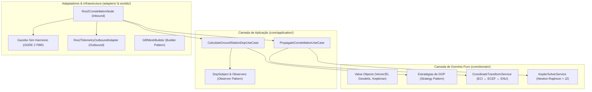

<div align="center">

# 🛰️ Brazilian RPS Sim (RPS-BR)
### Simulador do Sistema de Posicionamento e Aumento Regional Brasileiro

[](https://github.com/Rj-mwe/brazilian-rps-sim/actions/workflows/documentation.yml)
[](https://opensource.org/licenses/Apache-2.0)
[](https://creativecommons.org/licenses/by/4.0/)
[](https://docs.ros.org/en/jazzy/)
[](https://gazebosim.org/)
[](https://typst.app/)
[](https://github.com/astral-sh/uv)

**Simulador físico, orbital e de navegação de alta fidelidade para a constelação soberana do RPS-BR.**  
*Desenvolvido sob Arquitetura Hexagonal (Ports & Adapters), Test-Driven Development (TDD) e filosofia Docs-as-Code.*

[📖 Portal de Documentação](https://rj-mwe.github.io/brazilian-rps-sim/) • [📋 GitHub Projects (Mission Board)](https://github.com/users/Rj-mwe/projects/2) • [📄 Artigo Científico](docs/papers/sbas_brazil_journal/README.md)

</div>

---

## 🧭 Visão Geral da Missão

O **Brazilian Regional Positioning & Augmentation System (RPS-BR)** é um projeto de engenharia aeroespacial para modelar, avaliar e certificar um sistema regional de navegação por satélite e aumento diferencial (SBAS / RNSS) soberano sobre o território continental brasileiro, a Zona Econômica Exclusiva (Amazônia Azul) e o espaço aéreo adjacente.

O sistema opera de forma autônoma e como camada de integridade e aumento sobre constelações globais (GPS/Galileo), assegurando aproximações aéreas de precisão (Cat-I) em aeródromos sem infraestrutura terrestre (ILS), conformidade com os padrões **ICAO Annex 10** e **RTCA DO-229D**, e suporte a operações navais e agrícolas de alta precisão.

---

## 🌌 Constelação Híbrida GEO / IGSO (7 Satélites)

A geometria do RPS-BR emprega **3 veículos Geoestacionários (GEO)** combinados com **4 veículos Geossíncronos Inclinados (IGSO)** em órbita de Figura-8:

| Satélite | Tipo | Parâmetros Orbitais | Região Prioritária / Cobertura |
| :--- | :---: | :--- | :--- |
| **RPS-GEO-1** | GEO | $a = 42.164\text{ km}, i = 0^\circ, \lambda = 60^\circ\text{W}$ | Amazônia Ocidental e Fronteira Norte |
| **RPS-GEO-2** | GEO | $a = 42.164\text{ km}, i = 0^\circ, \lambda = 48^\circ\text{W}$ | Centro-Oeste, Brasília e Bacia do Pantanal |
| **RPS-GEO-3** | GEO | $a = 42.164\text{ km}, i = 0^\circ, \lambda = 36^\circ\text{W}$ | Região Nordeste e Costa Leste / Atlântico |
| **RPS-IGSO-1** | IGSO | $a = 42.164\text{ km}, e = 0.040, i = 25^\circ, \omega = 90^\circ$ | Figura-8 sobre o Brasil (Apogeu no Sul) |
| **RPS-IGSO-2** | IGSO | $a = 42.164\text{ km}, e = 0.040, i = 25^\circ, \omega = 90^\circ$ | Figura-8 sobre o Brasil (Fase $90^\circ$) |
| **RPS-IGSO-3** | IGSO | $a = 42.164\text{ km}, e = 0.040, i = 25^\circ, \omega = 90^\circ$ | Figura-8 sobre o Brasil (Fase $180^\circ$) |
| **RPS-IGSO-4** | IGSO | $a = 42.164\text{ km}, e = 0.040, i = 25^\circ, \omega = 90^\circ$ | Figura-8 sobre o Brasil (Fase $270^\circ$) |

---

## 🏛️ Arquitetura de Software (Clean Hexagonal)

O projeto separa rigorosamente a matemática do domínio aeroespacial dos frameworks e motores de simulação:



---

## 🚀 Como Executar

### 1. Inicializar a Simulação Física Completa (ROS 2 + Gazebo)
```bash
./run.sh ros2 launch rps_br unified_sim.launch.py
```

### 2. Executar a Suíte de Testes Automatizados (TDD)
```bash
pytest
# Ou dentro do contêiner:
# ./run.sh pytest
```

### 3. Compilar a Documentação Localmente (MkDocs com UV)
```bash
uv run mkdocs serve
# Acesse: http://127.0.0.1:8000
```

### 4. Compilar o Artigo Científico em Typst
```bash
typst compile docs/papers/sbas_brazil_journal/main.typ docs/papers/sbas_brazil_journal/paper_sbas_brazil.pdf
```

### ⚙️ Configuração do Ambiente de Contêiner (`docker/container.env`)

O diretório do host onde o Podman/Docker armazena os artefatos de compilação do ROS 2 (`build/`, `install/`, `log/`) é configurável por ambiente:

1. Copie o arquivo de exemplo para criar sua configuração local:
   ```bash
   cp docker/container.env.example docker/container.env
   ```
2. Ajuste `docker/container.env` conforme necessário (padrão: `~/Contêineres e VM's/brazilian-rps-sim`):
   ```bash
   CONTAINER_WS="${HOME}/Contêineres e VM's/brazilian-rps-sim"
   ```
3. É possível também sobrescrever pontualmente via linha de comando:
   ```bash
   RPS_CONTAINER_WS="/tmp/meu_workspace" ./run.sh
   ```

---

## 📜 Licenciamento Híbrido

Este projeto adota um modelo de licenciamento duplo para harmonizar o desenvolvimento de software com a Ciência Aberta:

* **Código-Fonte:** Licenciado sob a [Apache License, Versão 2.0](LICENSE).
* **Documentação, Especificações e Artigos:** Licenciados sob a licença internacional [Creative Commons Attribution 4.0 (CC BY 4.0)](https://creativecommons.org/licenses/by/4.0/).

---

## 📑 Como Citar este Projeto

Se você utilizar este simulador, seus modelos analíticos ou publicações em seus estudos ou pesquisas, utilize a citação formal disponibilizada no arquivo [`CITATION.cff`](CITATION.cff) ou via BibTeX:

```bibtex
@article{Gamito_RPS_BR_2026,
  author = {Gamito, Roger J. G.},
  title = {{Arquitetura de Constelação Híbrida GEO/IGSO e Desempenho de Navegação para o Sistema de Aumento Regional Brasileiro (RPS-BR)}},
  journal = {Brazilian RPS-BR Journal of Aerospace Engineering},
  year = {2026},
  volume = {1},
  number = {1},
  institution = {Instituto Tecnológico de Aeronáutica (ITA)},
  url = {https://github.com/Rj-mwe/brazilian-rps-sim}
}
```
