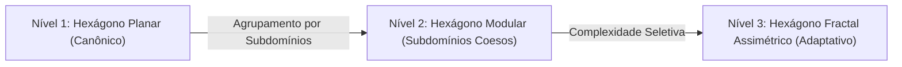

# ADR 0005: Os Três Níveis de Maturidade da Arquitetura Hexagonal

* **Status:** Aprovado
* **Data:** 2026-09-07
* **Autor:** Roger J. G. Gamito (ITA)

---

## 1. Contexto e Motivação

A Arquitetura Hexagonal (Ports & Adapters), formulada originalmente por Alistair Cockburn em 2005, revolucionou o isolamento de software ao estabelecer uma fronteira estrita entre a lógica interna da aplicação e o mundo externo (infraestrutura, persistência e interfaces de usuário). Contudo, a teoria original de Cockburn delimitou apenas a borda externa do sistema, tratando o interior do hexágono como uma caixa-preta indiferenciada.

Conforme sistemas de engenharia crítica e aeroespacial evoluem em complexidade — acumulando física orbital, modelos de propagação de sinais atmosféricos e solucionadores estocásticos de navegação —, a abordagem clássica de empilhar classes em diretórios por padrões técnicos puros (`services/`, `value_objects/`) gera sobrecarga cognitiva severa e acoplamento desordenado entre disciplinas científicas heterogêneas.

Para solucionar essa limitação sem recorrer à complexidade acidental de microsserviços distribuídos, este documento estabelece a **Teoria de Maturidade em Três Níveis da Arquitetura Hexagonal**.

---

## 2. Decisão Arquitetural: A Trilogia de Níveis

Adota-se uma classificação morfológica progressiva para a estruturação interna de núcleos de software (Cores):

### 2.1. Nível 1: Hexágono Planar (Canônico)
* **Definição:** O modelo clássico de Cockburn e da Clean Architecture tradicional.
* **Morfologia:** Possui uma única camada de `application/` e uma de `domain/`. No domínio, os elementos são dispostos de forma plana ou agrupados por padrões puramente técnicos (`domain/services/`, `domain/value_objects/`, `domain/aggregates/`).
* **Mecanismo Operacional:** Chamadas diretas em memória entre classes irmãs no mesmo namespace.
* **Aplicabilidade:** Indicado para o início de projetos, protótipos, MVPs ou sistemas com apenas um subdomínio funcional restrito.
* **Limite de Ruptura:** Esgota-se quando o domínio passa a conter algoritmos de naturezas científicas ou de negócio distintas, misturando conceitos na mesma pasta.

### 2.2. Nível 2: Hexágono Modular por Subdomínios (O Padrão Adotado no RPS-BR)
* **Definição:** Um monólito modular estritamente tipado, particionado pela Linguagem Ubíqua da engenharia.
* **Morfologia:**
  1. **Orquestrador Global Unificado (`core/application/`):** Contém os Use Cases que realizam o fluxo macro de ponta a ponta (`PropagateConstellationUseCase`, `CalculateGroundStationDopUseCase`), seus DTOs de borda e suas Interfaces de entrada.
  2. **Subdomínios Especialistas de Domínio Puro (`core/domain/<subdomain>/`):** O domínio é fatiado por competência científica real (`astrodynamics/`, `signal_propagation/`, `navigation_pvt/`). Cada subdomínio abriga exclusivamente seus serviços matemáticos, agregados e especificações.
  3. **Kernel Compartilhado (`core/domain/shared/`):** Um repositório central estrito para Value Objects matemáticos universais e imutáveis (`Vector3DVO`, `GeodeticCoordinatesVO`, `QuaternionVO`), acessíveis por todos os subdomínios.
* **Mecanismo Operacional:** Chamadas de método diretas in-memory, trafegando Value Objects imutáveis. Zero sobrecarga de serialização e latência de nanossegundos.
* **Aplicabilidade:** Sistemas científicos, aeroespaciais e de engenharia de médio a grande porte em monorepositórios de alta performance.

### 2.3. Nível 3: Hexágono Fractal Assimétrico (Adaptativo / Multiescala)
* **Definição:** O modelo maduro que respeita a heterogeneidade da física e das regras de negócio, rejeitando a falácia da simetria forçada.
* **Morfologia:** No mesmo sistema coexistem:
  - Subdomínios de **Nível 2** (bibliotecas de física pura sem camada de aplicação própria, como o modelo de Klobuchar em `signal_propagation`).
  - **Subcores Fractais Completos** (módulos hipercomplexos que possuem sua própria camada interna de `application/`, `dtos/` e `domain/`, como o solucionador de navegação PVT com filtragem estocástica).
* **A Regra de Promoção:** Um subdomínio simples só é promovido a Fractal Completo se possuir:
  1. Múltiplos estados internos e históricos (ex: Filtros de Kalman).
  2. Orquestração interna com mais de três etapas distintas.
  3. Potencial concreto de ser extraído para um binário compilado nativo (C++/Rust) ou serviço isolado.
* **Nota sobre a "Opção B" (Fractal Simétrico Puro):** Considera-se a simetria forçada de exigir que todo e qualquer subdomínio simples tenha camadas de DTOs e Application como um anti-padrão de sobreengenharia burocrática (*Architectural Ceremony*), justificável apenas em sistemas massivamente distribuídos mantidos por equipes distintas.

---

# 3. A Matriz Funcional dos 12 Elementos do Core

A divisão de responsabilidades entre o nível global e os subdomínios segue a matriz invariante:

| Camada | Elemento | Escopo Primário | Função no Sistema |
| :--- | :--- | :---: | :--- |
| **Application** | 1. Use Cases (Services) | **Global no Core** | Orquestram os fluxos do sistema chamando os subdomínios. |
| **Application** | 2. DTOs | **Global na Borda** | Contratos de transporte externo (ROS 2 / GUI / CLI). |
| **Application** | 3. Mappers | **Global na Borda** | Traduzem DTOs para objetos de domínio. |
| **Application** | 4. Interfaces (Input) | **Global no Core** | Portas de entrada do sistema. |
| **Domain** | 5. Aggregates | **Particular do Subdomínio** | Raízes de consistência transacional do subdomínio. |
| **Domain** | 6. Entities | **Particular do Subdomínio** | Objetos com identidade própria no subdomínio. |
| **Domain** | 7. Value Objects | **Híbrido** | **Universais** em `shared/`; **Especialistas** no subdomínio. |
| **Domain** | 8. Domain Services | **Particular do Subdomínio** | Algoritmos de física e regras matemáticas puras. |
| **Domain** | 9. Specifications | **Particular do Subdomínio** | Regras booleanas invariantes (ex: visibilidade zenital). |
| **Domain** | 10. Policies / Strategies | **Particular do Subdomínio** | Famílias de algoritmos intercambiáveis. |
| **Domain** | 11. Domain Events | **Origem Particular / Barramento Global** | Notificações imutáveis de transição de estado. |
| **Domain** | 12. Factories | **Particular do Subdomínio** | Construtores de agregados complexos. |

---

# 4. Vinculação Intrínseca com Padrões de Design (Design Patterns)

A transição entre os três níveis é operacionalizada por padrões de projeto específicos:

1. **Padrões do Nível 1:** *Strategy* (intercambiabilidade de portas de saída), *Factory* e *Value Object*.
2. **Padrões do Nível 2:** *Shared Kernel* (núcleo imutável compartilhado), *Facade* (fachadas de subdomínio) e *Observer / Mediator* (comunicação desacoplada por eventos).
3. **Padrões do Nível 3:** *Composite* (tratamento homogêneo de sub-hexágonos pelo orquestrador), *Anti-Corruption Layer (ACL)* (isolamento semântico de dialetos de subcores) e *Pipeline / Chain of Responsibility* (execução multietapa de fractais).

---

## 5. Consequências e Benefícios para o RPS-BR

* **Clareza Semântica:** A árvore de diretórios espelha a física aeroespacial real sem metáforas burocráticas artificiais.
* **Máximo Desempenho:** Eliminação de intermediários e serializações entre cálculos de órbita e propagação de sinal.
* **Evolutividade Segura:** O projeto adota hoje o **Nível 2**, garantindo a fundação técnica exata para evoluir pontualmente para o **Nível 3** nas fases de PVT e RAIM.
