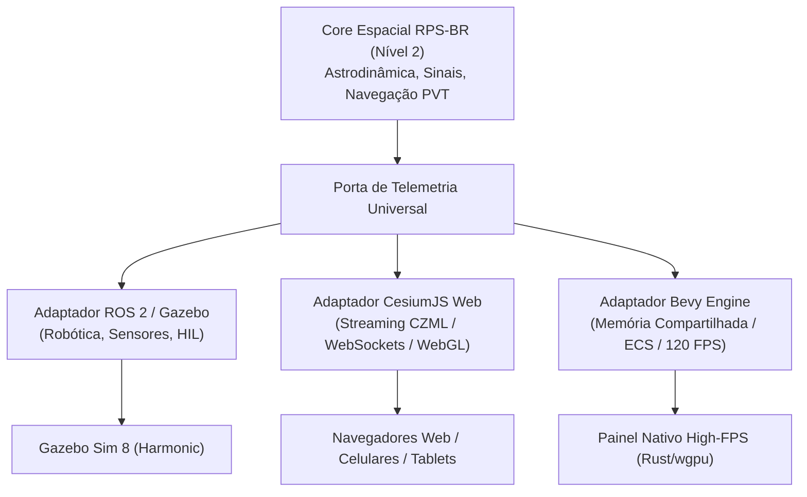

# ADR 0006: Adaptadores Fractais e a Arquitetura Multi-Engine (Multi-Head)

* **Status:** Aprovado
* **Data:** 2026-09-07
* **Autor:** Roger J. G. Gamito (ITA)

---

## 1. Contexto e Motivação

Com a consolidação da Arquitetura Hexagonal de Nível 2 no `brazilian-rps-sim`, o Core da aplicação encontra-se completamente desacoplado de qualquer tecnologia de persistência ou interface gráfica.

Entretanto, as demandas de visualização e orquestração de um Sistema de Posicionamento Regional (RPS) englobam múltiplos cenários operacionais distintos:
1. **Simulação Robótica e Hardware-in-the-Loop:** Necessidade de integração com ROS 2 (Harmonic) e Gazebo Sim (OGRE 2) para validação de atuadores, dinâmica de atitude e sensores.
2. **Visualização Geoespacial Planetária na Web:** Demanda por acesso via navegadores web (desktop, tablets) para centros de controle e usuários civis/aeronáuticos através de CesiumJS com mapas globais de satélite (Cesium ION / OpenStreetMap), sem a exigência de instalar ROS 2 ou Linux nas máquinas clientes.
3. **Renderização de Ultra-Alta Performance e Fidelidade:** Renderização a mais de 120 FPS de milhares de pontos orbitais e detritos utilizando motores gráficos modernos baseados em ECS nativo e Rust/wgpu (como o Bevy Engine).

Além disso, adaptadores complexos — como a geração procedural de mundos SDFormat e malhas glTF 2.0 binárias — acumulam lógica matemática de geometria computacional (tubos RMF de Frenet-Serret, tesselação esférica, materiais PBR). Se esses adaptadores forem implementados como meras classes lineares ou pastas de scripts soltos, tornam-se frágeis e caóticos.

---

## 2. Decisões Arquiteturais

### 2.1. O Princípio dos Adaptadores Fractais (Fractal Edge)
Adota-se a regra de que **adaptadores complexos que realizam modelagem gráfica, conversões geométricas ou orquestrações de middleware distribuído devem ser estruturados internamente como Mini-Hexágonos (Nível 1)**:
* **Fronteira de Entrada:** Implementa estritamente uma Porta de Saída do Core (`ISimulationTelemetryPort` ou equivalente).
* **Mini-Domínio Gráfico Interno:** Modela conceitos próprios da computação gráfica (geração de tubos RMF, triangulação de esferas UV, paletas de cores e grafos de cena glTF) sem que nenhuma dessas idiossincrasias penetre no Core da simulação espacial.
* **Fronteira de Saída do Adaptador:** Drivers especializados em emissão de dados (`GltfMeshBuilder` gravando buffers binários `.glb`, geradores de templates SDFormat `.sdf`, ou streamers WebSocket CZML).

### 2.2. Arquitetura Multi-Engine (Multi-Head)
O Core espacial do `brazilian-rps-sim` atua como a **Única Fonte da Verdade** física e geométrica. Ele emite telemetria orbital através de Portas de Saída agnósticas. Três adaptadores de saída podem coexistir ou ser ativados dinamicamente:

1. **Cabeça 1 (ROS 2 + Gazebo Sim):** Para dinâmica de corpos rígidos, acoplamento de sensores e interoperabilidade com nós do ecossistema robótico.
2. **Cabeça 2 (CesiumJS Web):** Para visualização geoespacial 3D global em navegadores comuns via streaming CZML, permitindo que operadores remotos acompanhem a constelação sem infraestrutura complexa.
3. **Cabeça 3 (Bevy Engine):** Para computação gráfica intensiva na GPU, inspeção orbital com shaders customizados e simulações com altíssima taxa de quadros.

### 2.3. Padrão Dual-Scale Data Representation (Simbiose DDD + DoD)
Para responder às exigências de desempenho mecânico (eliminação de cache misses e viabilização de auto-vetorização SIMD):
* **No Deep Core (Micro-Escala):** Subdomínios intensivos em cálculo mantêm matrizes contíguas de dados (Structure of Arrays - SoA com NumPy e extensões compiladas), operando via álgebra linear vetorizada.
* **Na Borda do Core (Macro-Escala):** As interfaces de Portas, Casos de Uso e DTOs mantêm a segurança de tipos, imutabilidade e clareza semântica do Domain-Driven Design através de Value Objects ricos.

---

## 3. Consequências e Benefícios

* **Portabilidade Extrema:** A substituição ou adição de uma nova engine gráfica (ex: Three.js, Unreal Engine ou Bevy) não altera uma única linha de código nos subdomínios de astrodinâmica, propagação de sinais ou navegação.
* **Independência Operacional:** O simulador pode ser executado em modo de testes unitários rápidos (com mocks de portas), em modo web leve (para demonstrações e briefings operacionais), ou em modo robótico completo no Gazebo Sim.
* **Proteção contra Big Ball of Mud:** A lógica matemática de geração de malhas 3D e manipulação de arquivos binários glTF fica confinada em seu próprio ecossistema modular dentro de `adapters/outbound/visualization/`.
