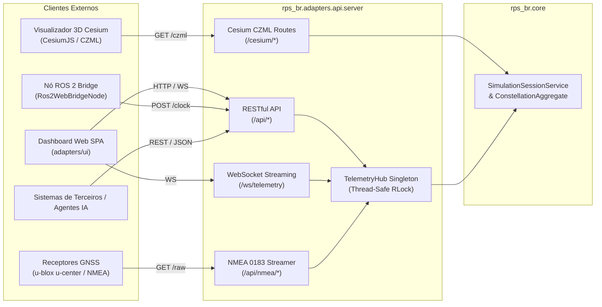

# 🌐 Documentação da Interface API (API Gateway & Telemetria)

O **RPS-BR API Gateway** (`rps_br.adapters.api`) constitui o ponto de entrada unificado para comunicação máquina-máquina, streaming de telemetria em tempo real, emulação de protocolos GNSS de bancada e distribuição de dados geoespaciais tridimensionais.

Desenvolvido sobre o framework **FastAPI**, o gateway opera como um **Adaptador Primário (*Driving Adapter*)** dentro da Arquitetura Hexagonal, traduzindo estímulos de rede (HTTP REST, WebSockets) em chamadas aos Casos de Uso e Serviços de Aplicação do Core.

---

## 🏛️ Visão Geral da Arquitetura de Comunicação



---

## ⚡ Inicialização e Acesso Rápido

O gateway pode ser iniciado pelo script utilitário ou diretamente pelo módulo Python:

```bash
# Inicialização via script oficial:
./dashboard.sh

# Ou via Uvicorn diretamente:
python3 -m uvicorn rps_br.adapters.api.server:app --host 0.0.0.0 --port 8000 --reload
```

* **Dashboard Web:** [http://localhost:8000/](http://localhost:8000/)
* **Documentação Swagger Interativa:** [http://localhost:8000/docs](http://localhost:8000/docs)
* **Documentação Redoc Formal:** [http://localhost:8000/redoc](http://localhost:8000/redoc)
* **Visualizador 3D Cesium (WGS84):** [http://localhost:8000/cesium/viewer](http://localhost:8000/cesium/viewer)

---

## 📡 1. Especificação da API RESTful

Todas as respostas RESTful retornam `application/json` e seguem os códigos de status HTTP convencionais.

### A. Telemetria e Estado da Constelação

#### `GET /api/status`
Retorna o estado operacional do gateway, identificador do sistema e contagem de satélites ativos.
* **Exemplo de Resposta (200 OK):**
```json
{
  "status": "online",
  "system": "SPR-BR / RPS-BR Mission Control API Gateway",
  "version": "2.0.0",
  "active_satellites_count": 7,
  "simulation_time_sec": 3600.0,
  "is_paused": false,
  "time_multiplier": 3600.0,
  "selected_station": "São José dos Campos (ITA / SP)"
}
```

#### `GET /api/satellites`
Retorna a lista completa dos 7 satélites (3 GEO + 4 IGSO) com suas coordenadas ECEF, parâmetros geodésicos e visibilidade.
* **Exemplo de Resposta (200 OK):**
```json
[
  {
    "id": 1,
    "name": "RPS-GEO-1",
    "type": "GEO",
    "r_ecef_km": [-21082.07, -36515.22, 0.0],
    "geodetic": {
      "latitude_deg": 0.0,
      "longitude_deg": -60.0,
      "altitude_km": 35786.0
    },
    "elevation_deg": 52.4,
    "azimuth_deg": 315.2,
    "distance_km": 36850.1,
    "in_view": true,
    "tropo_m": 2.87,
    "tropo_ns": 9.57
  }
]
```

#### `GET /api/satellites/{satellite_id}`
Retorna os detalhes analíticos e cinemáticos de um veículo espacial individual (ID de 1 a 7).
* **Parâmetros:** `satellite_id` (inteiro, 1 a 7).
* **Erros:** `404 Not Found` caso o satélite não exista.

---

### B. Navegação e Métricas de Geometria (DOP)

#### `GET /api/dop`
Retorna as métricas instantâneas de Diluição Geométrica de Precisão para a estação de monitoramento ativa.
* **Exemplo de Resposta (200 OK):**
```json
{
  "station": "São José dos Campos (ITA / SP)",
  "elevation_mask_deg": 5.0,
  "visible_satellites_count": 6,
  "dop": {
    "gdop": 2.85,
    "pdop": 2.41,
    "hdop": 1.38,
    "vdop": 1.97,
    "tdop": 1.52,
    "is_valid": true
  }
}
```

#### `GET /api/stations`
Lista todas as estações terrestres de referência cadastradas no território brasileiro:
* **Exemplo de Resposta (200 OK):**
```json
[
  "São José dos Campos (ITA / SP)",
  "Brasília (DF)",
  "Alcântara (CLA / MA)",
  "Manaus (AM)",
  "Recife (PE)",
  "Porto Alegre (RS)",
  "Cuiabá (MT)"
]
```

#### `GET /api/history`
Retorna a série temporal recente de métricas DOP (até 120 passos históricos) para renderização de gráficos na interface de usuário.

---

### C. Modelagem de Retardos Atmosféricos

#### `GET /api/atmosphere/delays`
Retorna os retardos ionosféricos (Klobuchar) e troposféricos (Saastamoinen) calculados para cada linha de visada ativa entre a estação e os satélites visíveis.
* **Exemplo de Resposta (200 OK):**
```json
{
  "station": "São José dos Campos (ITA / SP)",
  "weather": {
    "pressure_hpa": 1013.25,
    "temperature_k": 293.15,
    "relative_humidity_pct": 60.0
  },
  "delays": {
    "RPS-GEO-1": {
      "elevation_deg": 52.4,
      "tropospheric_zenith_m": 2.27,
      "tropospheric_slant_m": 2.87,
      "tropospheric_slant_ns": 9.57,
      "ionospheric_slant_m": 4.12,
      "ionospheric_slant_ns": 13.74
    }
  }
}
```

---

### D. Comandos de Controle Interativo da Simulação

#### `POST /api/control/pause`
Alterna ou define o estado de execução da simulação.
* **Corpo da Requisição:**
```json
{ "paused": true }
```

#### `POST /api/control/multiplier` (ou `/speed`)
Define a taxa de aceleração do tempo virtual (ex: 1.0x, 10.0x, 3600.0x onde 1s real = 1h virtual).
* **Corpo da Requisição:**
```json
{ "multiplier": 3600.0 }
```

#### `POST /api/control/mask`
Altera dinamicamente o ângulo de corte da máscara de elevação da estação de solo.
* **Corpo da Requisição:**
```json
{ "elevation_mask_deg": 10.0 }
```

#### `POST /api/control/station`
Seleciona a estação terrestre de monitoramento ativa para recálculo instantâneo das linhas de visada e matriz DOP.
* **Corpo da Requisição:**
```json
{ "station_name": "Brasília (DF)" }
```

---

### E. Porta Interna de Sincronização de Relógio

#### `POST /api/internal/clock`
Porta consumida por nós de ponte (ex.: `Ros2WebBridgeNode`) para sincronizar a simulação web com motores de física externos como o Gazebo Sim.
* **Corpo da Requisição:**
```json
{
  "sim_time_sec": 7200.5,
  "is_paused": false,
  "time_multiplier": 3600.0
}
```

---

## 🔄 2. Streaming em Tempo Real via WebSocket

* **Endpoint:** `ws://localhost:8000/ws/telemetry`
* **Taxa de Publicação:** 1 Hz (1 transmissão por segundo).
* **Comportamento:** Ao conectar, o cliente recebe imediatamente o snapshot completo da simulação. A conexão é mantida ativa com *heartbeat* automático.

### Envelope de Dados Enviado pelo Servidor
```json
{
  "simulation": {
    "time_sec": 3600.0,
    "time_formatted": "01:00:00",
    "is_paused": false,
    "time_multiplier": 3600.0,
    "elevation_mask_deg": 5.0,
    "active_station": "São José dos Campos (ITA / SP)",
    "station_lat": -23.2128,
    "station_lon": -45.8755,
    "station_alt_km": 0.6
  },
  "dop": {
    "gdop": 2.85,
    "pdop": 2.41,
    "hdop": 1.38,
    "vdop": 1.97,
    "tdop": 1.52,
    "is_valid": true,
    "visible_sats": 6
  },
  "satellites": [ ... ],
  "stations": [ ... ],
  "history": [ ... ]
}
```

### Comandos Aceitos via Mensagem WebSocket (Upstream)
O cliente pode enviar comandos interativos diretamente pelo canal WebSocket aberto:
```json
// Pausar/Retomar
{ "pause": true }

// Alterar Aceleração Temporal
{ "multiplier": 10.0 }

// Alterar Máscara de Elevação
{ "mask": 15.0 }

// Trocar Estação Terrestre
{ "station": "Alcântara (CLA / MA)" }
```

---

## 📡 3. Protocolo GNSS NMEA 0183

O submódulo `rps_br.adapters.api.nmea` traduz a telemetria astrodinâmica da constelação em sentenças padronizadas NMEA 0183 (IEC 61162-1), permitindo a conexão direta com softwares comerciais de navegação como o **u-blox u-center**, navegadores GIS e pilotos automáticos.

### Endpoints Disponíveis

#### `GET /api/nmea/sentences`
Retorna as sentenças do instante atual como uma lista estruturada JSON.

#### `GET /api/nmea/raw`
Retorna o fluxo textual bruto formatado com quebra de linha `\r\n` (CRLF), pronto para ser redirecionado para um pseudo-terminal serial (`pty`), socket TCP ou arquivo log `.nmea`.

### Formato das Sentenças Emitidas

1. **`$GNGGA` (Global Positioning System Fix Data):**
   * Contém tempo UTC, coordenadas da estação em formato `ddmm.mmmm`, indicador de qualidade da correção (Fix), contagem de satélites visíveis, HDOP e altitude ortométrica em metros.
   ```text
   $GNGGA,010000.00,2312.7680,S,04552.5300,W,1,06,1.38,600.0,M,0.0,M,,*7E
   ```

2. **`$GNGSA` (GNSS DOP and Active Satellites):**
   * Contém modo operacional (Automático), fixo 3D (modo 3), IDs dos PRNs em visada ativa e valores de PDOP, HDOP e VDOP.
   ```text
   $GNGSA,A,3,01,02,03,04,05,06,,,,,,,2.41,1.38,1.97*29
   ```

3. **`$GPGSV` (GNSS Satellites in View):**
   * Agrupado em blocos de até 4 veículos espaciais por mensagem. Informa PRN, elevação em graus ($0^\circ$ a $90^\circ$), azimute topocêntrico ($0^\circ$ a $359^\circ$) e relação sinal-ruído (SNR simulada em dB-Hz).
   ```text
   $GPGSV,2,1,07,01,52,315,45,02,68,024,45,03,48,088,45,04,32,185,45*7B
   $GPGSV,2,2,07,05,74,210,45,06,41,045,45,07,02,120,20*7F
   ```

### Algoritmo do Checksum XOR
Conforme a norma NMEA 0183, o checksum é computado através da operação XOR bit a bit entre todos os caracteres ASCII posicionados estritamente entre o caractere inicial `$` e o delimitador `*`:

$$\text{Checksum} = \bigoplus_{i=1}^{N} \text{ord}(c_i) \implies \text{Formatado em Hexadecimal de 2 Dígitos (02X)}$$

---

## 🌍 4. Adaptador Geoespacial 3D Cesium (CZML)

O adaptador [`rps_br.adapters.cesium`](file:///home/rjgamito/Projetos/Engenharia/Aeroespacial/brazilian-rps-sim/rps_br/adapters/cesium) converte a física orbital em pacotes **CZML (Cesium Language)**, padrão da NASA e Cesium para transmissão de cenas dinâmicas baseadas em tempo.

* **`GET /cesium/viewer`**: Serve a aplicação web do globo tridimensional WGS84 em tela cheia com renderização atmosférica, iluminação solar realista e texturas Natural Earth.
* **`GET /cesium/constellation.czml`**: Gera dinamicamente o documento CZML composto por:
  1. *Packet Document*: Relógio de simulação com intervalo temporal e taxa de reprodução.
  2. *Packets de Satélites*: Posições cartesianas WGS84 amostradas, cones e rastros orbitais (GEO em Ciano `#00E6FF`, IGSO em Âmbar `#F59E0B`).
  3. *Packets de Estações Terrestres*: Localização tridimensional exata das 7 bases brasileiras com marcadores esmeralda `#10B981`.
