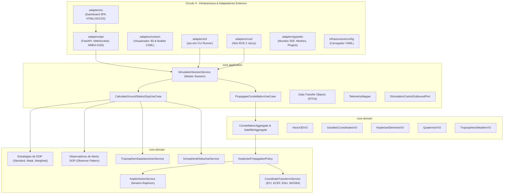

# 🏛️ Arquitetura do Sistema, Árvore do Projeto e Decisões de Design

Este documento apresenta a visão arquitetural abrangente do **Brazilian Regional Positioning System Simulator (RPS-BR)**, detalhando os princípios de separação de responsabilidades, a árvore estrutural do código-fonte, o catálogo de abstrações de domínio e os padrões de projeto de software implementados.

---

## 🎯 1. Princípios Arquiteturais Fundamentais

O projeto foi concebido sob três pilares metodológicos rigorosos:

1. **Arquitetura Hexagonal (*Ports & Adapters* - Alistair Cockburn):**
   * O **Core** de negócio é o hexágono central isolado do mundo exterior. Ele não conhece nem depende de frameworks de rede (FastAPI, WebSockets), middleware de robótica (ROS 2), motores de física (Gazebo Sim) ou bibliotecas de interface visual (Leaflet, CesiumJS).
   * As fronteiras de comunicação são delimitadas por **Portas (*Ports*)**:
     * *Driving Ports (Inbound):* Interfaces de Casos de Uso acionadas por agentes externos (REST, WebSockets, CLI, ROS 2).
     * *Driven Ports (Outbound):* Interfaces que o Core utiliza para notificar ou comandar o ambiente exterior (emissão de alertas DOP, persistência, controle de física do Gazebo).
2. **Domain-Driven Design (DDD - Eric Evans):**
   * A linguagem ubíqua reflete fielmente o jargão da astrodinâmica e da radionavegação por satélite (*Keplerian Elements*, *Slant Range*, *Line of Sight*, *Dilution of Precision*, *Tropospheric Saastamoinen Delay*, *Klobuchar EIA*).
   * Separação clara entre **Entidades**, **Agregados**, **Value Objects Imutáveis**, **Políticas de Domínio** e **Serviços de Domínio**.
3. **Design API-First & *Dogfooding*:**
   * A interface de usuário (SPA) é um cliente externo puro que consome as mesmas portas públicas de rede que qualquer outro cliente automatizado (receptores GNSS comerciais via NMEA 0183, nós ROS 2 ou agentes autônomos de IA).

---

## 🧭 2. Os Quatro Círculos Concêntricos da Arquitetura



---

## 🌲 3. Árvore do Projeto Anotada

```text
brazilian-rps-sim/
├── config/                          # Configurações declarativas da simulação
│   └── simulation_parameters.yaml   # Parâmetros orbitais dos 7 satélites, estações e relógio
├── docs/                            # Documentação técnica e científica de engenharia
│   ├── adr/                         # Architectural Decision Records formais (0001 a 0004)
│   ├── api.md                       # Especificação da API REST, WebSockets e NMEA 0183
│   ├── cli.md                       # Manual de uso e automação da CLI rps-sim
│   ├── testing.md                   # Engenharia de testes, pirâmide e tolerâncias
│   ├── quality_safety.md            # Qualidade, confiabilidade e segurança (DO-178C, ECSS)
│   ├── algorithms_complexity.md     # Análise assintótica de algoritmos e estruturas de dados
│   ├── architecture.md              # Este documento (visão arquitetural global)
│   └── index.md                     # Portal de entrada e índice mestre da documentação
├── papers/                          # [CIDADÃO DE PRIMEIRA CLASSE] Artigos científicos
│   └── sbas_brazil_journal/         # Manuscrito formal em Typst para periódicos aeroespaciais
│       ├── main.typ                 # Código-fonte do artigo em Typst
│       ├── README.md                # Instruções de compilação
│       └── paper_rps_brazil.pdf     # PDF compilado do artigo
├── rps_br/                          # Pacote Python principal da biblioteca
│   ├── core/                        # NÚCLEO PURO (Hexágono Central - Zero dependências externas)
│   │   ├── application/             # Casos de Uso, Serviços de Aplicação, DTOs e Mappers
│   │   │   ├── dtos/                # Data Transfer Objects com tipagem estática
│   │   │   ├── interfaces/          # Portas abstratas de casos de uso
│   │   │   ├── mappers/             # Mapeadores entre entidades e DTOs
│   │   │   └── services/            # SimulationSessionService, CalculateGroundStationDopUseCase
│   │   └── domain/                  # Domínio Astrodinâmico e de Radionavegação
│   │       ├── astrodynamics/       # Agregados de Satélite/Constelação, Políticas de Órbita
│   │       ├── navigation_pvt/      # Estratégias de cálculo DOP e Observadores de alerta
│   │       ├── signal_propagation/  # Modelos de retardo Saastamoinen e Klobuchar
│   │       └── shared/              # Value Objects fundamentais (Vector3D, Geodetic, Keplerian)
│   ├── adapters/                    # ADAPTADORES DE BORDA (Ports & Adapters)
│   │   ├── api/                     # Gateway Unificado de APIs (FastAPI, WebSockets, NMEA 0183)
│   │   │   ├── rest/                # Rotas RESTful modulares de telemetria e controle
│   │   │   ├── streaming/           # Loop assíncrono de streaming WebSocket a 1 Hz
│   │   │   ├── nmea/                # Gerador e emulador de sentenças NMEA 0183 ($GNGGA, etc.)
│   │   │   └── server.py            # Servidor FastAPI principal agregador
│   │   ├── ui/                      # Dashboard SPA Independente (HTML5, Tailwind, Chart.js)
│   │   ├── cesium/                  # Adaptador 3D Cesium (Builder CZML WGS84 e visualizador)
│   │   ├── cli/                     # Adaptador CLI autônomo (rps-sim)
│   │   ├── ros2/                    # Nós de temporização e tópicos de robótica em ROS 2 Jazzy
│   │   ├── gazebo/                  # Descrição de mundos SDF, modelos 3D e controle de física
│   │   └── export/                  # Exportador de séries temporais de trajetória (JSON/CSV)
│   └── infrastructure/              # INFRAESTRUTURA DE APOIO
│       └── config/                  # Carregamento e validação de arquivos YAML
├── scripts/                         # Executáveis e lançadores de conveniência
│   ├── rps-sim                      # Atalho para a CLI
│   ├── rps_constellation_node       # Executável do nó ROS 2 de dinâmica
│   └── rps_web_bridge_node          # Executável da ponte de relógio ROS 2 -> Web
├── tests/                           # SUÍTE DE TESTES AUTOMATIZADOS (65 testes no Pytest)
│   ├── integration/                 # Testes de missão de longa duração (24 horas)
│   └── unit/                        # Testes unitários particionados por domínio e adaptadores
├── dashboard.sh                     # Script shell de inicialização rápida do API Gateway
└── setup.py                         # Manifesto oficial de empacotamento Python / ROS 2
```

---

## 🎨 4. Catálogo de Padrões de Projeto (*Design Patterns*) Implementados

### A. Padrão Strategy (*Estratégia de Cálculo de DOP*)
* **Problema:** Diferentes cenários operacionais exigem diferentes métodos de seleção e ponderação de satélites para cálculo de GDOP/PDOP/HDOP/VDOP.
* **Solução:** A interface `IDopCalculationStrategy` desacopla o algoritmo de cálculo do caso de uso.
* **Estratégias Implementadas:**
  * `StandardLeastSquaresDopStrategy`: Inversão matricial de mínimos quadrados clássica.
  * `ElevationMaskDopStrategy`: Descarta satélites abaixo de um ângulo de corte ($\theta_i < \theta_{\text{mask}}$).
  * `WeightedElevationDopStrategy`: Pondera a matriz de covariância pelo seno da elevação ($\sin^2 el$).

### B. Padrão Observer (*Notificação e Alertas de Degradação de Sinal*)
* **Problema:** Quando o PDOP ultrapassa limites operacionais de aproximação aeronáutica ($PDOP > 6.0$), múltiplos subsistemas precisam ser notificados sem acoplamento direto.
* **Solução:** A classe `DopSubject` mantém uma lista de observadores (`IDopObserver`):
  * `DopAlertThresholdObserver`: Dispara alarmes quando a precisão geométrica é violada.
  * `DopLoggingObserver`: Registra eventos em logs de telemetria.
  * `DopTelemetryBufferObserver`: Armazena as amostras em buffer circular para a interface gráfica.

### C. Padrão Facade (*Fachada Modular via `__init__.py`*)
* **Problema:** Proteger consumidores de conhecerem a árvore profunda de diretórios internos e evitar quebras quando arquivos internos são refatorados.
* **Solução:** Todos os subpacotes (`core.domain.astrodynamics`, `core.application.dtos`, `adapters.api`, etc.) atuam como Fachadas explícitas exportando seus símbolos públicos através de `__all__`.

### D. Padrão Singleton Thread-Safe com Lock Reentrante
* **Problema:** Garantir que rotas HTTP assíncronas do FastAPI, o laço de streaming WebSocket e os pulsos de física externa acessem uma visão unificada e atômica da simulação.
* **Solução:** As classes `TelemetryHub` e `SimulationSessionService` implementam o padrão Singleton protegido por `threading.RLock`, permitindo reentrância segura e eliminando condições de corrida.

### E. Padrão Micro-Frontend Embed (*2D Leaflet $\leftrightarrow$ 3D Cesium*)
* **Problema:** Um globo 3D WebGL (CesiumJS) consome recursos intensivos de GPU e shaders, o que provocaria travamentos e colisões na DOM se executado no mesmo escopo JavaScript que os gráficos Chart.js e tabelas do painel 2D.
* **Solução:** O visualizador Cesium roda em uma rota dedicada (`/cesium/viewer`) e é embutido na aplicação principal via `<iframe>` isolado. A troca entre a projeção 2D e o globo 3D ocorre instantaneamente apenas alternando a visibilidade dos containers, com desacoplamento total de contextos gráficos.
