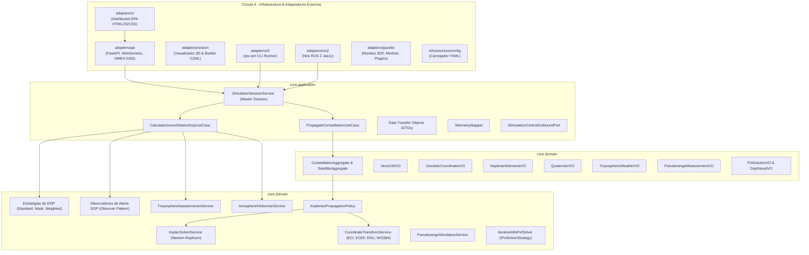
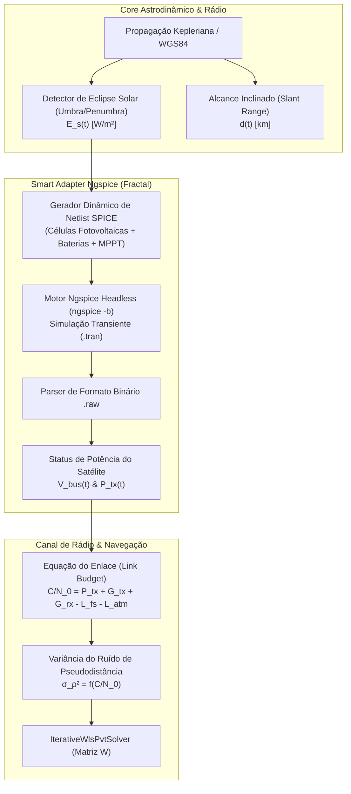

# 🏛️ Arquitetura do Sistema, Árvore do Projeto e Decisões de Design

Este documento apresenta a visão arquitetural abrangente do **Brazilian Regional Positioning System Simulator (RPS-BR)**, detalhando os princípios de separação de responsabilidades, a árvore estrutural do código-fonte, o catálogo de abstrações de domínio e os padrões de projeto de software implementados.

---

## 🎯 1. Princípios Arquiteturais Fundamentais

O projeto foi concebido sob três pilares metodológicos rigorosos:

1. **Arquitetura Hexagonal (*Ports & Adapters* - Alistair Cockburn):**
   * O **Core** de negócio é o hexágono central isolado do mundo exterior. Ele não conhece nem depende de frameworks de rede (FastAPI, WebSockets), middleware de robótica (ROS 2), motores de física (Gazebo Sim) ou bibliotecas de interface visual (Leaflet, CesiumJS).
   * As fronteiras de comunicação são delimitadas por **Portas (*Ports*)**:
     * *Driving Ports (Inbound):* Interfaces de Casos de Uso acionadas por agentes externos (REST, WebSockets, CLI, ROS 2).
     * *Driven Ports (Outbound):* Interfaces que o Core utiliza para notificar ou comandar o ambiente exterior (emissão de alertas DOP, persistência, controle de física do Gazebo).
2. **Domain-Driven Design (DDD - Eric Evans):**
   * A linguagem ubíqua reflete fielmente o jargão da astrodinâmica e da radionavegação por satélite (*Keplerian Elements*, *Slant Range*, *Line of Sight*, *Dilution of Precision*, *Tropospheric Saastamoinen Delay*, *Klobuchar EIA*).
   * Separação clara entre **Entidades**, **Agregados**, **Value Objects Imutáveis**, **Políticas de Domínio** e **Serviços de Domínio**.
3. **Design API-First & *Dogfooding*:**
   * A interface de usuário (SPA) é um cliente externo puro que consome as mesmas portas públicas de rede que qualquer outro cliente automatizado (receptores GNSS comerciais via NMEA 0183, nós ROS 2 ou agentes autônomos de IA).

---

## 🧭 2. Os Quatro Círculos Concêntricos da Arquitetura



---

## 🌲 3. Árvore do Projeto Anotada

```text
brazilian-rps-sim/
├── config/                          # Configurações declarativas da simulação
│   └── simulation_parameters.yaml   # Parâmetros orbitais dos 7 satélites, estações e relógio
├── docs/                            # Documentação técnica e científica de engenharia
│   ├── adr/                         # Architectural Decision Records formais (0001 a 0004)
│   ├── api.md                       # Especificação da API REST, WebSockets e NMEA 0183
│   ├── cli.md                       # Manual de uso e automação da CLI rps-sim
│   ├── testing.md                   # Engenharia de testes, pirâmide e tolerâncias
│   ├── quality_safety.md            # Qualidade, confiabilidade e segurança (DO-178C, ECSS)
│   ├── algorithms_complexity.md     # Análise assintótica de algoritmos e estruturas de dados
│   ├── architecture.md              # Este documento (visão arquitetural global)
│   └── index.md                     # Portal de entrada e índice mestre da documentação
├── papers/                          # [CIDADÃO DE PRIMEIRA CLASSE] Artigos científicos
│   └── sbas_brazil_journal/         # Manuscrito formal em Typst para periódicos aeroespaciais
│       ├── main.typ                 # Código-fonte do artigo em Typst
│       ├── README.md                # Instruções de compilação
│       └── paper_rps_brazil.pdf     # PDF compilado do artigo
├── rps_br/                          # Pacote Python principal da biblioteca
│   ├── core/                        # NÚCLEO PURO (Hexágono Central - Zero dependências externas)
│   │   ├── application/             # Casos de Uso, Orquestração, NoC e Governança
│   │   │   ├── dtos/                # Data Transfer Objects com tipagem estática
│   │   │   ├── interfaces/          # Portas abstratas de casos de uso (driven/driving)
│   │   │   ├── mappers/             # Mapeadores entre entidades e DTOs
│   │   │   ├── services/            # Casos de uso: SimulationSessionService, CalculateGroundStationDopUseCase
│   │   │   ├── noc/                 # [NETWORK ON CORE] Malha lógica de transporte, envelopes e canais virtuais
│   │   │   └── governance/          # [SUB-CORE DE GOVERNANÇA] Mestre do relógio, compliance e ciclo de vida
│   │   └── domain/                  # Domínio Astrodinâmico e de Radionavegação
│   │       ├── astrodynamics/       # Agregados de Satélite/Constelação, Políticas de Órbita
│   │       ├── navigation_pvt/      # Estratégias de cálculo DOP e Observadores de alerta
│   │       ├── signal_propagation/  # Modelos de retardo Saastamoinen e Klobuchar
│   │       └── shared/              # Value Objects fundamentais (Vector3D, Geodetic, Keplerian)
│   ├── adapters/                    # ADAPTADORES DE BORDA (Ports & Adapters)
│   │   ├── api/                     # Gateway Unificado de APIs (FastAPI, WebSockets, NMEA 0183)
│   │   │   ├── rest/                # Rotas RESTful modulares de telemetria e controle
│   │   │   ├── streaming/           # Loop assíncrono de streaming WebSocket a 1 Hz
│   │   │   ├── nmea/                # Gerador e emulador de sentenças NMEA 0183 ($GNGGA, etc.)
│   │   │   └── server.py            # Servidor FastAPI principal agregador
│   │   ├── ui/                      # Dashboard SPA Independente (HTML5, Tailwind, Chart.js)
│   │   ├── cesium/                  # Adaptador 3D Cesium (Builder CZML WGS84 e visualizador)
│   │   ├── cli/                     # Adaptador CLI autônomo (rps-sim)
│   │   ├── ros2/                    # Nós de temporização e tópicos de robótica em ROS 2 Jazzy
│   │   ├── gazebo/                  # Descrição de mundos SDF, modelos 3D e controle de física
│   │   └── export/                  # Exportador de séries temporais de trajetória (JSON/CSV)
│   └── infrastructure/              # INFRAESTRUTURA DE APOIO
│       └── config/                  # Carregamento e validação de arquivos YAML
├── scripts/                         # Executáveis e lançadores de conveniência
│   ├── rps-sim                      # Atalho para a CLI
│   ├── rps_constellation_node       # Executável do nó ROS 2 de dinâmica
│   └── rps_web_bridge_node          # Executável da ponte de relógio ROS 2 -> Web
├── tests/                           # SUÍTE DE TESTES AUTOMATIZADOS (78 testes no Pytest)
│   ├── integration/                 # Testes de missão de longa duração (24 horas)
│   └── unit/                        # Testes unitários particionados por domínio e adaptadores
├── dashboard.sh                     # Script shell de inicialização rápida do API Gateway
└── setup.py                         # Manifesto oficial de empacotamento Python / ROS 2
```

---

## 🎨 4. Catálogo de Padrões de Projeto (*Design Patterns*) Implementados

### A. Padrão Strategy (*Estratégia de Cálculo de DOP*)
* **Problema:** Diferentes cenários operacionais exigem diferentes métodos de seleção e ponderação de satélites para cálculo de GDOP/PDOP/HDOP/VDOP.
* **Solução:** A interface `IDopCalculationStrategy` desacopla o algoritmo de cálculo do caso de uso.
* **Estratégias Implementadas:**
  * `StandardLeastSquaresDopStrategy`: Inversão matricial de mínimos quadrados clássica.
  * `ElevationMaskDopStrategy`: Descarta satélites abaixo de um ângulo de corte ($\theta_i < \theta_{\text{mask}}$).
  * `WeightedElevationDopStrategy`: Pondera a matriz de covariância pelo seno da elevação ($\sin^2 el$).

### B. Padrão Strategy (*Solucionador de Navegação PVT*)
* **Problema:** Um receptor GNSS pode alternar entre algoritmos numéricos de posicionamento (ex: Mínimos Quadrados Simples, Mínimos Quadrados Ponderados, Filtro de Kalman Estendido - EKF, ou Factor Graphs) sem que a camada de aplicação ou casos de uso dependam da implementação matemática específica.
* **Solução:** A interface `IPvtSolverStrategy` define o contrato universal de resolução de estado $\mathbf{x} = [x, y, z, c \cdot \delta t_{\text{rx}}]^T$.
* **Estratégias Implementadas:**
  * `IterativeWlsPvtSolver`: Algoritmo iterativo de Gauss-Newton com matriz de pesos estocásticos baseada no seno da elevação e conversão geodésica WGS-84 integrada (para a formulação matemática rigorosa das equações de pseudodistância e convergência de mínimos quadrados, consulte [`docs/math_theory/pvt_least_squares.md`](math_theory/pvt_least_squares.md)).

### C. Padrão Observer (*Notificação e Alertas de Degradação de Sinal*)
* **Problema:** Quando o PDOP ultrapassa limites operacionais de aproximação aeronáutica ($PDOP > 6.0$), múltiplos subsistemas precisam ser notificados sem acoplamento direto.
* **Solução:** A classe `DopSubject` mantém uma lista de observadores (`IDopObserver`):
  * `DopAlertThresholdObserver`: Dispara alarmes quando a precisão geométrica é violada.
  * `DopLoggingObserver`: Registra eventos em logs de telemetria.
  * `DopTelemetryBufferObserver`: Armazena as amostras em buffer circular para a interface gráfica.

### D. Padrão Facade (*Fachada Modular via `__init__.py`*)
* **Problema:** Proteger consumidores de conhecerem a árvore profunda de diretórios internos e evitar quebras quando arquivos internos são refatorados.
* **Solução:** Todos os subpacotes (`core.domain.astrodynamics`, `core.domain.navigation_pvt`, `core.application.dtos`, `adapters.api`, etc.) atuam como Fachadas explícitas exportando seus símbolos públicos através de `__all__`.

### E. Padrão Singleton Thread-Safe com Lock Reentrante
* **Problema:** Garantir que rotas HTTP assíncronas do FastAPI, o laço de streaming WebSocket e os pulsos de física externa acessem uma visão unificada e atômica da simulação.
* **Solução:** As classes `TelemetryHub` e `SimulationSessionService` implementam o padrão Singleton protegido por `threading.RLock`, permitindo reentrância segura e eliminando condições de corrida.

### F. Padrão Micro-Frontend Embed (*2D Leaflet $\leftrightarrow$ 3D Cesium*)
* **Problema:** Um globo 3D WebGL (CesiumJS) consome recursos intensivos de GPU e shaders, o que provocaria travamentos e colisões na DOM se executado no mesmo escopo JavaScript que os gráficos Chart.js e tabelas do painel 2D.
* **Solução:** O visualizador Cesium roda em uma rota dedicada (`/cesium/viewer`) e é embutido na aplicação principal via `<iframe>` isolado. A troca entre a projeção 2D e o globo 3D ocorre instantaneamente apenas alternando a visibilidade dos containers, com desacoplamento total de contextos gráficos.

---

## 🧩 5. Teoria dos Adaptadores Inteligentes e Arquitetura Hexagonal Fractal

### A. A Dicotomia: *Thin Adapters* vs. *Smart Adapters*
Nem todo adaptador em uma Arquitetura Hexagonal necessita da mesma densidade estrutural. A complexidade do adaptador é estritamente proporcional à complexidade de estado do agente externo com o qual ele se comunica:

1. **Adaptadores Finos (*Thin / Passive Adapters*):**
   * Adequados para protocolos *stateless*, canais unidirecionais simples ou serializadores imediatos (ex.: exportador CSV/JSON em lote, logger textual, endpoints REST simples de leitura).
   * Operam apenas como conversores de tipos: $\text{DTO}_{\text{Core}} \to \text{Payload}_{\text{Externo}}$. Não possuem máquinas de estado, laços temporais ou ciclo de vida autônomo.
2. **Adaptadores Inteligentes (*Smart / Rich Adapters*):**
   * Mandatórios quando o sistema periférico possui **seu próprio relógio de execução, ciclo de vida de nós, concorrência interna ou restrições rígidas de sincronismo** (ex.: CesiumJS com WebGL render loop, Gazebo Sim com motor físico ODE/OGRE 2, ROS 2 com DDS/rmw e Ngspice com solver transiente analógico).
   * Um adaptador fino falha perante esses sistemas porque o sistema externo tem vida própria e tenderá a divergir silenciosamente (como observado quando o Cesium animava órbitas com a simulação pausada).

### B. A Estrutura em Três Camadas de um *Smart Adapter*
Para evitar que a complexidade do mundo externo contamine o Core e garantir que os contratos sejam respeitados, o *Smart Adapter* decompõe-se internamente em três camadas:

```text
[ Core do Sistema (Domínio & Casos de Uso) ]
                     ▲
                     │ Porta Soberana (IClockPort, ITelemetryPort, IControlPort)
                     ▼
┌─────────────────────────────────────────────────────────────┐
│                 ADAPTADOR INTELIGENTE (SMART ADAPTER)        │
│                                                             │
│  1. Adapter Application Layer                               │
│     ├── Orquestrador de Ciclo de Vida (Init / Teardown)     │
│     ├── Gerenciador de Sincronismo Temporal & Anti-Deriva  │
│     ├── Detecção de Pausa & Watchdogs de Heartbeat          │
│     └── Tradutor de Intenção e Comandos de Controle         │
│                                                             │
│  2. Adapter Domain Layer                                    │
│     ├── Modelo Conceitual do Protocolo Externo              │
│     │   (Ex: Netlist AST no Ngspice, Scene Graph no Cesium, │
│     │    QoS Profiles no ROS 2, Sentenças NMEA 0183)        │
│     └── Invariantes & Validações da Tecnologia Específica   │
│                                                             │
│  3. Adapter Driver / Transport Layer                        │
│     ├── Sockets Web (WebSocket / TCP / UDP)                 │
│     ├── Subprocess IPC (stdio pipes / POSIX signals)        │
│     └── Bindings C++/Middleware (rclpy / DDS)               │
└─────────────────────────────────────────────────────────────┘
                     ▲
                     ▼
[ Sistema ou Engine Externa (CesiumJS, Gazebo, ROS 2, Ngspice) ]
```

* **Adapter Application Layer:** Responsável por governar a ponte de controle entre a sessão do Core e a sessão externa. Implementa políticas de tolerância a falhas, reconexão, amortecimento de jitter de rede e sincronização de relógio.
* **Adapter Domain Layer:** Representa a ontologia da tecnologia externa. O Core de radionavegação não deve conhecer o que é uma *directive `.tran`*, um *nó SPICE*, um *pacote CZML* ou um *perfil de QoS Transient Local*. Esse vocabulário pertence legitimamente ao Domínio do Adaptador.
* **Adapter Driver / Transport Layer:** O código de baixo nível que lida com I/O de rede, pipes de sistema operacional ou chamadas nativas C/C++.

### C. A Natureza Fractal da Arquitetura Hexagonal (*Fractal Hexagons*)
Conforme formulado por Alistair Cockburn, a Arquitetura Hexagonal é **recursiva e fractal**:
> *"Cada hexágono representa um Bounded Context. Ao ampliarmos uma das arestas (um Adaptador), descobrimos no seu interior um outro hexágono completo."*

O adaptador não é um mero script "colado" na borda; ele é um **micro-sistema autônomo** com suas próprias portas internas:
* Uma porta interna voltada para a aplicação do Core;
* Seu próprio domínio de protocolo/tecnologia;
* Portas de saída secundárias conectadas aos drivers de comunicação física.

Essa separação fractal impede o vazamento de abstrações (*leaky abstractions*), permitindo substituir, por exemplo, o CesiumJS por Unreal Engine 5, ou o Ngspice por Xyce/LTspice, sem alterar uma única linha do Core do RPS-BR.

### D. Regulação Temporal Formal (Conformidade com IEEE 1516 / HLA)
Para simulações distribuídas em engenharia aeroespacial, o tempo não é um parâmetro trivial de transporte. Adotamos os princípios da norma **IEEE 1516 (High Level Architecture - HLA)**:
* **Time-Regulating Entity:** O Core atua como regulador soberano do relógio virtual em modo *Standalone*.
* **Time-Constrained Entity:** Todos os *Smart Adapters* de visualização ou co-simulação (Cesium, Dashboard, Displays) são entidades estritamente restritas pelo tempo, proibidas de avançar o estado sem a respectiva autorização temporal (*Time Advance Grant*).
* **Master Co-Simulation Mode:** Quando o Gazebo Sim é ativado, o Gazebo assume temporariamente a regulação da física de corpo rígido, transmitindo pulsos `/clock` que o Core ingere e redistribui para os demais federados escravos.

### E. O Antipadrão do "Adaptador de Utilidades" e Acoplamento Lateral (*Cross-Adapter Coupling*)
Em grandes projetos de engenharia de software, surge com frequência a tentação de consolidar múltiplas pequenas rotinas de suporte (parsers auxiliares, conversores de formato, cálculo de checksums, manipuladores de string) em um único "Adaptador de Utilidades" (*Utility/Common Adapter*). Essa prática é um **antipadrão grave** na Arquitetura Hexagonal:

1. **Violação do Princípio da Responsabilidade Única (SRP) e Contratos de Portas:**
   * Cada porta do Core expressa uma intenção de negócio coesa (ex.: `ITelemetryExportPort`, `ISerialLogPort`, `IClockPort`).
   * Um adaptador "faz-tudo" implementa portas díspares ou expõe interfaces genéricas sem coesão semântica, transformando-se em uma *God Class* (*Blob*).
   * Ele acopla desnecessariamente dependências externas heterogêneas (ex.: bibliotecas de rede, parsers XML, drivers seriais) em consumidores que precisavam de apenas uma função pontual.
2. **A Regra de Ouro sobre Acoplamento Lateral (*Adapter-to-Adapter*):**
   * **Adaptadores nunca devem depender diretamente de outros adaptadores.** Se o adaptador ROS 2 importar diretamente classes internas do adaptador FastAPI/REST, cria-se uma malha de dependências cruzadas que destrói a modularidade hexagonal.
   * Se dois ou mais adaptadores necessitam de lógica compartilhada (ex.: conversão de coordenadas, rotinas matemáticas, serialização NMEA comum), essa lógica deve residir em:
     * **`infrastructure/common` ou `infrastructure/utils`:** Para utilitários técnicos puros e sem estado (*Shared Kernel* de infraestrutura);
     * **`core/domain/shared`:** Se a função representar uma regra de cálculo, invariante matemática ou conversão de unidades do domínio aeroespacial.

### F. Taxonomia e Níveis de Complexidade de Adaptadores (Nível 1 a Nível 3)
A decomposição interna de um adaptador segue o princípio da proporcionalidade, categorizando-se em três níveis de maturidade arquitetural:

| Nível de Maturidade | Classificação | Camada de Aplicação do Adaptador | Camada de Domínio do Adaptador | Casos de Uso Típicos |
| :--- | :--- | :--- | :--- | :--- |
| **Nível 1** | **Thin / Direct Adapter** | **Inexistente:** Apenas função/método de tradução direta ($\text{DTO} \to \text{Payload}$). | **Inexistente:** Sem conceitos ontológicos locais. | Exportador CSV, gravador de logs stdout, endpoint REST simples de leitura. |
| **Nível 2** | **Smart / Composite Adapter** | **Presente (4 Elementos Canônicos):** Application Service, DTOs locais, Mappers e Interfaces de Driver. | **Leve / Parcial:** Value Objects de protocolo e enums de estado (sem agregados pesados). | Cesium Viewer (`CesiumClockSynchronizer`, `JulianDateVO`), Dashboard WebSocket Hub. |
| **Nível 3** | **Fractal / Autonomous Engine Adapter** | **Completa (4 Elementos):** Orquestrador de transientes, buffers de sincronismo, observadores e tratadores de erro. | **Rica (Elementos Táticos DDD):** Agregados de tecnologia (ex: `SpiceCircuitAggregate`), Entidades, VOs, Domain Services e Factories. | Co-simulador Ngspice, simuladores SDR (Software-Defined Radio), bridges robóticas avançadas. |

#### A Composição Canônica da *Adapter Application Layer*
Quando um adaptador atinge o Nível 2 ou 3, sua camada de aplicação reproduz de fato a mesma estrutura em 4 elementos canônicos da camada de aplicação do Core:
1. **Adapter Application Services:** Orquestram a seqüência de execução local (ex.: `NgspiceCoordinatorService`, `CesiumClockSyncService`).
2. **Adapter DTOs:** Estruturas de dados próprias da tecnologia externa (ex.: `SpiceTransientOutputDTO`, `CesiumFrameStateDTO`), blindando o Core contra peculiaridades do protocolo.
3. **Adapter Mappers:** Conversores bidirecionais estritos ($\text{Core DTO} \longleftrightarrow \text{Adapter DTO}$), assegurando que evoluções nas APIs de bibliotecas externas não afetem o Core.
4. **Adapter Driver Interfaces:** Portas internas do próprio adaptador (ex.: `INgspiceProcessDriver`), permitindo testar a lógica do adaptador com mocks sem disparar processos no sistema operacional.

#### É Necessário Replicar Todos os Elementos Táticos no *Adapter Domain*?
**Não.** A existência de um *Adapter Domain* não significa copiar cegamente os padrões de DDD por burocracia sintática (*Dogmatismo vs. Pragmatismo*). 
* Elementos como **Agregados, Entidades e Repositórios** só devem ser criados no domínio do adaptador quando a tecnologia externa tiver um **modelo de dados estruturado e mutável** (como o grafo de uma netlist de circuito no Ngspice ou o grafo de nós de cena em uma engine 3D).
* Para a maioria dos adaptadores de Nível 2, **Value Objects imutáveis e Serviços de Domínio puros** (ex.: validadores de sintaxe de pacote, cálculos de deriva temporal) são mais do que suficientes para garantir robustez sem incorrer em sobre-engenharia (*YAGNI - You Aren't Gonna Need It*).

### G. A Camada de Driver / Transporte do Adaptador (*Adapter Driver / Transport Layer*)
A terceira camada de um *Smart Adapter* é a **fronteira física de contato com o ambiente hospedeiro**. Ela é responsável por interagir diretamente com o Sistema Operacional, protocolos de rede de baixo nível, bibliotecas C nativas ou hardware físico.

```text
┌─────────────────────────────────────────────────────────────┐
│                 ADAPTER APPLICATION LAYER                   │
│         (Orquestração, Máquina de Estados, Mappers)         │
└──────────────────────────────┬──────────────────────────────┘
                               │
               usa interface   ▼
┌─────────────────────────────────────────────────────────────┐
│              INTERFACE DE DRIVER (Porta Interna)            │
│               ex: INgspiceProcessDriver                     │
└──────────────────────────────┬──────────────────────────────┘
                               │
         implementada por      ▼
┌─────────────────────────────────────────────────────────────┐
│           ADAPTER DRIVER / TRANSPORT IMPLEMENTATION         │
│  ┌───────────────────────────────────────────────────────┐  │
│  │ 1. Gestão de Processos & Sinais POSIX (SIGTERM/KILL)  │  │
│  │ 2. Streams Assíncronos sem Deadlock (stdin/stdout)    │  │
│  │ 3. Timeouts Rígidos de Execução (Evita Hangs de CPU)  │  │
│  │ 4. Memória Compartilhada / I/O em /dev/shm            │  │
│  └───────────────────────────────────────────────────────┘  │
└─────────────────────────────────────────────────────────────┘
                               │
                               ▼
              [ Binário Externo / SO / Hardware ]
```

#### Princípios de Engenharia da Camada de Driver:
1. **Inversão de Dependência Interna (DIP):**
   * A camada de aplicação do adaptador nunca deve invocar diretamente funções como `subprocess.Popen()`, `socket.connect()` ou chamadas de sistema operacional. Ela sempre consome uma interface abstrata (ex.: `INgspiceProcessDriver` ou `IWebSocketTransportDriver`).
2. **Testabilidade Hermética com Mocks de Driver:**
   * Graças à interface de driver, é possível executar testes unitários do adaptador em milissegundos injetando um `InMemoryMockNgspiceDriver`, sem necessitar do binário compilado do Ngspice instalado no ambiente de CI/CD e sem criar arquivos reais em disco.
3. **Resiliência e Salvaguardas em Nível de SO:**
   * **Prevenção de *Pipe Deadlocks*:** Leitura e escrita assíncronas via streams não-bloqueantes (`asyncio.StreamReader/StreamWriter`), impedindo que o processo filho trave por saturação do buffer de saída do SO ($64\text{ KB}$ padrão Linux).
   * **Timeouts Rígidos:** Toda invocação externa é protegida por um temporizador máximo (ex.: $2.0\text{ s}$). Se o solver externo entrar em laço infinito de convergência, o driver despacha um `SIGTERM` seguido de `SIGKILL`.
   * **I/O Otimizado em RAM:** Netlists e arquivos de resultados transientes são gravados preferencialmente em diretórios de memória compartilhada (`/dev/shm` ou `tmpfs`), evitando desgaste de SSD e latências de disco.

---

## ⚡ 6. Subsistema de Co-Simulação Eletrônica com Ngspice

### A. Conveniência e Relevância do Ngspice para o Projeto RPS-BR
O **Ngspice** é o simulador de circuitos analógicos, digitais e de sinais mistos em nível de componentes (*SPICE*) padrão da indústria e da academia. Em uma missão aeroespacial de posicionamento regional como o RPS-BR, o Core governa a cinemática de alto nível e a geometria de sinal, mas a **física do hardware embarcado no satélite e nas estações terrestres** exige fidelidade eletroeletrônica:



### B. Os Três Pontos Críticos de Integração Elétrica
1. **Subsistema de Energia Elétrica (EPS - Electrical Power System):**
   * **Cenário Físico:** Durante as passagens dos 4 satélites IGSO e 3 GEO pela sombra da Terra (eclipses de equinócio), os painéis solares deixam de produzir corrente ($I_{\text{pv}} \to 0$). O barramento primário passa a ser alimentado exclusivamente pelos bancos de baterias de Lítio.
   * **Papel do Ngspice:** Simulação do circuito conversor chaveado Buck/Boost, regulação MPPT e cinética eletroquímica equivalente da bateria ($R_{\text{int}}, C_{\text{cap}}$). O Ngspice calcula a queda de tensão no barramento $V_{\text{bus}}(t)$.
2. **Amplificador de Alta Potência da Carga Útil (Payload HPA / SSPA):**
   * **Cenário Físico:** Se a tensão do barramento $V_{\text{bus}}$ sofre subtensão durante um eclipse severo, os amplificadores de potência de RF em banda L perdem ponto de quiescência, reduzindo a potência efetiva isotrópica radiada (EIRP).
   * **Papel do Ngspice:** Simulação transiente não-linear do estágio de potência RF. A potência real de saída $P_{\text{tx}}(t)$ é re-injetada no Core para atualizar a relação portadora-ruído $C/N_0$ e a matriz estocástica de pesos do solver PVT.
3. **Front-End Analógico do Receptor Terrestre (LNA & Filtros RF):**
   * **Cenário Físico:** Na estação de monitoramento de solo (ex.: ITA / São José dos Campos), o sinal chega na antena com potência de apenas $\approx -160\text{ dBW}$. O front-end precisa amplificar com baixíssimo ruído.
   * **Papel do Ngspice:** Modelagem da figura de ruído ($NF$), ruído térmico de Johnson-Nyquist ($4 k_B T B$) e resposta em frequência do filtro passa-faixa em banda L1/L5.

### C. A Aplicação dos 8 Elementos Táticos de Domínio no Adaptador Ngspice
Como um **Smart Adapter de Nível 3 (Fractal)**, o adaptador do Ngspice implementa de forma completa os 8 elementos do Domain-Driven Design para governar a ontologia de circuitos e simulação de hardware:

1. **Agregados (*Aggregates*):**
   * `SatelliteCircuitAggregate`: Raiz de consistência do circuito elétrico do satélite. Encapsula o grafo de conexões (painéis, baterias, reguladores e transmissor). Garante o invariante elétrico fundamental: existência obrigatória de um nó terra de referência comum (nó 0) e ausência de nós flutuantes que causariam singularidade na matriz nodal do SPICE ($G \cdot V = I$).
2. **Entidades (*Entities*):**
   * `CircuitNodeEntity`: Representa os nós de interconexão com identidade única (ex.: nó `BUS_28V`, nó `BAT_POS`). Seu estado (tensão instantânea) evolui a cada passo, mas sua identidade na netlist permanece imutável.
   * `SpiceComponentEntity`: Componentes físicos com parâmetros individuais (ex.: transistor GaN `Q_HPA_1`, célula de bateria `CELL_BATT_3`).
3. **Objetos de Valor (*Value Objects - VOs*):**
   * `ResistanceVO`, `CapacitanceVO`, `InductanceVO`: VOs imutáveis com validação de grandezas físicas e unidades no `__post_init__` (rejeitando valores nulos ou negativos incoerentes).
   * `SpiceDirectiveVO`: Representa comandos de controle de simulação (ex.: `.tran 10u 1s`, `.options reltol=0.001`).
   * `TransientResultVO`: Amostra temporal congelada de tensões de nós e correntes de ramos resultante da execução do solver.
4. **Serviços de Domínio (*Domain Services*):**
   * `NetlistTopologicalValidatorService`: Analisa a topologia do circuito antes da execução para detectar malhas fechadas de fontes de tensão ideais ou ramos indutivos em aberto.
   * `TransientStepCalculatorService`: Calcula o passo máximo de integração ($\Delta t_{\max} \le \frac{1}{10 f_{\text{sw}}}$) baseado na frequência de chaveamento do regulador para assegurar estabilidade numérica no integrador trapezoidal do SPICE.
5. **Especificações (*Specifications* - Padrão Specification):**
   * `BatteryUnderVoltageSpecification`: Verifica se a curva de descarga da bateria violou a margem de segurança operacional ($V_{\text{bus}} < 22.0\text{ V}$).
   * `ThermalOperatingLimitSpecification`: Avalia se a dissipação de potência de pico no transistor de RF ultrapassa o limite térmico de junção ($T_j > 150^\circ\text{C}$).
6. **Políticas de Domínio (*Policies*):**
   * `BatteryDegradationPolicy`: Modela o envelhecimento da bateria, incrementando a resistência interna equivalente ($R_{\text{int}}$) a cada ciclo térmico de eclipse completado na órbita.
   * `SolverConvergenceRemediationPolicy`: Se o Ngspice falhar com erro de "Timestep too small", esta política comuta o algoritmo de integração numérica de `TRAP` (trapezoidal) para `GEAR` e ajusta as tolerâncias de condutância `gmin` dinamicamente.
7. **Eventos de Domínio (*Domain Events*):**
   * `BatteryDepletionWarningEvent`: Disparado internamente no domínio do adaptador quando a bateria atinge $80\%$ de profundidade de descarga (*DoD*).
   * `PayloadUnderVoltageEvent`: Disparado quando a tensão do barramento afeta a linearidade do transmissor.
   * *Mapeamento:* A camada de aplicação do adaptador captura esses eventos e os traduz para DTOs de alarme despachados ao Core de controle da missão.
8. **Fábricas (*Factories*):**
   * `SatelliteCircuitFactory`: Constrói proceduralmente o agregado `SatelliteCircuitAggregate` a partir das condições de irradiância solar $E_s(t)$ e temperatura fornecidas pelo Core, instanciando os modelos elétricos adequados para satélites GEO (plataformas de alta potência) ou IGSO.

### D. A Camada de Driver do Ngspice
O acesso ao motor SPICE é blindado pela interface `INgspiceProcessDriver`:
* `AsyncSubprocessNgspiceDriver`: Implementação de produção que gerencia a invocação do executável `ngspice -b` via processos assíncronos POSIX, redireciona o binário `.raw` para `/dev/shm` e faz o parse vetorial em C/NumPy em tempo real;
* `InMemoryMockNgspiceDriver`: Implementação de teste hermético que emula as respostas transientes sem depender da presença do binário Ngspice no ambiente de desenvolvimento ou CI/CD.

### E. Orquestração Multi-Agente Autônoma (Integração AutoGen + LangGraph)
Esta arquitetura fractal viabiliza a orquestração por agentes autônomos de Inteligência Artificial:
* **AutoGen (Camada Operacional / Tool-Use):** Agentes de engenharia elétrica especializados (ex.: *CircuitDesignerAgent*, *SpiceSimulationAgent*, *DiagnosticsAgent*) realizam síntese de circuitos, dimensionamento de componentes e análise de convergência numérica em netlists SPICE.
* **LangGraph (Camada de Governança e Grafo Cíclico):** Implementa a máquina de estados determinística da missão:
  $$\text{Passo Orbital (Core)} \longrightarrow \text{Avaliação de Eclipse} \longrightarrow \text{Disparo Ngspice} \longrightarrow \text{Telemetria Elétrica} \longrightarrow \text{Balanço de Link RF}$$
  Caso ocorra anomalia elétrica (ex.: subtensão crítica de bateria no Ngspice), o LangGraph comuta a constelação para modo de sobrevivência (*Safe Mode*), desliga cargas secundárias e notifica o operador via alertas da Camada de Aplicação do Core.

---

## 🌐 7. A Malha de Transporte de Alto Nível: O Paradigma Network on Core (NoC)

### A. Desmistificando o NoC em Software (Da Microeletrônica à Engenharia de Software)
No projeto **Vanguard** e na concepção de sistemas ciber-físicos aeroespaciais avançados, o conceito de **Network on Core (NoC)** importa o princípio de *Network on Chip* da microeletrônica moderna para resolver um gargalo arquitetural crítico:
* Em circuitos integrados de muitos núcleos (MPSoCs), o NoC substituiu os barramentos compartilhados e as trilhas dedicadas ponto-a-ponto porque a proliferação de conexões gerava contenção, acoplamento físico e capacitância parasita.
* No software de grande porte, o problema é estruturalmente idêntico:
  * À medida que o sistema cresce para comportar dezenas de *Smart Adapters* (CesiumJS, Gazebo Sim, Ngspice, NMEA 0183, REST Gateway, CLI, Agentes de IA), se cada adaptador exigir portas ponto-a-ponto acopladas com o Core ou entre si, o sistema degenera em uma malha espaguete incontrolável ($O(N^2)$ dependências cruzadas).
  * O **NoC (Network on Core)** é o **middleware e malha de transporte de alto nível do ecossistema de software**, responsável por rotear eventos, comandos e telemetria através de envelopes universais, roteadores semânticos, árbitros de QoS e canais virtuais segregados.

### B. Distinção de Fronteira: NoC (Alto Nível / Intra-Sistema) vs. Adapter Driver (Baixo Nível / Periférico)
O NoC e a *Adapter Driver Layer* não concorrem nem se anulam; **eles atuam em escalas e fronteiras complementares**:

```text
┌─────────────────────────────────────────────────────────────────────────────┐
│                    CORE DO SISTEMA (DOMÍNIO & CASOS DE USO)                 │
└──────────────────────────────────────┬──────────────────────────────────────┘
                                       │ Soquete NI (Network Interface)
                                       ▼
═══════════════════════════════════════════════════════════════════════════════
  NoC (NETWORK ON CORE) - MALHA DE TRANSPORTE DE ALTO NÍVEL (INTRA-SISTEMA)
  - Envelope de Roteamento (MissionPacket / Header: Src, Dest, Priority, VC)
  - Logical Router (Roteamento Semântico baseado em intenção)
  - Arbiter & QoS (Prioridades estritas para evitar Head-of-Line Blocking)
  - Virtual Channels (VC-Control, VC-Telemetry, VC-CoSimulation)
  - Fast-Path Bypass (Latência Zero para chamadas in-process críticas)
═══════════════════════════════════════════════════════════════════════════════
        ▲                                                     ▲
        │ Soquete NI                                          │ Soquete NI
        ▼                                                     ▼
┌──────────────────────────────────┐        ┌──────────────────────────────────┐
│   SMART ADAPTER 1 (Ex: Cesium)   │        │   SMART ADAPTER 2 (Ex: Ngspice)  │
│                                  │        │                                  │
│  1. Adapter Application Layer    │        │  1. Adapter Application Layer    │
│  2. Adapter Domain Layer (CZML)  │        │  2. Adapter Domain Layer (Netlist│
│                                  │        │                                  │
│  3. Adapter Driver / Transport   │        │  3. Adapter Driver / Transport   │
│     (TRANSPORTE DE BAIXO NÍVEL   │        │     (TRANSPORTE DE BAIXO NÍVEL   │
│      COM O PERIFÉRICO EXTERNO)   │        │      COM O PERIFÉRICO EXTERNO)   │
│      - Sockets WebSocket / WebGL │        │      - Subprocess POSIX pipes /  │
│        Context Canvas Driver     │        │        I/O em /dev/shm Driver    │
└────────────────┬─────────────────┘        └────────────────┬─────────────────┘
                 │                                           │
                 ▼                                           ▼
      [ Navegador / Tela 3D ]                      [ Binário /usr/bin/ngspice ]
```

1. **O NoC é o Transporte Lógico de Alto Nível (Intra-Sistema / Lógica de Malha):**
   * Situa-se **dentro do ecossistema de software**, conectando os *Bounded Contexts* (Fractais) e *Smart Adapters* entre si e com o Core;
   * Padroniza a comunicação via envelopes estruturados (`MissionPacket` / `GoldenPacket`), blindando os componentes contra detalhes de implementação vizinhos;
   * Evita o acoplamento lateral (*cross-adapter coupling*): dois adaptadores podem colaborar sem que um importe o código do outro, interagindo exclusivamente através da malha do NoC;
   * Previne a contenção (*Head-of-Line Blocking*) através de **Canais Virtuais**: uma simulação transiente pesada do Ngspice rodando no canal de co-simulação não retém nem atrasa os batimentos críticos do relógio de controle no canal de controle.
2. **A Adapter Driver Layer é o Transporte Físico de Baixo Nível (Periférica / "PHY"):**
   * Situa-se **na extremidade exterior de cada Smart Adapter individual**;
   * É responsável por falar com o "mundo exterior" que não entende o protocolo do NoC (ex.: streams de bytes stdin/stdout de um executável C em `/usr/bin/ngspice`, chamadas WebGL com a GPU no navegador, portas seriais UART físicas ou o barramento DDS do ROS 2).

### C. Os Cinco Pilares Estruturais do NoC em Software
1. **Envelope de Pacote (`MissionPacket`):**
   * Encapsula a mensagem com metadados universais de transporte: `source_id`, `destination_id`, `priority` (0 a 7), `virtual_channel`, `timestamp` e `payload`.
2. **Network Interface (NI):**
   * O "soquete" formal de acoplamento. O Core e os adaptadores apenas enxergam a NI, depositando e recebendo pacotes sem conhecer a topologia da malha.
3. **Logical Router:**
   * Motor de despacho semântico que entrega pacotes baseado em intenção (*Point-to-Point* para comandos específicos ou *Publish/Subscribe* para fluxos de telemetria contínua).
4. **Arbiter & QoS (Garantia de Qualidade de Serviço):**
   * Árbitro de tráfego com escalonamento por prioridade estrita. Mensagens de controle de emergência ou pausa imediata furam a fila de pacotes analíticos secundários.
5. **Canais Virtuais (Virtual Channels - VCs) e Fast-Path:**
   * **VC-Control:** Canal prioritário de alta garantia para pulsos de relógio, sinais de sincronismo IEEE 1516 e comandos de pausa/retomada;
   * **VC-Telemetry:** Canal de streaming contínuo para métricas orbitais, DOP e atrasos atmosféricos (1 Hz a 10 Hz);
   * **VC-CoSimulation:** Canal assíncrono para intercâmbio de dados pesados e simulações transientes (Ngspice, modelos térmicos);
   * **Fast-Path (Crossbar Virtual de Latência Zero):** Para trechos críticos de alta performance em que emissor e receptor residem no mesmo processo in-memory (ex.: propagação orbital consumida diretamente pelo solver PVT), a NI efetua o *bypass* da serialização e invoca a função destino em linha, atingindo latência zero com máxima velocidade de CPU.

### D. Unificação da Interface de Rede no NoC: A Arquitetura em Duas Camadas (Pilha Lógica vs. Pilha de Enlace)
A fragmentação da comunicação ocorre quando cada adaptador estabelece contratos ad-hoc e protocolos heterogêneos para conversar com o Core (ex.: um adaptador expõe callbacks síncronos, outro usa RPC assíncrono, outro compartilha referências mutáveis em memória e outro consome sockets diretamente). 

Para **desfragmentar a responsabilidade e padronizar o ecossistema**, o NoC atua como a **Interface Unificada de Comunicação**, organizada internamente em duas camadas concêntricas bem delimitadas:

```text
┌─────────────────────────────────────────────────────────────────────────────┐
│                       DOMÍNIO & CASOS DE USO DO CORE                        │
└──────────────────────────────────────┬──────────────────────────────────────┘
                                       │ INetworkInterface
                                       ▼
┌─────────────────────────────────────────────────────────────────────────────┐
│ 1. CAMADA DE ALTO NÍVEL (LÓGICA / SEMÂNTICA - NETWORK ON CORE MESH)         │
│    - Roteamento Semântico e Resolução de Destino por Intenção               │
│    - Envelope Universal MissionPacket / GoldenPacket                        │
│    - Gestão de Canais Virtuais (VC-Control, VC-Telemetry, VC-CoSimulation)  │
│    - Arbitragem de Prioridades (QoS 0 a 7, Prevenção de Head-of-Line Blocking│
│    - Filtros de Interceptação e Governança de Contrato                     │
└──────────────────────────────────────┬──────────────────────────────────────┘
                                       │ ILinkDriver (Inversão de Dependência)
                                       ▼
┌─────────────────────────────────────────────────────────────────────────────┐
│ 2. CAMADA DE BAIXO NÍVEL (ENLACE / TRANSPORTE CONCRETO - LINK DRIVERS)      │
│    ┌────────────────────────┬───────────────────────┬─────────────────────┐ │
│    │ MemoryLinkDriver       │ ShmIpcLinkDriver      │ NetworkLinkDriver   │ │
│    │ (In-Process Fast-Path, │ (POSIX Pipes,         │ (WebSocket, DDS/    │ │
│    │  Zero-Copy, asyncio)   │  /dev/shm, Shared Mem)│  ROS 2, TCP, gRPC)  │ │
│    └────────────────────────┴───────────────────────┴─────────────────────┘ │
└──────────────────────────────────────┬──────────────────────────────────────┘
                                       │ Sockets / Pipes / Buffers Físicos
                                       ▼
                    [ Mundo Exterior / Processos / SO ]
```

1. **A Camada Superior (Lógica / Semântica - Network Layer):**
   * Exposta a todos os nós do sistema através do contrato puro `INetworkInterface`.
   * Fornece primitivas semânticas de comunicação: `send_packet(packet)`, `request(query) -> response`, `subscribe(channel, listener)`.
   * Desconhece completamente se o destinatário está rodando na mesma thread, em um sub-processo C++ separado ou em uma máquina remota.
   * Assegura as garantias de qualidade de serviço (QoS), priorização estrita de pacotes de controle sobre pacotes de telemetria e o isolamento de canais virtuais.

2. **A Camada Inferior (Enlace / Transporte Físico - Link Driver Layer):**
   * Implementa a interface `ILinkDriver` para viabilizar o transporte físico concreto.
   * Desacopla o mecanismo de I/O da semântica de rede:
     * **In-Process Memory Driver (Fast-Path):** Utilizado quando emissor e receptor compartilham o mesmo espaço de endereçamento (ex.: Core e solver WLS PVT). O pacote é transferido por referência imutável ou fila thread-safe em memória, alcançando latência de nanossegundos e *zero-copy*.
     * **POSIX / Shared Memory Driver (`/dev/shm`):** Utilizado para isolar adaptadores de processos externos intensivos (ex.: binário Ngspice ou parsers C++), garantindo alta vazão sem sobrecarregar a rede do sistema operacional.
     * **Network / Protocol Driver:** Utilizado para atravessar a fronteira do processo ou da rede física (ex.: WebSockets para o CesiumJS no navegador, DDS para nós ROS 2, ou TCP/IP para estações de solo remotas).

---

### E. A Dicotomia Vanguard: NoC Passivo (Local) vs. NoC Ativo (Centralizado)
Na concepção original do ecossistema **Vanguard** (*Hexágono Dourado*), o NoC foi idealizado em duas modalidades estruturais distintas, correspondendo a diferentes níveis de escala, acoplamento e maturidade do sistema:

| Dimensão Arquitetural | NoC Passivo (Descentralizado / Local) | NoC Ativo (Centralizado / Vanguard Kernel) |
| :--- | :--- | :--- |
| **Natureza de Execução** | Reativa (*Event-Driven* / Sob Demanda) | Proativa (*Active Supervisor Daemon*) |
| **Ciclo de Fundo (Daemon)** | Inexistente (Zero consumo de CPU em repouso) | Execução contínua com relógio de supervisão |
| **Determinismo Temporal** | Absoluto (reprodutibilidade estrita em testes) | Estocástico / Adaptativo ao tráfego de rede |
| **Escopo Primário** | Nó local, simulações monoprocesso ou IPC | Federação multi-nó, multi-máquina e distribuída |
| **Latência Típica** | Latência Zero / Nanosegundos (*In-Process*) | Milissegundos (sobrecarga de rede e telemetria) |
| **Governança e Compliance** | Interceptores síncronos em pipeline | Árbitro centralizado permanente e dinâmico |
| **Adequação ao RPS-BR Atual** | **Excelente (Modelo Recomendado)** | Complexidade desnecessária para simulação local |

#### 1. NoC Passivo (Local / Descentralizado / Autônomo)
* **Princípio Operacional:** O NoC Passivo é uma malha reativa embutida (*in-library / event-driven*). Ele **não executa um daemon ou thread de fundo contínua** quando não há mensagens em trânsito.
* **Mecanismo de Despacho:** O fluxo de dados só ocorre quando um nó chama explicitamente `send_packet()` na `INetworkInterface` ou quando um ciclo de simulação avança. A entrega para os inscritos ocorre de maneira imediata e determinística através de filas prioritárias locais ou invocações diretas de callbacks protegidos.
* **Por que é o modelo ideal para a fase atual do RPS-BR?**
  1. **Determinismo Temporal Rígido:** Não há condições de corrida (*race conditions*) provocadas por escalonadores externos imprevisíveis. Uma simulação orbital passo a passo ($t_0, t_1, \dots, t_n$) produz exatamente o mesmo resultado bit-a-bit em qualquer máquina.
  2. **Testabilidade Hermética:** Facilita a execução de suítes de testes unitários (`pytest`) em milissegundos, sem necessidade de levantar servidores de mensageria, brokers RabbitMQ/Kafka ou daemons de background.
  3. **Eficiência e Sobrecarga Zero:** Sem ociosidade de CPU, ideal para ambientes embarcados ou execuções locais de alto desempenho.

#### 2. NoC Ativo (Centralizado / Orquestrado pelo Vanguard Kernel)
* **Princípio Operacional:** O NoC Ativo possui uma entidade orquestradora centralizada em execução permanente (*Active Mesh Supervisor* ou *Vanguard Orchestrator*), que roda seu próprio relógio de supervisão.
* **Capacidades Avançadas:**
  1. **Supervisão Contínua e Heartbeats:** Monitora ativamente o pulso de vida de cada subsistema conectado. Se um nó travar ou entrar em loop infinito, o supervisor detecta a ausência de batimento e aplica medidas de quarentena.
  2. **Controle Dinâmico de Congestionamento:** Aplica *backpressure* proativo, modulando a taxa de emissão de adaptadores barulhentos antes que os buffers de canais virtuais transbordem.
  3. **Roteamento Dinâmico Adaptativo:** Capaz de reconfigurar caminhos de pacotes em tempo de execução caso um enlace físico ou nó intermediário falhe.
  4. **Gestão de Federação Distribuída:** Orquestra a sincronização entre múltiplos processos, contêineres e nós computacionais geograficamente distribuídos.

#### 3. O Caminho de Transição: "Construir Passivo, Preparar para Ativo"
A engenharia de software de alta resiliência recomenda que o sistema **nasça como um NoC Passivo robusto**, dotado de contratos de interface estritos. Quando o ecossistema Vanguard for ativado:
* O nó local do RPS-BR continua executando seu NoC Passivo internamente com máxima performance.
* Um adaptador especializado (**NoC Gateway / Vanguard Uplink**) conecta a malha local ao NoC Ativo da Vanguard, integrando o simulador à federação global sem exigir a alteração de uma única linha de código do Domínio Kepleriano ou dos algoritmos de navegação.

---

### F. Localização Arquitetural do NoC e o Papel do Sub-Core de Governança
Uma dúvida recorrente em projetos que adotam o Paradigma Hexagonal diz respeito a onde posicionar a malha de rede e os órgãos de controle.

```text
┌─────────────────────────────────────────────────────────────────────────────┐
│                              SISTEMA RPS-BR                                 │
│                                                                             │
│  ┌───────────────────────────────────────────────────────────────────────┐  │
│  │ SUB-CORE DE GOVERNANÇA (O "PODER JUDICIÁRIO")                         │  │
│  │ - Validação Constitucional de Contratos e Schemas                     │  │
│  │ - Mestre do Relógio e Ciclo de Vida da Missão                         │  │
│  │ - Gestão de Estados Globais (INIT, RUN, PAUSE, SAFE_MODE, TEARDOWN)   │  │
│  │ - Auditoria, Rastreabilidade e Políticas de Sanção                    │  │
│  └──────────────────────────────────┬────────────────────────────────────┘  │
│                                     │ Interceptação / Veto                  │
│  ┌──────────────────────────────────┴────────────────────────────────────┐  │
│  │ CAMADA DE APLICAÇÃO DO CORE                                           │  │
│  │ - Orquestração de Casos de Uso (RunStepUseCase, SolvePvtUseCase)      │  │
│  │ - Portas Hexagonais: INetworkInterface, INoCArbiter                   │  │
│  │ - NoC Fabric Service (Malha Lógica de Alto Nível)                     │  │
│  └──────────────────────────────────┬────────────────────────────────────┘  │
│                                     │ Dados de Domínio Puros                │
│  ┌──────────────────────────────────┴────────────────────────────────────┐  │
│  │ CAMADA DE DOMÍNIO DO CORE (O "PODER EXECUTIVO")                       │  │
│  │ - Matemática Kepleriana, Modelos Troposféricos/Ionoféricos, WLS PVT    │  │
│  │ - 100% Livre de conceitos de Rede, Soquetes, Pacotes ou Filas         │  │
│  └───────────────────────────────────────────────────────────────────────┘  │
└─────────────────────────────────────────────────────────────────────────────┘
```

#### 1. Em Qual Camada Habita o NoC?
* **O NoC NÃO pertence ao Domínio Puro do Core:** As leis da gravidade de dois corpos, o modelo ionosférico de Klobuchar e o solver WLS PVT operam sobre vetores tridimensionais, matrizes e instantes de tempo físico ($t$). Eles não devem saber o que é um `MissionPacket`, uma porta TCP, uma prioridade de QoS ou um buffer circular.
* **O NoC habita a Camada de Aplicação do Core / Infraestrutura Compartilhada:**
  * As **Portas** (`INetworkInterface`, `INoCRouter`) residem em `core/application/ports/noc/`.
  * Os **Serviços de Aplicação** utilizam essas portas para publicar eventos de missão e orquestrar os fluxos de trabalho.
  * A **Implementação da Malha** (`NoCFabric`, `LogicalRouter`, `StrictPriorityArbiter`) reside na infraestrutura do Core, orquestrando o tráfego intra-processo e inter-adaptadores.

#### 2. O Sub-Core de Governança: O "Poder Judiciário" do Sistema
Enquanto a Camada de Aplicação e o Domínio formam o "Poder Executivo" (executam a lógica de satélites e cálculo posicional), o **Sub-Core de Governança** funciona como o **Poder Judiciário e Regulatório**:
1. **Fiscalização de Conformidade e Schemas (Contract Compliance):**
   * Nenhum pacote transita pelo NoC sem antes passar pelos censores de governança.
   * Se um adaptador defeituoso enviar um pacote com coordenadas contendo valores `NaN`, tempos negativos ou comandos fora de ordem, o Sub-Core de Governança **veta o pacote**, emite um alerta de violação de invariante e impede a contaminação do Core.
2. **Mestre do Relógio e Ciclos de Vida (Clock & Lifecycle Master):**
   * O Sub-Core de Governança arbitra soberanamente as transições da máquina de estados global:
     $$\text{INITIALIZING} \longrightarrow \text{READY} \longleftrightarrow \text{RUNNING} \longleftrightarrow \text{PAUSED} \longrightarrow \text{SAFE\_MODE} \longrightarrow \text{TERMINATED}$$
   * Controla a sincronização temporal determinística (IEEE 1516 / Discrete Event Simulation), assegurando que o Cesium, o Gazebo e o Ngspice avancem em estrito uníssono (*lock-step* ou *time-barrier*).
3. **Políticas de Sanção e Isolamento de Falhas (Failure Containment):**
   * Caso um adaptador fractal (ex.: Ngspice) entre em pane numérica ou não responda dentro do limite de tempo (*timeout*), o Sub-Core de Governança sanciona o adaptador:
     * Comuta o nó para estado isolado (*Quarantine*);
     * Ativa uma política de contingência (ex.: utiliza o último estado elétrico válido ou um modelo linear simplificado);
     * Permite que a propagação orbital e a navegação continuem operando de forma resiliente e ininterrupta.

#### 3. Os NoCs dos Adaptadores Fractais São Ativos ou Passivos?
* Dentro de um Smart Adapter Fractal (Nível 3, como o Ngspice ou o Gazebo), o seu **NoC interno deve ser estritamente PASSIVO**.
* **Fundamentação:**
  * Um adaptador fractal não deve instanciar daemons de orquestração concorrentes que disputem o controle de threads com a aplicação principal;
  * Sua governança interna limita-se a gerenciar os invariantes do próprio subsistema (ex.: ausência de nós flutuantes no circuito SPICE ou integridade do Z-buffer na cena gráfica);
  * O ciclo de vida do fractal é passivo e subordinado às ordens do Mestre do Relógio da Governança Central.

---

### G. Escalabilidade e Federação Inter-Projetos: O Papel do NoC Ativo no Futuro
À medida que o simulador RPS-BR expande suas fronteiras e passa a se integrar com outros sistemas e projetos de grande porte (ex.: Simulador de Dinâmica e Controle de Atitude - AOCS, Simuladores de Cargas Úteis de Comunicação, Redes Reais de Rastreamento de Satélites e Sistemas Multi-Agente de IA), a topologia de malha evolui naturalmente:

```text
┌─────────────────────────────────────────────────────────────────────────────┐
│                   FEDERAÇÃO INTER-PROJETOS (VANGUARD MESH)                  │
├─────────────────────────────────────────────────────────────────────────────┤
│                                                                             │
│                  ┌────────────────────────────────────────┐                 │
│                  │        VANGUARD KERNEL / NOC ATIVO     │                 │
│                  │  - Orquestrador Global de Federação    │                 │
│                  │  - Roteamento Inter-Projetos (BGP-like)│                 │
│                  │  - QoS Global e Alocação de Banda      │                 │
│                  └───────▲────────────────────────▲───────┘                 │
│                          │                        │                         │
│           NoC Uplink     │                        │ NoC Uplink              │
│                          ▼                        ▼                         │
│     ┌───────────────────────────┐   ┌───────────────────────────┐           │
│     │    PROJETO RPS-BR         │   │    PROJETO AOCS SIM       │           │
│     │  - NoC Passivo Local      │   │  - NoC Passivo Local      │           │
│     │  - Sub-Core de Governança │   │  - Sub-Core de Governança │           │
│     │  - Fractais Locais        │   │  - Fractais Locais        │           │
│     └───────────────────────────┘   └───────────────────────────┘           │
└─────────────────────────────────────────────────────────────────────────────┘
```

1. **Autonomia Local Preservada:** Cada projeto individual preserva seu **NoC Passivo Local**, operando com velocidade de barramento de memória interna, sem sofrer latências desnecessárias de rede distribuída.
2. **Federação Transparente via NoC Ativo:** O NoC Ativo da Vanguard atua no topo da hierarquia, assumindo o papel de **Roteador de Borda e Árbitro Federado**:
   * Descobre automaticamente os serviços expostos por cada projeto;
   * Traduz e roteia pacotes inter-projetos de alta prioridade (ex.: comando do AOCS solicitando manobra corretiva baseado no DOP calculado pelo RPS-BR);
   * Garante a sincronia de relógio global da federação via protocolos de tempo coordenado (*Distributed Virtual Time*).

---

### H. Diretrizes e Recomendações de Engenharia para o RPS-BR
Para guiar o desenvolvimento prático do sistema, são fixadas as seguintes diretrizes arquiteturais obrigatórias:

| Diretriz | Regra de Engenharia | Justificativa Arquitetural |
| :--- | :--- | :--- |
| **Interface Única** | Todo componente se comunica via `INetworkInterface`. | Elimina o acoplamento ponto-a-ponto e desfragmenta as camadas de comunicação. |
| **Separação de Camadas** | Separar rigidamente a lógica do NoC (`MissionPacket`, Canais) dos drivers físicos de enlace (`ILinkDriver`). | Permite alternar entre memória local, IPC `/dev/shm` e WebSockets sem alterar a lógica de negócios. |
| **NoC Base Passivo** | O NoC do RPS-BR deve ser implementado inicialmente no modo **Passivo (Reativo)**. | Garante determinismo total, reprodutibilidade em testes unitários e sobrecarga zero de CPU. |
| **NoC Fractal Passivo** | Adaptadores fractais (Ngspice, Gazebo) devem usar NoC interno passivo subordinado ao Core. | Evita concorrência e condições de corrida entre múltiplos daemons de orquestração. |
| **Governança Separada** | Manter o Sub-Core de Governança responsável por Schemas, Relógio e Ciclo de Vida. | Desonera o Domínio puro de preocupações regulatórias e garante contenção de falhas (*fail-safe*). |
| **Prontidão para Federação** | Projetar os envelopes de pacotes com identificadores universais (`source_id`, `destination_id`, `system_id`). | Viabiliza conexão plug-and-play futura com o NoC Ativo da Vanguard sem necessidade de refatoração. |

---

### I. Topologia de Diretórios e Fronteiras de Soberania da Governança

#### 1. Endereçamento do NoC: Por que `core/application/noc/` e Não um Maior Aninhamento?
A escolha de posicionar a malha em `core/application/noc/` em vez de subdiretórios convolutos (como `core/application/services/mesh/noc/` ou `core/application/infrastructure/noc/`) fundamenta-se em princípios consolidados de design de software:
* **Prevenção do Antipadrão de Hiper-Aninhamento (*Over-Nesting / Deep Hierarchy Smell*):**
  * Hierarquias excessivamente profundas em Python geram importações quilométricas, aumentam o risco de ciclos de importação espúrios e impõem burocracia cognitiva desnecessária.
  * O PEP 20 (*The Zen of Python*) prescreve expressamente: *"Flat is better than nested"* e *"Namespaces are one honking great idea -- let's do more of those!"*.
* **O NoC como Cidadão de Primeira Classe da Aplicação:**
  * O NoC não é um "serviço comum" (como um caso de uso pontual), nem mero DTO. Ele é a própria infraestrutura lógica de comunicação da camada de aplicação.
  * O endereço `rps_br/core/application/noc/` concede a granularidade ideal:
    ```text
    rps_br/core/application/noc/
    ├── __init__.py          # Exporta a Fachada: INetworkInterface, MissionPacket, VirtualChannel
    ├── ports/               # Portas abstratas: INetworkInterface, ILinkDriver, INoCRouter
    ├── models/              # Envelopes e VOs: MissionPacket, VirtualChannel, PriorityVO
    ├── mesh/                # Implementação lógica: NoCFabric, LogicalRouter, StrictPriorityArbiter
    └── drivers/             # Driver in-memory puro (Fast-Path zero-copy com stdlib)
    ```
  * Drivers concretos pesados ou com dependências externas de SO/rede (ex.: POSIX `/dev/shm`, DDS/ROS 2, WebSockets) residem em `rps_br/infrastructure/noc/` ou nos adaptadores de borda, implementando a porta `ILinkDriver`.

#### 2. Endereçamento do Sub-Core de Governança: Por que em `core/application/governance/`?
* **A Pureza Atemporal do Domínio:**
  * O Domínio Matemático Puro (`core/domain/astrodynamics`, `signal_propagation`, `navigation_pvt`) é atemporal e passivo: equações diferenciais orbitais, modelos ionosféricos de Klobuchar e solvers WLS não têm consciência de estados de simulação ("Pausa", "Reset", "Modo de Segurança", "Quarentena"). Eles operam como funções puras $f(t, \mathbf{x})$.
* **A Governança como Órgão Especial da Aplicação (O "Poder Judiciário"):**
  * O controle da máquina de estados global, a imposição de barreiras temporais de sincronização (*time-barriers*) e a censura/sanção de pacotes malformados são atribuições executivas e regulatórias da Camada de Aplicação.
  * A Governança habita formalmente em `rps_br/core/application/governance/`:
    ```text
    rps_br/core/application/governance/
    ├── __init__.py          # Exporta: MissionLifecycleState, ClockMaster, ContractCensor
    ├── lifecycle/           # Máquina de estados: MissionStateMachine, ClockBarrierMaster
    ├── compliance/          # Validação constitucional: ContractCensor, SchemaValidator
    └── supervision/         # Quarentena e sanção: FailureSupervisor, CircuitBreakerPolicy
    ```

#### 3. Fronteiras de Soberania: Compartilhamento vs. Autossuficiência da Governança
A relação entre a Governança e os demais sub-cores resolve o dilema entre duplicação de código e acoplamento tóxico através do **Modelo de Soberania Constitucional**:

```text
┌─────────────────────────────────────────────────────────────────────────────┐
│                   MODELO DE SOBERANIA CONSTITUCIONAL                        │
├─────────────────────────────────────────────────────────────────────────────┤
│                                                                             │
│   [ RECURSOS COMPARTILHADOS ]               [ SOBERANIA E AUTOSSUFICIÊNCIA ]│
│   (Shared Kernel Mínimo / Imutável)         (Propriedade Exclusiva da Governança)
│                                                                             │
│   • core/domain/shared/                     • Estado Global do Ciclo de Vida│
│     - JulianDate, Vector3DVO,                 (INIT, RUN, PAUSE, SAFE_MODE) │
│       GeodeticCoordinatesVO, SatelliteId    • Relógio Mestre & Time Barriers│
│   • core/application/noc/                   • Critérios de Censura & Schemas│
│     - MissionPacket, VirtualChannel,        • Regras de Quarentena & Sanção │
│       PriorityVO                            • Mecanismos de Fail-Safe       │
│                                                                             │
│   "A Governança compartilha a língua         "A Governança é autossuficiente│
│    e a Constituição do sistema..."            em sua autoridade deliberativa"│
└─────────────────────────────────────────────────────────────────────────────┘
```

* **O que a Governança COMPARTILHA:**
  * **O Shared Kernel Mínimo Imutável (`core/domain/shared/`):** Objetos de valor atômicos livres de efeitos colaterais (`JulianDate`, `Vector3DVO`, `GeodeticCoordinatesVO`). Compartilhar esses VOs evita a aberração de duplicar conceitos fundamentais e preserva a Linguagem Ubíqua.
  * **Os Envelopes do NoC (`core/application/noc/`):** Tipos universais de transporte (`MissionPacket`, `VirtualChannel`).
* **No que a Governança é TOTALMENTE AUTOSSUFICIENTE:**
  * **Soberania de Estado (*State Sovereignty*):** O estado da máquina de ciclo de vida (`MissionLifecycleState`) é imutável para agentes externos. Nenhum sub-core ou adaptador pode forçar ou alterar o estado do sistema; apenas a Governança delibera e transiciona.
  * **Soberania de Regras (*Rule Sovereignty*):** As especificações de integridade, limites de tolerância de erro e políticas de quarentena residem encapsuladas dentro de `governance/`. Os sub-cores executivos não podem desativar ou contornar essas regras.
  * **Soberania de Resiliência (*Fault Independence*):** Se o subdomínio de astrodinâmica lançar uma exceção catastrófica ou o Ngspice travar em divergência numérica, a Governança **não morre junto**. Ela intercepta a falha, isola o componente em quarentena e comuta autonomamente a constelação para `SAFE_MODE`, garantindo que o sistema como um todo sobreviva.


