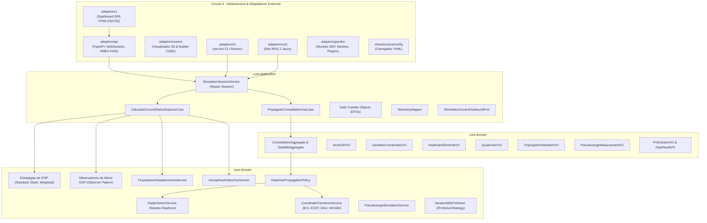

# 🏛️ Arquitetura do Sistema & Sumário Executivo

> **Documentação Modular:** A especificação completa da arquitetura do **Brazilian Regional Positioning System Simulator (RPS-BR)** foi estruturada modularmente para facilitar a leitura técnica e a navegação web. Para acessar os capítulos detalhados, utilize o menu lateral ou os links temáticos abaixo.

---

## 🎯 Sumário Executivo e Síntese de Design

O RPS-BR é um simulador aeroespacial de alta precisão projetado sob o paradigma **Clean Fractal Hexagonal Architecture** (uma síntese entre a Arquitetura Hexagonal de Alistair Cockburn, a Clean Architecture de Robert C. Martin e os princípios de sistemas ciber-físicos do ecossistema **Vanguard / Hexágono Dourado**).

```text
┌─────────────────────────────────────────────────────────────────────────────┐
│              SÍNTESE DA ARQUITETURA HEXAGONAL FRACTAL LIMPA                 │
├─────────────────────────────────────────────────────────────────────────────┤
│                                                                             │
│   1. ARQUITETURA HEXAGONAL (Cockburn):                                      │
│      • Delimita a fronteira simétrica do sistema.                           │
│      • Portas de Entrada (Driving) e Portas de Saída (Driven).              │
│      • Garante imunidade total contra acoplamento com frameworks.           │
│                                                                             │
│   2. CLEAN ARCHITECTURE (Robert C. Martin):                                 │
│      • Estabelece a Regra de Dependência Concêntrica Unidirecional.         │
│      • Separa com rigor Casos de Uso (Application) de Entidades (Domain).   │
│      • O centro nunca sabe quem está na periferia.                          │
│                                                                             │
│   3. ARQUITETURA FRACTAL & O HEXÁGONO DOURADO (Vanguard):                    │
│      • Substitui o hexágono monolítico estático por Auto-Similaridade.      │
│      • Permite que subsistemas complexos sejam sub-hexágonos completos.     │
│      • Adota a malha Network on Core (NoC) como middleware de alto nível.   │
│      • Sub-Core de Governança como "Poder Judiciário" e árbitro temporal.   │
│                                                                             │
└─────────────────────────────────────────────────────────────────────────────┘
```

---

## 🧭 Os Quatro Círculos Concêntricos da Arquitetura



---

## 🗺️ Módulos da Arquitetura do Sistema

Para navegar em cada dimensão formal da arquitetura, consulte os capítulos dedicados:

### 1. 🏛️ [Visão Geral da Arquitetura & O Hexágono Dourado](architecture/index.md)
* **Princípios Fundamentais:** Clean Architecture, Ports & Adapters, DDD e API-First.
* **Os 4 Círculos Concêntricos:** Regra de dependência estrita e isolamento do Core.
* **A Síntese Híbrida:** *Clean Fractal Hexagonal Architecture*.
* **O Confronto Formal:** Hexágono Comum (Cockburn 2005) vs. Hexágono Dourado (Vanguard).

### 2. 🌲 [Árvore do Projeto & Catálogo de Padrões de Projeto](architecture/tree_and_patterns.md)
* **Árvore do Repositório Anotada:** Localização e responsabilidade de cada diretório e pacote.
* **Catálogo de Design Patterns:** Strategy (DOP e PVT), Observer (Alertas), Facade (Módulos limpos), Singleton Thread-Safe e Micro-Frontend Embed (Leaflet $\leftrightarrow$ Cesium 3D).

### 3. 🧩 [Smart Adapters & Taxonomia Fractal](architecture/smart_adapters.md)
* **Dicotomia:** *Thin Adapters* vs. *Smart Adapters*.
* **Anatomia em Três Camadas:** Application Layer, Domain Layer e Driver/Transport Layer no adaptador.
* **A Natureza Fractal:** Auto-similaridade multiescala e conformidade com IEEE 1516 / HLA.
* **Antipadrão Utilitário:** Por que agrupar funções genéricas em um adaptador quebra a coesão.
* **Taxonomia de Maturidade:** Níveis 1 a 3 (conforme [ADR 0005](adr/0005_hexagonal_architecture_maturity_levels.md)).
* **Anatomia Canônica de um Fractal (Nível 3):** Os 12 Elementos (4 de Aplicação + 8 de Domínio), Sub-Core de Governança Local Subordinada, Adaptadores de Borda Locais (`adapters/`) e Substratos Privados.
* **Isomorfismo Estrutural vs. Auto-Similaridade Semântica:** Preservação do conteúdo plasmático sem hiper-aninhamento estéril.

### 4. ⚡ [Subsistema de Co-Simulação com Ngspice](architecture/cosimulation_ngspice.md)
* **Conveniência e Relevância:** Dinâmica de energia do satélite (EPS), amplificadores de potência de RF (HPA) e front-end receptor de solo (LNA).
* **Os 12 Elementos Canônicos no Ngspice:** Aplicação de 4 elementos de Aplicação e 8 elementos táticos DDD no circuito.
* **A Camada de Driver:** Gerenciamento de processos POSIX e I/O de alta velocidade.
* **Substratos Locais Privados:** Compilador sintático de netlists e cache de modelos de semicondutores.
* **Orquestração Multi-Agente:** Execução reativa via AutoGen e controle de ciclo de vida e convergência via LangGraph.

### 5. 🌐 [Network on Core (NoC) & Governança](architecture/network_on_core.md)
* **Desmistificando o NoC em Software:** Do hardware MPSoC à malha lógica de software.
* **Os 5 Pilares do NoC:** Envelopes universais (`MissionPacket`), Network Interface, Logical Router, Arbiter/QoS e Canais Virtuais (`VC-Control`, `VC-Telemetry`, `VC-CoSim`).
* **Topologia e Nomenclatura Formal:** Root NoC (Core Backbone) vs. Leaf NoC (Autarquias) e Topologia Federada Híbrida.
* **As Quatro Variantes Estruturais do NoC:** Variante 1 (Nativa / Zero-Driver sem pasta de drivers), Variante 2 (Mediada por Shim), Variante 3 (In-Process Fast-Path) e Variante 4 (Federada WAN).
* **Arquitetura em Duas Camadas:** Pilha Lógica da Aplicação vs. Pilha de Enlace da Infraestrutura.
* **Dicotomia Vanguard:** NoC Passivo (determinístico, local) vs. NoC Ativo (centralizado, federado).
* **Sub-Core de Governança:** O "Poder Judiciário", conformidade de contratos e barreira temporal (IEEE 1516).
* **Topologia e Soberania:** `core/application/noc/`, `core/application/governance/` e modelo de soberania constitucional.

### 6. 🏗️ [Camada de Infraestrutura & Substrato Vanguard](architecture/infrastructure_substrate.md)
* **Dicotomia de Borda:** Adaptadores (`/adapters/`) vs. Infraestrutura (`/infrastructure/`).
* **Os Quatro Substratos da Vanguard:** Enlace Físico, Cofre de Telemetria, Registro Canônico e Raiz de Confiança.
* **Encapsulamento de Validações:** Specifications de Domínio puras vs. Governança e Borda.
* **Relógio e Barreira Temporal:** Do modelo imperativo in-memory à barreira de rendezvous determinística.
* **Comparativo Epistemológico:** Modelo Tradicional (`/infrastructure/`) vs. Modelo Vanguard (*Substratos*).
* **Persistência de Dados Poliglota:** SQLite, DuckDB, HDF5 e a escala de maturidade Níveis 0 a 3.
* **Padrão Edge Network Interface (Edge NI):** Interoperabilidade simétrica (Porta Inbound vs. Outbound Shim).
* **Decisão Lexical Canônica:** Justificativa formal de `/infrastructure/` no singular.
