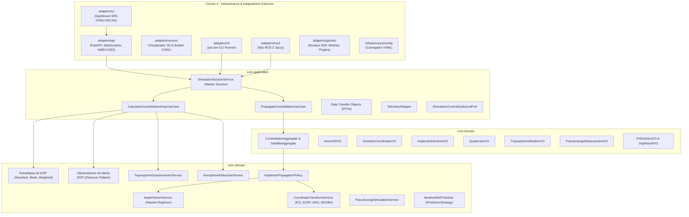
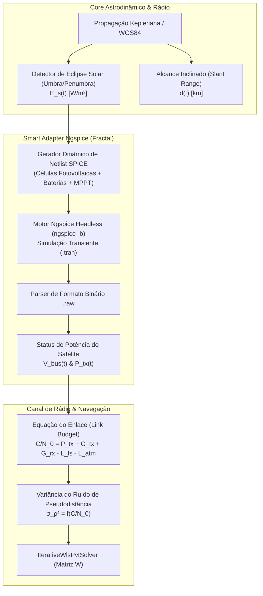

# 🏛️ Arquitetura do Sistema, Árvore do Projeto e Decisões de Design

Este documento apresenta a visão arquitetural abrangente do **Brazilian Regional Positioning System Simulator (RPS-BR)**, detalhando os princípios de separação de responsabilidades, a árvore estrutural do código-fonte, o catálogo de abstrações de domínio e os padrões de projeto de software implementados.

---

## 🎯 1. Princípios Arquiteturais Fundamentais

O projeto foi concebido sob três pilares metodológicos rigorosos:

1. **Arquitetura Hexagonal (*Ports & Adapters* - Alistair Cockburn):**
   * O **Core** de negócio é o hexágono central isolado do mundo exterior. Ele não conhece nem depende de frameworks de rede (FastAPI, WebSockets), middleware de robótica (ROS 2), motores de física (Gazebo Sim) ou bibliotecas de interface visual (Leaflet, CesiumJS).
   * As fronteiras de comunicação são delimitadas por **Portas (*Ports*)**:
     * *Driving Ports (Inbound):* Interfaces de Casos de Uso acionadas por agentes externos (REST, WebSockets, CLI, ROS 2).
     * *Driven Ports (Outbound):* Interfaces que o Core utiliza para notificar ou comandar o ambiente exterior (emissão de alertas DOP, persistência, controle de física do Gazebo).
2. **Domain-Driven Design (DDD - Eric Evans):**
   * A linguagem ubíqua reflete fielmente o jargão da astrodinâmica e da radionavegação por satélite (*Keplerian Elements*, *Slant Range*, *Line of Sight*, *Dilution of Precision*, *Tropospheric Saastamoinen Delay*, *Klobuchar EIA*).
   * Separação clara entre **Entidades**, **Agregados**, **Value Objects Imutáveis**, **Políticas de Domínio** e **Serviços de Domínio**.
3. **Design API-First & *Dogfooding*:**
   * A interface de usuário (SPA) é um cliente externo puro que consome as mesmas portas públicas de rede que qualquer outro cliente automatizado (receptores GNSS comerciais via NMEA 0183, nós ROS 2 ou agentes autônomos de IA).

---

## 🧭 2. Os Quatro Círculos Concêntricos da Arquitetura



---

## 🌲 3. Árvore do Projeto Anotada

```text
brazilian-rps-sim/
├── config/                          # Configurações declarativas da simulação
│   └── simulation_parameters.yaml   # Parâmetros orbitais dos 7 satélites, estações e relógio
├── docs/                            # Documentação técnica e científica de engenharia
│   ├── adr/                         # Architectural Decision Records formais (0001 a 0004)
│   ├── api.md                       # Especificação da API REST, WebSockets e NMEA 0183
│   ├── cli.md                       # Manual de uso e automação da CLI rps-sim
│   ├── testing.md                   # Engenharia de testes, pirâmide e tolerâncias
│   ├── quality_safety.md            # Qualidade, confiabilidade e segurança (DO-178C, ECSS)
│   ├── algorithms_complexity.md     # Análise assintótica de algoritmos e estruturas de dados
│   ├── architecture.md              # Este documento (visão arquitetural global)
│   └── index.md                     # Portal de entrada e índice mestre da documentação
├── papers/                          # [CIDADÃO DE PRIMEIRA CLASSE] Artigos científicos
│   └── sbas_brazil_journal/         # Manuscrito formal em Typst para periódicos aeroespaciais
│       ├── main.typ                 # Código-fonte do artigo em Typst
│       ├── README.md                # Instruções de compilação
│       └── paper_rps_brazil.pdf     # PDF compilado do artigo
├── rps_br/                          # Pacote Python principal da biblioteca
│   ├── core/                        # NÚCLEO PURO (Hexágono Central - Zero dependências externas)
│   │   ├── application/             # Casos de Uso, Serviços de Aplicação, DTOs e Mappers
│   │   │   ├── dtos/                # Data Transfer Objects com tipagem estática
│   │   │   ├── interfaces/          # Portas abstratas de casos de uso
│   │   │   ├── mappers/             # Mapeadores entre entidades e DTOs
│   │   │   └── services/            # SimulationSessionService, CalculateGroundStationDopUseCase
│   │   └── domain/                  # Domínio Astrodinâmico e de Radionavegação
│   │       ├── astrodynamics/       # Agregados de Satélite/Constelação, Políticas de Órbita
│   │       ├── navigation_pvt/      # Estratégias de cálculo DOP e Observadores de alerta
│   │       ├── signal_propagation/  # Modelos de retardo Saastamoinen e Klobuchar
│   │       └── shared/              # Value Objects fundamentais (Vector3D, Geodetic, Keplerian)
│   ├── adapters/                    # ADAPTADORES DE BORDA (Ports & Adapters)
│   │   ├── api/                     # Gateway Unificado de APIs (FastAPI, WebSockets, NMEA 0183)
│   │   │   ├── rest/                # Rotas RESTful modulares de telemetria e controle
│   │   │   ├── streaming/           # Loop assíncrono de streaming WebSocket a 1 Hz
│   │   │   ├── nmea/                # Gerador e emulador de sentenças NMEA 0183 ($GNGGA, etc.)
│   │   │   └── server.py            # Servidor FastAPI principal agregador
│   │   ├── ui/                      # Dashboard SPA Independente (HTML5, Tailwind, Chart.js)
│   │   ├── cesium/                  # Adaptador 3D Cesium (Builder CZML WGS84 e visualizador)
│   │   ├── cli/                     # Adaptador CLI autônomo (rps-sim)
│   │   ├── ros2/                    # Nós de temporização e tópicos de robótica em ROS 2 Jazzy
│   │   ├── gazebo/                  # Descrição de mundos SDF, modelos 3D e controle de física
│   │   └── export/                  # Exportador de séries temporais de trajetória (JSON/CSV)
│   └── infrastructure/              # INFRAESTRUTURA DE APOIO
│       └── config/                  # Carregamento e validação de arquivos YAML
├── scripts/                         # Executáveis e lançadores de conveniência
│   ├── rps-sim                      # Atalho para a CLI
│   ├── rps_constellation_node       # Executável do nó ROS 2 de dinâmica
│   └── rps_web_bridge_node          # Executável da ponte de relógio ROS 2 -> Web
├── tests/                           # SUÍTE DE TESTES AUTOMATIZADOS (78 testes no Pytest)
│   ├── integration/                 # Testes de missão de longa duração (24 horas)
│   └── unit/                        # Testes unitários particionados por domínio e adaptadores
├── dashboard.sh                     # Script shell de inicialização rápida do API Gateway
└── setup.py                         # Manifesto oficial de empacotamento Python / ROS 2
```

---

## 🎨 4. Catálogo de Padrões de Projeto (*Design Patterns*) Implementados

### A. Padrão Strategy (*Estratégia de Cálculo de DOP*)
* **Problema:** Diferentes cenários operacionais exigem diferentes métodos de seleção e ponderação de satélites para cálculo de GDOP/PDOP/HDOP/VDOP.
* **Solução:** A interface `IDopCalculationStrategy` desacopla o algoritmo de cálculo do caso de uso.
* **Estratégias Implementadas:**
  * `StandardLeastSquaresDopStrategy`: Inversão matricial de mínimos quadrados clássica.
  * `ElevationMaskDopStrategy`: Descarta satélites abaixo de um ângulo de corte ($\theta_i < \theta_{\text{mask}}$).
  * `WeightedElevationDopStrategy`: Pondera a matriz de covariância pelo seno da elevação ($\sin^2 el$).

### B. Padrão Strategy (*Solucionador de Navegação PVT*)
* **Problema:** Um receptor GNSS pode alternar entre algoritmos numéricos de posicionamento (ex: Mínimos Quadrados Simples, Mínimos Quadrados Ponderados, Filtro de Kalman Estendido - EKF, ou Factor Graphs) sem que a camada de aplicação ou casos de uso dependam da implementação matemática específica.
* **Solução:** A interface `IPvtSolverStrategy` define o contrato universal de resolução de estado $\mathbf{x} = [x, y, z, c \cdot \delta t_{\text{rx}}]^T$.
* **Estratégias Implementadas:**
  * `IterativeWlsPvtSolver`: Algoritmo iterativo de Gauss-Newton com matriz de pesos estocásticos baseada no seno da elevação e conversão geodésica WGS-84 integrada (para a formulação matemática rigorosa das equações de pseudodistância e convergência de mínimos quadrados, consulte [`docs/math_theory/pvt_least_squares.md`](math_theory/pvt_least_squares.md)).

### C. Padrão Observer (*Notificação e Alertas de Degradação de Sinal*)
* **Problema:** Quando o PDOP ultrapassa limites operacionais de aproximação aeronáutica ($PDOP > 6.0$), múltiplos subsistemas precisam ser notificados sem acoplamento direto.
* **Solução:** A classe `DopSubject` mantém uma lista de observadores (`IDopObserver`):
  * `DopAlertThresholdObserver`: Dispara alarmes quando a precisão geométrica é violada.
  * `DopLoggingObserver`: Registra eventos em logs de telemetria.
  * `DopTelemetryBufferObserver`: Armazena as amostras em buffer circular para a interface gráfica.

### D. Padrão Facade (*Fachada Modular via `__init__.py`*)
* **Problema:** Proteger consumidores de conhecerem a árvore profunda de diretórios internos e evitar quebras quando arquivos internos são refatorados.
* **Solução:** Todos os subpacotes (`core.domain.astrodynamics`, `core.domain.navigation_pvt`, `core.application.dtos`, `adapters.api`, etc.) atuam como Fachadas explícitas exportando seus símbolos públicos através de `__all__`.

### E. Padrão Singleton Thread-Safe com Lock Reentrante
* **Problema:** Garantir que rotas HTTP assíncronas do FastAPI, o laço de streaming WebSocket e os pulsos de física externa acessem uma visão unificada e atômica da simulação.
* **Solução:** As classes `TelemetryHub` e `SimulationSessionService` implementam o padrão Singleton protegido por `threading.RLock`, permitindo reentrância segura e eliminando condições de corrida.

### F. Padrão Micro-Frontend Embed (*2D Leaflet $\leftrightarrow$ 3D Cesium*)
* **Problema:** Um globo 3D WebGL (CesiumJS) consome recursos intensivos de GPU e shaders, o que provocaria travamentos e colisões na DOM se executado no mesmo escopo JavaScript que os gráficos Chart.js e tabelas do painel 2D.
* **Solução:** O visualizador Cesium roda em uma rota dedicada (`/cesium/viewer`) e é embutido na aplicação principal via `<iframe>` isolado. A troca entre a projeção 2D e o globo 3D ocorre instantaneamente apenas alternando a visibilidade dos containers, com desacoplamento total de contextos gráficos.

---

## 🧩 5. Teoria dos Adaptadores Inteligentes e Arquitetura Hexagonal Fractal

### A. A Dicotomia: *Thin Adapters* vs. *Smart Adapters*
Nem todo adaptador em uma Arquitetura Hexagonal necessita da mesma densidade estrutural. A complexidade do adaptador é estritamente proporcional à complexidade de estado do agente externo com o qual ele se comunica:

1. **Adaptadores Finos (*Thin / Passive Adapters*):**
   * Adequados para protocolos *stateless*, canais unidirecionais simples ou serializadores imediatos (ex.: exportador CSV/JSON em lote, logger textual, endpoints REST simples de leitura).
   * Operam apenas como conversores de tipos: $\text{DTO}_{\text{Core}} \to \text{Payload}_{\text{Externo}}$. Não possuem máquinas de estado, laços temporais ou ciclo de vida autônomo.
2. **Adaptadores Inteligentes (*Smart / Rich Adapters*):**
   * Mandatórios quando o sistema periférico possui **seu próprio relógio de execução, ciclo de vida de nós, concorrência interna ou restrições rígidas de sincronismo** (ex.: CesiumJS com WebGL render loop, Gazebo Sim com motor físico ODE/OGRE 2, ROS 2 com DDS/rmw e Ngspice com solver transiente analógico).
   * Um adaptador fino falha perante esses sistemas porque o sistema externo tem vida própria e tenderá a divergir silenciosamente (como observado quando o Cesium animava órbitas com a simulação pausada).

### B. A Estrutura em Três Camadas de um *Smart Adapter*
Para evitar que a complexidade do mundo externo contamine o Core e garantir que os contratos sejam respeitados, o *Smart Adapter* decompõe-se internamente em três camadas:

```text
[ Core do Sistema (Domínio & Casos de Uso) ]
                     ▲
                     │ Porta Soberana (IClockPort, ITelemetryPort, IControlPort)
                     ▼
┌─────────────────────────────────────────────────────────────┐
│                 ADAPTADOR INTELIGENTE (SMART ADAPTER)        │
│                                                             │
│  1. Adapter Application Layer                               │
│     ├── Orquestrador de Ciclo de Vida (Init / Teardown)     │
│     ├── Gerenciador de Sincronismo Temporal & Anti-Deriva  │
│     ├── Detecção de Pausa & Watchdogs de Heartbeat          │
│     └── Tradutor de Intenção e Comandos de Controle         │
│                                                             │
│  2. Adapter Domain Layer                                    │
│     ├── Modelo Conceitual do Protocolo Externo              │
│     │   (Ex: Netlist AST no Ngspice, Scene Graph no Cesium, │
│     │    QoS Profiles no ROS 2, Sentenças NMEA 0183)        │
│     └── Invariantes & Validações da Tecnologia Específica   │
│                                                             │
│  3. Adapter Driver / Transport Layer                        │
│     ├── Sockets Web (WebSocket / TCP / UDP)                 │
│     ├── Subprocess IPC (stdio pipes / POSIX signals)        │
│     └── Bindings C++/Middleware (rclpy / DDS)               │
└─────────────────────────────────────────────────────────────┘
                     ▲
                     ▼
[ Sistema ou Engine Externa (CesiumJS, Gazebo, ROS 2, Ngspice) ]
```

* **Adapter Application Layer:** Responsável por governar a ponte de controle entre a sessão do Core e a sessão externa. Implementa políticas de tolerância a falhas, reconexão, amortecimento de jitter de rede e sincronização de relógio.
* **Adapter Domain Layer:** Representa a ontologia da tecnologia externa. O Core de radionavegação não deve conhecer o que é uma *directive `.tran`*, um *nó SPICE*, um *pacote CZML* ou um *perfil de QoS Transient Local*. Esse vocabulário pertence legitimamente ao Domínio do Adaptador.
* **Adapter Driver / Transport Layer:** O código de baixo nível que lida com I/O de rede, pipes de sistema operacional ou chamadas nativas C/C++.

### C. A Natureza Fractal da Arquitetura Hexagonal (*Fractal Hexagons*)
Conforme formulado por Alistair Cockburn, a Arquitetura Hexagonal é **recursiva e fractal**:
> *"Cada hexágono representa um Bounded Context. Ao ampliarmos uma das arestas (um Adaptador), descobrimos no seu interior um outro hexágono completo."*

O adaptador não é um mero script "colado" na borda; ele é um **micro-sistema autônomo** com suas próprias portas internas:
* Uma porta interna voltada para a aplicação do Core;
* Seu próprio domínio de protocolo/tecnologia;
* Portas de saída secundárias conectadas aos drivers de comunicação física.

Essa separação fractal impede o vazamento de abstrações (*leaky abstractions*), permitindo substituir, por exemplo, o CesiumJS por Unreal Engine 5, ou o Ngspice por Xyce/LTspice, sem alterar uma única linha do Core do RPS-BR.

### D. Regulação Temporal Formal (Conformidade com IEEE 1516 / HLA)
Para simulações distribuídas em engenharia aeroespacial, o tempo não é um parâmetro trivial de transporte. Adotamos os princípios da norma **IEEE 1516 (High Level Architecture - HLA)**:
* **Time-Regulating Entity:** O Core atua como regulador soberano do relógio virtual em modo *Standalone*.
* **Time-Constrained Entity:** Todos os *Smart Adapters* de visualização ou co-simulação (Cesium, Dashboard, Displays) são entidades estritamente restritas pelo tempo, proibidas de avançar o estado sem a respectiva autorização temporal (*Time Advance Grant*).
* **Master Co-Simulation Mode:** Quando o Gazebo Sim é ativado, o Gazebo assume temporariamente a regulação da física de corpo rígido, transmitindo pulsos `/clock` que o Core ingere e redistribui para os demais federados escravos.

### E. O Antipadrão do "Adaptador de Utilidades" e Acoplamento Lateral (*Cross-Adapter Coupling*)
Em grandes projetos de engenharia de software, surge com frequência a tentação de consolidar múltiplas pequenas rotinas de suporte (parsers auxiliares, conversores de formato, cálculo de checksums, manipuladores de string) em um único "Adaptador de Utilidades" (*Utility/Common Adapter*). Essa prática é um **antipadrão grave** na Arquitetura Hexagonal:

1. **Violação do Princípio da Responsabilidade Única (SRP) e Contratos de Portas:**
   * Cada porta do Core expressa uma intenção de negócio coesa (ex.: `ITelemetryExportPort`, `ISerialLogPort`, `IClockPort`).
   * Um adaptador "faz-tudo" implementa portas díspares ou expõe interfaces genéricas sem coesão semântica, transformando-se em uma *God Class* (*Blob*).
   * Ele acopla desnecessariamente dependências externas heterogêneas (ex.: bibliotecas de rede, parsers XML, drivers seriais) em consumidores que precisavam de apenas uma função pontual.
2. **A Regra de Ouro sobre Acoplamento Lateral (*Adapter-to-Adapter*):**
   * **Adaptadores nunca devem depender diretamente de outros adaptadores.** Se o adaptador ROS 2 importar diretamente classes internas do adaptador FastAPI/REST, cria-se uma malha de dependências cruzadas que destrói a modularidade hexagonal.
   * Se dois ou mais adaptadores necessitam de lógica compartilhada (ex.: conversão de coordenadas, rotinas matemáticas, serialização NMEA comum), essa lógica deve residir em:
     * **`infrastructure/common` ou `infrastructure/utils`:** Para utilitários técnicos puros e sem estado (*Shared Kernel* de infraestrutura);
     * **`core/domain/shared`:** Se a função representar uma regra de cálculo, invariante matemática ou conversão de unidades do domínio aeroespacial.

### F. Taxonomia e Níveis de Complexidade de Adaptadores (Nível 1 a Nível 3)
A decomposição interna de um adaptador segue o princípio da proporcionalidade, categorizando-se em três níveis de maturidade arquitetural:

| Nível de Maturidade | Classificação | Camada de Aplicação do Adaptador | Camada de Domínio do Adaptador | Casos de Uso Típicos |
| :--- | :--- | :--- | :--- | :--- |
| **Nível 1** | **Thin / Direct Adapter** | **Inexistente:** Apenas função/método de tradução direta ($\text{DTO} \to \text{Payload}$). | **Inexistente:** Sem conceitos ontológicos locais. | Exportador CSV, gravador de logs stdout, endpoint REST simples de leitura. |
| **Nível 2** | **Smart / Composite Adapter** | **Presente (4 Elementos Canônicos):** Application Service, DTOs locais, Mappers e Interfaces de Driver. | **Leve / Parcial:** Value Objects de protocolo e enums de estado (sem agregados pesados). | Cesium Viewer (`CesiumClockSynchronizer`, `JulianDateVO`), Dashboard WebSocket Hub. |
| **Nível 3** | **Fractal / Autonomous Engine Adapter** | **Completa (4 Elementos):** Orquestrador de transientes, buffers de sincronismo, observadores e tratadores de erro. | **Rica (Elementos Táticos DDD):** Agregados de tecnologia (ex: `SpiceCircuitAggregate`), Entidades, VOs, Domain Services e Factories. | Co-simulador Ngspice, simuladores SDR (Software-Defined Radio), bridges robóticas avançadas. |

#### A Composição Canônica da *Adapter Application Layer*
Quando um adaptador atinge o Nível 2 ou 3, sua camada de aplicação reproduz de fato a mesma estrutura em 4 elementos canônicos da camada de aplicação do Core:
1. **Adapter Application Services:** Orquestram a seqüência de execução local (ex.: `NgspiceCoordinatorService`, `CesiumClockSyncService`).
2. **Adapter DTOs:** Estruturas de dados próprias da tecnologia externa (ex.: `SpiceTransientOutputDTO`, `CesiumFrameStateDTO`), blindando o Core contra peculiaridades do protocolo.
3. **Adapter Mappers:** Conversores bidirecionais estritos ($\text{Core DTO} \longleftrightarrow \text{Adapter DTO}$), assegurando que evoluções nas APIs de bibliotecas externas não afetem o Core.
4. **Adapter Driver Interfaces:** Portas internas do próprio adaptador (ex.: `INgspiceProcessDriver`), permitindo testar a lógica do adaptador com mocks sem disparar processos no sistema operacional.

#### É Necessário Replicar Todos os Elementos Táticos no *Adapter Domain*?
**Não.** A existência de um *Adapter Domain* não significa copiar cegamente os padrões de DDD por burocracia sintática (*Dogmatismo vs. Pragmatismo*). 
* Elementos como **Agregados, Entidades e Repositórios** só devem ser criados no domínio do adaptador quando a tecnologia externa tiver um **modelo de dados estruturado e mutável** (como o grafo de uma netlist de circuito no Ngspice ou o grafo de nós de cena em uma engine 3D).
* Para a maioria dos adaptadores de Nível 2, **Value Objects imutáveis e Serviços de Domínio puros** (ex.: validadores de sintaxe de pacote, cálculos de deriva temporal) são mais do que suficientes para garantir robustez sem incorrer em sobre-engenharia (*YAGNI - You Aren't Gonna Need It*).

---

## ⚡ 6. Subsistema de Co-Simulação Eletrônica com Ngspice

### A. Conveniência e Relevância do Ngspice para o Projeto RPS-BR
O **Ngspice** é o simulador de circuitos analógicos, digitais e de sinais mistos em nível de componentes (*SPICE*) padrão da indústria e da academia. Em uma missão aeroespacial de posicionamento regional como o RPS-BR, o Core governa a cinemática de alto nível e a geometria de sinal, mas a **física do hardware embarcado no satélite e nas estações terrestres** exige fidelidade eletroeletrônica:



### B. Os Três Pontos Críticos de Integração Elétrica
1. **Subsistema de Energia Elétrica (EPS - Electrical Power System):**
   * **Cenário Físico:** Durante as passagens dos 4 satélites IGSO e 3 GEO pela sombra da Terra (eclipses de equinócio), os painéis solares deixam de produzir corrente ($I_{\text{pv}} \to 0$). O barramento primário passa a ser alimentado exclusivamente pelos bancos de baterias de Lítio.
   * **Papel do Ngspice:** Simulação do circuito conversor chaveado Buck/Boost, regulação MPPT e cinética eletroquímica equivalente da bateria ($R_{\text{int}}, C_{\text{cap}}$). O Ngspice calcula a queda de tensão no barramento $V_{\text{bus}}(t)$.
2. **Amplificador de Alta Potência da Carga Útil (Payload HPA / SSPA):**
   * **Cenário Físico:** Se a tensão do barramento $V_{\text{bus}}$ sofre subtensão durante um eclipse severo, os amplificadores de potência de RF em banda L perdem ponto de quiescência, reduzindo a potência efetiva isotrópica radiada (EIRP).
   * **Papel do Ngspice:** Simulação transiente não-linear do estágio de potência RF. A potência real de saída $P_{\text{tx}}(t)$ é re-injetada no Core para atualizar a relação portadora-ruído $C/N_0$ e a matriz estocástica de pesos do solver PVT.
3. **Front-End Analógico do Receptor Terrestre (LNA & Filtros RF):**
   * **Cenário Físico:** Na estação de monitoramento de solo (ex.: ITA / São José dos Campos), o sinal chega na antena com potência de apenas $\approx -160\text{ dBW}$. O front-end precisa amplificar com baixíssimo ruído.
   * **Papel do Ngspice:** Modelagem da figura de ruído ($NF$), ruído térmico de Johnson-Nyquist ($4 k_B T B$) e resposta em frequência do filtro passa-faixa em banda L1/L5.

### C. O Adaptador Ngspice como *Smart Adapter*
O adaptador para Ngspice seguirá rigorosamente o modelo fractal:
* **NgspiceNetlistDomain:** Modelos de componentes (resistores, capacitores, fontes controladas, transistores GaN/LDMOS, subcircuitos de bateria);
* **NgspiceExecutionCoordinatorService (Application):** Recebe o passo de tempo e as condições de iluminação do Core, sintetiza a netlist proceduralmente, orquestra a execução de `ngspice -b circuit.cir -r output.raw`, extrai os dados analíticos via parser binário nativo e entrega um DTO padronizado (`SatellitePowerTelemetryDTO`) ao Core;
* **NgspiceProcessDriver (Transport):** Gerencia a invocação segura do binário no SO ou contêiner via pipes POSIX assíncronos.

### D. Orquestração Multi-Agente Autônoma (Integração AutoGen + LangGraph)
Esta arquitetura fractal viabiliza a orquestração por agentes autônomos de Inteligência Artificial:
* **AutoGen (Camada Operacional / Tool-Use):** Agentes de engenharia elétrica especializados (ex.: *CircuitDesignerAgent*, *SpiceSimulationAgent*, *DiagnosticsAgent*) realizam síntese de circuitos, dimensionamento de componentes e análise de convergência numérica em netlists SPICE.
* **LangGraph (Camada de Governança e Grafo Cíclico):** Implementa a máquina de estados determinística da missão:
  $$\text{Passo Orbital (Core)} \longrightarrow \text{Avaliação de Eclipse} \longrightarrow \text{Disparo Ngspice} \longrightarrow \text{Telemetria Elétrica} \longrightarrow \text{Balanço de Link RF}$$
  Caso ocorra anomalia elétrica (ex.: subtensão crítica de bateria no Ngspice), o LangGraph comuta a constelação para modo de sobrevivência (*Safe Mode*), desliga cargas secundárias e notifica o operador via alertas da Camada de Aplicação do Core.

