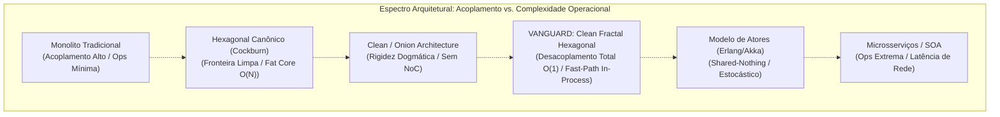
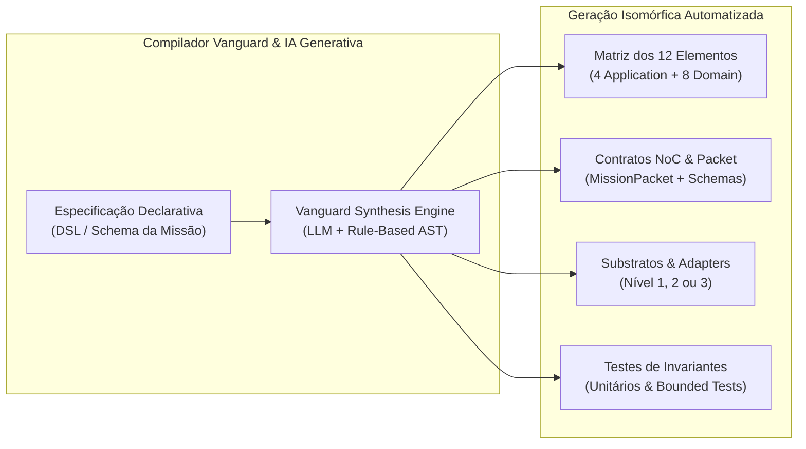
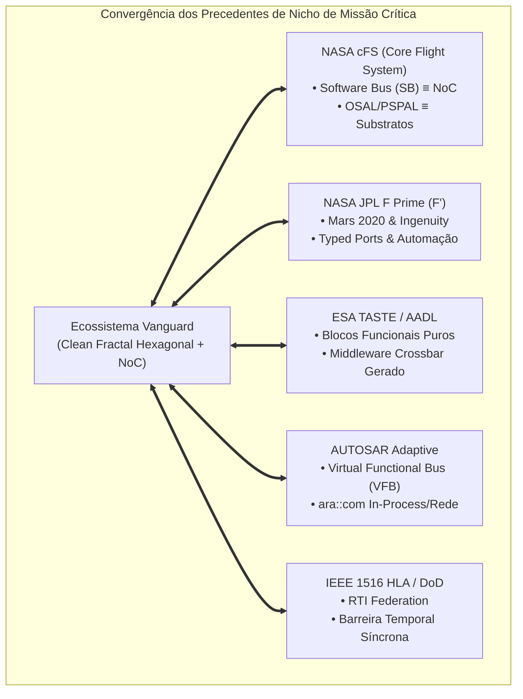

# 📊 Análise Comparativa, Automabilidade & Precedentes de Missão Crítica

Uma avaliação multidimensional da **Clean Fractal Hexagonal Architecture (Vanguard / Hexágono Dourado)** frente aos paradigmas consolidados da indústria, o potencial de metaprogramação e síntese por Inteligência Artificial, e seus precedentes nos programas aeroespaciais mais rigorosos do mundo.

---

## 🎯 1. Introdução e Propósito do Ensaio Arquitetural

Ao longo da evolução do simulador **RPS-BR**, consolidou-se uma síntese arquitetural singular denominada **Clean Fractal Hexagonal Architecture** (ou **Arquitetura Vanguard / Hexágono Dourado**). Esta abordagem unifica quatro vertentes de excelência em engenharia de software:

1. **Arquitetura Hexagonal (Ports & Adapters - Cockburn, 2005):** Simetria operacional e isolamento do domínio contra acoplamento externo.
2. **Clean Architecture & DDD (Martin, 2012; Evans, 2003):** Círculos concêntricos de dependência estrita, separação entre Casos de Uso e Entidades, e invariantes matemáticos encapsulados em agregados.
3. **Topologia Fractal Multiescala:** Substituição do hexágono monolítico estático por autarquias auto-similares (*Smart Adapters de Nível 3*), dotadas de seu próprio núcleo de 12 elementos canônicos e sub-core de governança local.
4. **Network-on-Core (NoC) & Barreira Temporal (IEEE 1516):** Um middleware de alto nível intra-sistema para transporte semântico de pacotes universais (`MissionPacket`) com determinismo temporal estrito para co-simulação física.

Este capítulo responde formalmente a três indagações centrais de engenharia de software avançada:
* *Como este modelo se compara com as arquiteturas estabelecidas (Monolitos, Microsserviços, EDA, Hexagonal Canônica, Clean/Onion e Atores)?*
* *Qual é o grau real de automabilidade desta arquitetura pelo Vanguard Kernel e ferramentas de IA generativa?*
* *A arquitetura se enquadra como experimental e quais precedentes de nicho de missão crítica reproduzem seus princípios fundamentais?*

---

## ⚖️ 2. Comparativo Aprofundado com Arquiteturas Existentes



### 2.1. Confronto Individual com os Paradigmas Tradicionais

#### A. Monolito Tradicional (Layered Architecture / MVC)
* **Considerações Estruturais:** Organizado em camadas horizontais clássicas (UI $\to$ Business Logic $\to$ Database). Comunicação direta via chamadas de método em memória ($0$ overhead de serialização).
* **Vantagens do Monolito:** Extrema simplicidade de empacotamento (artefato binário único), ausência de indireção de rede, depuração trivial com *stack traces* contínuos e desempenho bruto máximo inicial.
* **Desvantagens Críticas:** Rápida degradação em "Big Ball of Mud" (*anti-pattern* espaguete); ausência de barreiras físicas entre subsistemas; acoplamento combinatório $\mathcal{O}(N^2)$ entre módulos; impossibilidade de co-simulação determinística multirate (ex: orbitografia em $1\text{ s}$ vs. Ngspice em $10\text{ ns}$).
* **O que o Hexágono Fractal Resolve:** Mantém o desempenho de baixa latência em memória através da **Variante 3 (In-Process Fast-Path)** do NoC, mas impõe **isolamento plasmático estrito**: nenhum módulo pode invadir a memória interna de outro subsistema sem passar por contratos universais.

#### B. Microsserviços / Service-Oriented Architecture (SOA)
* **Considerações Estruturais:** Separação do sistema em múltiplos processos e nós de rede autônomos comunicando-se via protocolos de transporte serializado (HTTP/REST, gRPC, Protobuf) através da pilha TCP/IP.
* **Vantagens dos Microsserviços:** Independência total de deploy e ciclo de vida entre equipes corporativas distintas, isolamento de memória a nível de sistema operacional (um crash de processo não contamina os demais) e elasticidade horizontal em nuvem.
* **Desvantagens Críticas:**
  1. **Penalidade Catastrófica de Latência:** Uma chamada de função in-process consome $\approx 1 \text{ a } 10\text{ ns}$. Uma chamada de rede RPC consome entre $500\,\mu\text{s}$ e $10\text{ ms}$ (uma degradação de $\mathbf{10^5}$ a $\mathbf{10^6}$ vezes). Em simulações físicas que requerem $100.000$ iterações por segundo, os microsserviços são tecnicamente inviáveis.
  2. **Complexidade Operacional Extrema:** Pesadelo de infraestrutura (Docker, Kubernetes, Service Mesh, Istio, tracing distribuído Jaeger, resiliência com Circuit Breaker, particionamento de rede / Teorema CAP).
* **O que o Hexágono Fractal Resolve:** Proporciona a **independência conceitual e o isolamento de domínios dos microsserviços sem pagar o custo de latência de rede externa e sobrecarga de DevOps**, executando primordialmente *in-process* sob o barramento Network-on-Core, podendo no entanto transicionar para rede física sob demanda (Variante 4).

#### C. Event-Driven Architecture (EDA) Pura (Kafka, RabbitMQ)
* **Considerações Estruturais:** Produtores e consumidores desacoplados no espaço e no tempo, comunicando-se por meio de tópicos assíncronos e logs distribuídos de eventos imutáveis.
* **Vantagens da EDA:** Excelente desacoplamento temporal, alta escalabilidade em processamento paralelo de fluxo contínuo (*streaming*) e facilidade de auditoria.
* **Desvantagens Críticas:**
  * **Ausência de Determinismo Temporal Estrito:** A EDA convencional é estocástica (mensagens chegam em ordens variáveis com jitter temporal). Em astrodinâmica e circuitos eletrônicos, o avanço temporal precisa ser síncrono e coordenado em *lock-step* através de uma barreira temporal. Na EDA pura, simulações físicas sofrem desvio de fase e perda de causalidade determinística.
  * Efeito "pinball": perda da visão linear e governança do ciclo de vida da execução.
* **O que o Hexágono Fractal Resolve:** Incorpora o melhor da EDA através de mensagens tipadas no NoC, mas subordina a entrega e o avanço temporal à **Governança Constitucional com Barreira Temporal IEEE 1516**, garantindo que nenhum nó avance seu relógio $t + \Delta t$ antes que todos tenham convergido.

#### D. Arquitetura Hexagonal Canônica (Ports & Adapters - Cockburn, 2005)
* **Considerações Estruturais:** Um único hexágono central plano contendo o domínio e a aplicação, cercado por portas de entrada (*driving*) e saída (*driven*), às quais conectam-se adaptadores.
* **Vantagens:** Isolamento da lógica de negócio em relação a tecnologias externas e excelente testabilidade com *mocks*.
* **Limitações Estruturais:**
  1. **Monolito Central Plano ("Fat Core"):** Cockburn concebeu um núcleo plano. Conforme o sistema cresce para dezenas de adaptadores complexos, o Core precisa expor dezenas de interfaces de portas dedicadas ponto-a-ponto, tornando a manutenção central insustentável ($\mathcal{O}(N)$ interfaces no Core).
  2. **Incapacidade de Comportar Adaptadores Inteligentes:** Na visão clássica, o adaptador é meramente um tradutor fino (*thin adapter*). A arquitetura não oferece resposta formal quando um adaptador possui sua própria riqueza semântica e complexidade de domínio (ex: Cesium com CZML, Gazebo com SDF/OGRE, Ngspice com netlists de circuitos).
* **O que o Hexágono Fractal Resolve:** Substitui portas ponto-a-ponto pelo barramento unificado **Network-on-Core (NoC)** com interface simétrica $\mathcal{O}(1)$ (`Edge NI`), e permite que os adaptadores atinjam a maturidade de **Fractais (Nível 3)** dotados de seus próprios 12 elementos canônicos e adaptadores locais.

#### E. Clean Architecture (Uncle Bob) & Onion Architecture (Palermo)
* **Considerações Estruturais:** Círculos concêntricos rigorosos onde a regra de ouro estipula que dependências de código-fonte apontam exclusivamente para dentro (Domain $\leftarrow$ Application $\leftarrow$ Adapters $\leftarrow$ Frameworks).
* **Vantagens:** Pureza e imutabilidade dos modelos de domínio, ausência total de dependência de UI ou bancos de dados nas entidades nucleares.
* **Limitações Estruturais:**
  * Tende à rigidez dogmática com proliferação excessiva de DTOs e mappers superficiais redundantes.
  * Não define como subsistemas equivalentes se comunicam entre si em topologia *peer-to-peer* sem que uma entidade de alto nível precise atuar como intermediária manual.
  * Não possui conceito de tempo contínuo ou discreto, sendo deficitária na modelagem de sistemas ciber-físicos.
* **O que o Hexágono Fractal Resolve:** Preserva os quatro círculos concêntricos e a regra de dependência no núcleo de cada módulo, mas os integra dinamicamente através do barramento NoC e do Substrato Temporal.

#### F. Modelo de Atores (Actor Model - Erlang/OTP, Akka, Orleans)
* **Considerações Estruturais:** Entidades autônomas com estado exclusivamente privado (*shared-nothing*) que se comunicam unicamente por passagem de mensagens assíncronas depositadas em caixas de correio (*mailboxes*), com hierarquias de supervisão de falhas.
* **Vantagens:** Concorrência livre de travas e sem condições de corrida em memória compartilhada; resiliência intrínseca com recuperação automática supervisionada.
* **Limitações:** Natureza estocástica sem garantia de sincronismo temporal determinístico para simulações ciber-físicas rígidas; ausência de convenção interna de camadas DDD dentro do próprio ator.
* **O que o Hexágono Fractal Resolve:** O Smart Adapter fractal opera com autonomia similar a um Ator de Erlang, supervisionado pela Governança do Core, mas sua estrutura interna segue a Clean Architecture com 12 elementos formais, e seu fluxo temporal é subordinado ao rendezvous da barreira temporal.

---

### 2.2. Matriz Comparativa Multidimensional

A tabela a seguir resume as principais dimensões de engenharia de software entre os paradigmas:

| Dimensão Arquitetural | Monolito Tradicional | Microsserviços / SOA | Hexagonal Clássico (Cockburn) | Clean / Onion Architecture | Modelo de Atores (Akka/Erlang) | **Clean Fractal Hexagonal (Vanguard)** |
| :--- | :--- | :--- | :--- | :--- | :--- | :--- |
| **Acoplamento Espacial** | Altíssimo (emaranhado) | Baixíssimo (rede) | Baixo (portas) | Baixo (interfaces) | Nulo (shared-nothing) | **Nulo (Isolamento Plasmático & NoC)** |
| **Acoplamento Temporal** | Síncrono direto | Desacoplado na rede | Síncrono em portas | Síncrono por chamadas | Totalmente assíncrono | **Híbrido Determinístico (IEEE 1516)** |
| **Complexidade de Adição ($\Delta N$)** | $\mathcal{O}(N^2)$ (espaguete) | $\mathcal{O}(1)$ (novo serviço) | $\mathcal{O}(N)$ (novas portas) | $\mathcal{O}(N)$ (interfaces) | $\mathcal{O}(1)$ (novo ator) | **$\mathcal{O}(1)$ (Plug-and-Play no NoC)** |
| **Latência de Comunicação** | $\approx 1\text{ a }10\text{ ns}$ | $\approx 0.5\text{ a }10\text{ ms}$ | $\approx 10\text{ a }50\text{ ns}$ | $\approx 10\text{ a }50\text{ ns}$ | $\approx 100\text{ a }500\text{ ns}$ | **$\approx 15\text{ a }80\text{ ns}$ (Fast-Path In-Process)** |
| **Aptidão a Co-Simulação Física** | Baixa (sem barreira) | Péssima (jitter de rede) | Baixa (fat core) | Média (sem relógio) | Baixa (não-determinístico) | **Excelente (Clock Barreira IEEE 1516)** |
| **Complexidade Operacional (DevOps)** | Mínima (1 binário) | Máxima (K8s, Mesh) | Baixa (1 processo) | Baixa (1 processo) | Média (cluster de nós) | **Baixa a Média (Modular in-process)** |
| **Automabilidade por IA (Geração)** | Péssima (alucinação) | Média (fragmentação) | Média (duplicação) | Alta (regras claras) | Alta (templates atores) | **Altíssima (Isomorfismo dos 12 Elem.)** |

---

## 🤖 3. A Tese da Automabilidade da Vanguard (Metaprogramação & IA)

### 3.1. Diagnóstico: Por que as Arquiteturas Tradicionais Falham na Automação por IA?

Ferramentas de geração de código baseadas em Inteligência Artificial generativa (LLMs) ou compiladores de metaprogramação enfrentam barreiras severas quando aplicadas a arquiteturas convencionais:

1. **No Monolito:** A ausência de fronteiras físicas faz com que alterações geradas por IA criem **efeitos colaterais ocultos** e quebras de estado em locais remotos da base de código. A IA necessita de janelas de contexto colossais para prever os impactos cruzados, levando a alucinações e falhas estruturais.
2. **Nos Microsserviços:** A lógica é fragmentada entre dezenas de repositórios, contratos OpenAPI/Protobuf, *helm charts*, pipelines de CI/CD e arquivos Docker. A IA perde a visão holística do sistema e gera incompatibilidades de deploy e versionamento.
3. **No Hexagonal Comum:** Ao adicionar uma funcionalidade, a IA precisa alterar simultaneamente o Core para adicionar portas e os adaptadores para implementá-las, gerando inconsistências bidirecionais frequentes.

---

### 3.2. Os Quatro Pilares que Viabilizam a Automação Total na Arquitetura Vanguard

A **Clean Fractal Hexagonal Architecture** foi desenhada com propriedades de simetria formal que a tornam **o ambiente mais favorável à automação algorítmica e à geração por IA existente**:



#### Pilar 1: Isomorfismo Estrito dos 12 Elementos Canônicos
Em vez de permitir que o desenvolvedor organize pastas e arquivos de forma arbitrária, a Vanguard impõe a **matriz dos 12 elementos**:
* **Aplicação (4):** `commands/`, `queries/`, `services/`, `dtos/`
* **Domínio (8):** `entities/`, `value_objects/`, `aggregates/`, `specifications/`, `policies/`, `services/`, `events/`, `interfaces/`

Essa rigidez matemática transforma o problema de geração de software por IA em um problema de **preenchimento determinístico de slots tipados**. A entropia do espaço de busca sintático cai a quase zero.

#### Pilar 2: Isolamento Plasmático e Context Window Focada
Como o Core e cada Fractal operam em isolamento de domínio pleno, uma IA pode ser solicitada a criar ou refatorar um Smart Adapter inteiro (como o módulo Ngspice ou Cesium) fornecendo-se em sua janela de contexto **apenas a especificação do adaptador e o schema do `MissionPacket` do NoC**. Não há necessidade de a IA ler ou conhecer a implementação das estações de solo ou do propagador orbital. O risco de contaminação cruzada é formalmente nulo.

#### Pilar 3: Interface de Malha Simétrica $\mathcal{O}(1)$ via NoC
A inclusão de um novo subsistema não exige a edição de nenhum arquivo dentro do Core. O novo adaptador conecta-se à malha Network-on-Core instanciando uma porta simétrica de borda (`Edge NI`). A complexidade de geração para a IA é puramente aditiva:
$$\text{Complexidade de Adição} = \mathcal{O}(1)$$

#### Pilar 4: Variante Zero-Driver
Em subsistemas analíticos e puramente algorítmicos, a Variante 1 do NoC dispensa a geração de drivers de transporte de baixo nível ou protocolos intermediários. A IA gera apenas o modelo matemático e os manipuladores de tópicos do NoC, eliminando de $40\%$ a $60\%$ do código redundante (*boilerplate*).

---

### 3.3. O Pipeline de Síntese Automatizada (Architecture Compiler)

No modelo ideal amadurecido da Vanguard, o fluxo de geração autônoma opera em 5 estágios determinísticos:

```text
┌─────────────────────────────────────────────────────────────────────────────┐
│ 1. MODELO DECLARATIVO (DSL de Missão em Typst / YAML / JSON Schema)         │
│    - Define Entidades, Constelação, Subsistemas, Requisitos de Passo e QoS. │
└──────────────────────────────────────┬──────────────────────────────────────┘
                                       ▼
┌─────────────────────────────────────────────────────────────────────────────┐
│ 2. VANGUARD SKELETON SYNTHESIS (Geração Estrutural Estrita)                 │
│    - Criação da Árvore de Diretórios (Core, Sub-Cores, Adapters Níveis 1-3).│
│    - Materialização dos 12 Elementos Canônicos e Interfaces de Portas.      │
└──────────────────────────────────────┬──────────────────────────────────────┘
                                       ▼
┌─────────────────────────────────────────────────────────────────────────────┐
│ 3. LLM DOMAIN REASONING (Síntese das Políticas & Specifications)            │
│    - Geração dos algoritmos de física, equações de satélite e netlists.     │
│    - Implementação de regras puras com asserções matemáticas invariantes.    │
└──────────────────────────────────────┬──────────────────────────────────────┘
                                       ▼
┌─────────────────────────────────────────────────────────────────────────────┐
│ 4. NOC & INFRASTRUCTURE WIRING (Amarração de Enlace e Substratos)           │
│    - Registro dos Canais Virtuais (VC-Control, VC-Telemetry, VC-CoSim).      │
│    - Configuração do Substrato Temporal e Barreira de Avanço (IEEE 1516).   │
└──────────────────────────────────────┬──────────────────────────────────────┘
                                       ▼
┌─────────────────────────────────────────────────────────────────────────────┐
│ 5. AUTOMATED VERIFICATION HARNESS (Fechamento Formal de Qualidade)          │
│    - Geração automática de testes unitários 100% isolados via Mocks do NoC. │
│    - Execução do Pytest e compilação das especificações em MkDocs/Typst.    │
└─────────────────────────────────────────────────────────────────────────────┘
```

> [!IMPORTANT]
> **Onde a Automação por IA é Perfeita vs. Onde Exige Supervisão Humana:**
> * **100% Automatizável pela IA:** Arcabouço estrutural, DTOs, mappers, serialização de pacotes NoC, contratos de portas, boilerplate de adapters e testes de conformidade de tipos.
> * **Exige Supervisão ou DSL Especializada:** Equações matemáticas críticas de astrodinâmica (propagações perturbadas por $J_2/J_4$, modelos ionosféricos de Klobuchar, matrizes de covariância WLS) e transitórios elétricos não-lineares. Nesses pontos, a IA deve atuar integrando bibliotecas testadas ou implementando equações sob specifications estritas de teste de oráculo.

---

## 🚀 4. Enquadramento Experimental & Precedentes de Nicho em Missão Crítica

### 4.1. A Arquitetura é Experimental?

**Sim, no contexto do desenvolvimento de software corporativo convencional (TI comercial, web e SaaS), a Clean Fractal Hexagonal Architecture enquadra-se categoricamente como uma arquitetura experimental e pioneira.**

Não existem pacotes de prateleira (*off-the-shelf*) como Spring Boot, Ruby on Rails ou Django que implementem nativamente este modelo integrado de *Fractais Multiescala + Network-on-Core + Barreira Temporal Determinística + Sub-Core de Governança Constitucional*.

### 4.2. Os Precedentes de Nicho de Classe Mundial

No entanto, quando examinamos **a engenharia de sistemas aeroespaciais, a robótica espacial de alta autonomia e os sistemas ciber-físicos de missão crítica**, descobre-se que **todos os pilares concebidos na Vanguard já são utilizados com rigor absoluto pelas agências espaciais e instituições mais avançadas da Terra**.

A tabela e os estudos de caso abaixo demonstram essa convergência estrutural:



---

### 4.3. Análise Detalhada dos Precedentes

#### 1. NASA Core Flight System (cFS) — NASA Goddard Space Flight Center
O **cFS** é o sistema de software de voo reutilizável da NASA utilizado em dezenas de missões históricas, incluindo satélites de observação da Terra (LRO, GPM), sondas heliofísicas (MMS) e componentes do programa Artemis/Gateway.
* **Equivalência Direta com o NoC (Network-on-Core):** O coração do cFS é o **Software Bus (SB)**. No cFS, nenhum aplicativo de voo (*Core App*) conhece a existência física, o ponteiro de memória ou a localização dos demais aplicativos. Toda a comunicação ocorre por mensagens padronizadas identificadas por Message IDs (`Mid`) publicadas e assinadas no Software Bus.
* **Equivalência com os Substratos da Vanguard:** O cFS introduziu pioneiramente a camada **OSAL** (*Operating System Abstraction Layer*) e **PSPAL** (*Platform Support Package Abstraction Layer*). Essas camadas isolam o domínio de voo do sistema operacional (RTEMS, VxWorks ou Linux) e do processador de bordo (RAD750, LEON ou ARM), exatamente como os **Substratos da Vanguard** desacoplam o Core do sistema operacional e do hardware.

#### 2. NASA JPL F Prime ($F'$) — Jet Propulsion Laboratory
Desenvolvido pelo JPL para voo espacial de pequenos satélites e robótica interplanetária de ponta, o **F'** foi o framework de software de voo que controlou com sucesso o rover **Mars 2020 Perseverance** e o primeiro voo propulsionado em outro mundo: o helicóptero **Ingenuity** em Marte.
* **Equivalência com Smart Adapters e Portas:** No $F'$, todo o sistema é decomposto em **Componentes** fechados com **Portas Tipadas (Typed Ports)** para comandos, telemetria e eventos.
* **Equivalência Direta com a Tese de Automabilidade:** O $F'$ utiliza arquivos formais em XML/FPP (*F Prime Prime DSL*). O desenvolvedor descreve apenas os tipos das portas e os tópicos; **um compilador de código automatizado gera 100% da malha de transporte, filas de prioridade, despachantes assíncronos e testes de unidade**, deixando para a equipe de engenharia apenas o miolo do algoritmo de domínio. É a concretização aeroespacial exata do pretendido compilador da Vanguard.

#### 3. ESA TASTE & AADL — Agência Espacial Europeia (ESA)
Criado pelo Centro Europeu de Pesquisa e Tecnologia Espacial (ESTEC/ESA), o **TASTE** (*The Architecture Analysis & Design Integrated Toolchain*) é o ambiente oficial da ESA para software embarcado de missão crítica baseado na norma formal **AADL** (*Architecture Analysis & Design Language*).
* **Equivalência com o Isolamento Plasmático e Governança:** O TASTE divide o software estritamente em **Visão Funcional** (código matemático em Ada, C ou Simulink sem qualquer chamada de I/O ou biblioteca externa) e **Visão de Concorrência e Enlace**. O compilador TASTE sintetiza automaticamente o barramento intermediário seguro contra impasses (*deadlocks*) e estritamente determinístico no tempo.

#### 4. AUTOSAR Adaptive Platform (VFB) — Consórcio Automotivo Global
Padronizado pelas principais montadoras mundiais para veículos definidos por software (*SDV*) e condução autônoma crítica.
* **Equivalência com as Variantes do NoC e Fast-Path:** A AUTOSAR introduziu o **Virtual Functional Bus (VFB)**. Componentes de software de controle (*SWCs*) conversam através do VFB sem saber se o destinatário está rodando no mesmo núcleo de CPU via memória compartilhada (*Fast-Path / Variante 3*), em outro núcleo via IPC, ou em uma central eletrônica (*ECU*) remota via rede Ethernet automotiva SOME/IP (*Variante 4 Federada*).

#### 5. IEEE 1516 HLA (High Level Architecture) — Departamento de Defesa dos EUA (DoD)
Padrão internacional de modelagem e co-simulação federada distribuída.
* **Equivalência com a Barreira Temporal e Governança:** No HLA, subsistemas autônomos chamados *Federates* conectam-se ao *Run-Time Infrastructure (RTI)*. Nenhum federado pode avançar seu tempo de simulação individualmente; ele deve emitir uma solicitação `Time Advance Request (TAR)` e aguardar que o RTI emita a concessão unificada `Time Advance Grant (TAG)`. Isso corresponde formalmente ao ciclo de barreira temporal do **Sub-Core de Governança** da arquitetura Vanguard.

---

## 🏁 5. Conclusão e Perspectivas

A análise comparativa e o resgate histórico revelam que a **Clean Fractal Hexagonal Architecture** conceituada no projeto RPS-BR não é um mero devaneio teórico, tampouco uma complicação acidental:

1. **Eficiência Híbrida Superior:** Ela captura o desacoplamento conceitual de microsserviços e atores, preservando a latência de nanossegundos e a simplicidade de infraestrutura do monolito in-process.
2. **Máxima Vocação para Automação:** A padronização isomórfica dos 12 elementos canônicos e o barramento simétrico NoC tornam a geração de código autônomo por agentes de Inteligência Artificial significativamente mais estável, previsível e à prova de quebras em comparação a qualquer outro paradigma de software.
3. **Conexão com o Estado da Arte Espacial:** Seu enquadramento como arquitetura "experimental" refere-se unicamente ao fato de ser uma síntese pioneira no meio comercial; estruturalmente, ela herda e refina as lições mais consagradas de missões da NASA (cFS e F Prime), da ESA (TASTE) e de padrões militares de simulação física (IEEE 1516).

---

> [!TIP]
> **Próximos Passos de Navegação:**
> * Para compreender a árvore de arquivos e os design patterns aplicados, consulte [Árvore do Projeto & Padrões](tree_and_patterns.md).
> * Para ver os 12 Elementos aplicados a um fractal de co-simulação real, consulte [Co-Simulação com Ngspice](cosimulation_ngspice.md).
> * Para entender os envelopes de rede e canais virtuais, consulte [Network on Core (NoC) & Governança](network_on_core.md).
