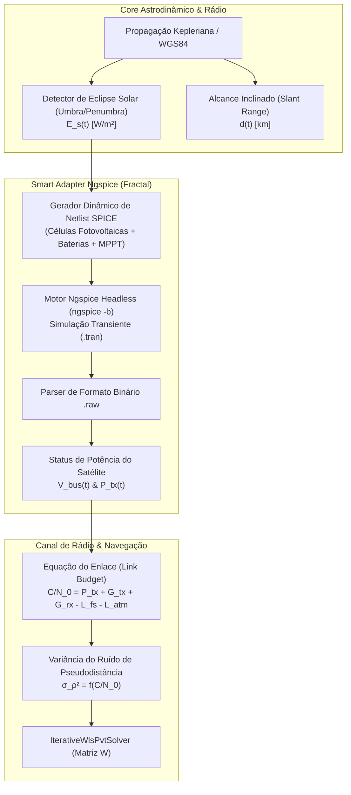

# ⚡ Subsistema de Co-Simulação Eletrônica com Ngspice

Este documento detalha o papel, a ontologia e os pontos de integração da co-simulação eletroeletrônica com o **Ngspice** no ecossistema do **Brazilian RPS Sim**, demonstrando a aplicação dos 8 elementos táticos do Domain-Driven Design (DDD) em um Smart Adapter Fractal de Nível 3.

---

## 🎯 1. Conveniência e Relevância do Ngspice para o Projeto RPS-BR

O **Ngspice** é o simulador de circuitos analógicos, digitais e de sinais mistos em nível de componentes (*SPICE*) padrão da indústria e da academia. Em uma missão aeroespacial de posicionamento regional como o RPS-BR, o Core governa a cinemática de alto nível e a geometria de sinal, mas a **física do hardware embarcado no satélite e nas estações terrestres** exige fidelidade eletroeletrônica:

---

## 🔌 2. Os Três Pontos Críticos de Integração Elétrica

1. **Subsistema de Energia Elétrica (EPS - Electrical Power System):**
   * **Cenário Físico:** Durante as passagens dos 4 satélites IGSO e 3 GEO pela sombra da Terra (eclipses de equinócio), os painéis solares deixam de produzir corrente ($I_{\text{pv}} \to 0$). O barramento primário passa a ser alimentado exclusivamente pelos bancos de baterias de Lítio.
   * **Papel do Ngspice:** Simulação do circuito conversor chaveado Buck/Boost, regulação MPPT e cinética eletroquímica equivalente da bateria ($R_{\text{int}}, C_{\text{cap}}$). O Ngspice calcula a queda de tensão no barramento $V_{\text{bus}}(t)$.
2. **Amplificador de Alta Potência da Carga Útil (Payload HPA / SSPA):**
   * **Cenário Físico:** Se a tensão do barramento $V_{\text{bus}}$ sofre subtensão durante um eclipse severo, os amplificadores de potência de RF em banda L perdem ponto de quiescência, reduzindo a potência efetiva isotrópica radiada (EIRP).
   * **Papel do Ngspice:** Simulação transiente não-linear do estágio de potência RF. A potência real de saída $P_{\text{tx}}(t)$ é re-injetada no Core para atualizar a relação portadora-ruído $C/N_0$ e a matriz estocástica de pesos do solver PVT.
3. **Front-End Analógico do Receptor Terrestre (LNA & Filtros RF):**
   * **Cenário Físico:** Na estação de monitoramento de solo (ex.: ITA / São José dos Campos), o sinal chega na antena com potência de apenas $\approx -160\text{ dBW}$. O front-end precisa amplificar com baixíssimo ruído.
   * **Papel do Ngspice:** Modelagem da figura de ruído ($NF$), ruído térmico de Johnson-Nyquist ($4 k_B T B$) e resposta em frequência do filtro passa-faixa em banda L1/L5.

---

## 🧩 3. Os 12 Elementos Canônicos do Núcleo Fractal no Ngspice

Como um **Smart Adapter de Nível 3 (Fractal)**, o adaptador do Ngspice implementa de forma completa os **12 Elementos Canônicos** (4 na Camada de Aplicação e 8 na Camada de Domínio) para governar a ontologia de circuitos, a simulação e o intercâmbio com o Core:

### A. Os 4 Elementos da Camada de Aplicação do Fractal

1. **Application Services (*Casos de Uso Locais*):**
   * `NgspiceCoSimulationService`: Orquestra o ciclo de vida da simulação transiente a cada passo temporal, capturando o estado solar e despachando os comandos de execução.
   * `CircuitConvergenceMonitorService`: Monitora os logs numéricos do integrador SPICE e aciona políticas de contingência em caso de não-convergência ou passo excessivamente reduzido (*timestep too small*).
2. **Data Transfer Objects (*DTOs do Adaptador*):**
   * `SpiceNetlistParametersDTO`: DTO imutável contendo irradiância instantânea ($E_s$), temperatura de operação e comandos de chaveamento.
   * `CircuitTelemetryOutputDTO`: DTO estruturado transportando tensões nodais ($V_{\text{bus}}$), corrente drenada e potência de RF ($P_{\text{tx}}$).
3. **Mappers (*Conversores Bidirecionais Puros*):**
   * `SpiceTelemetryMapper`: Converte o payload de pacotes do NoC (`MissionPacket`) para DTOs locais e mapeia as saídas transientes brutas em DTOs de telemetria prontos para re-injeção no NoC.
   * `NetlistParametersMapper`: Traduz os Value Objects do domínio elétrico nos parâmetros literais injetados nos modelos SPICE.
4. **Ports / Interfaces (*Portas Internas do Fractal*):**
   * `INetworkInterface`: Porta de entrada e saída voltada para a malha do NoC (`VC-Control` e `VC-CoSimulation`).
   * `INgspiceProcessDriver`: Porta interna de abstração do executável ou biblioteca SPICE de baixo nível.
   * `INetlistCompilerSubstrate`: Porta de acesso ao compilador sintático de netlists.

---

### B. Os 8 Elementos Táticos de Domínio do Fractal

5. **Agregados (*Aggregates*):**
   * `SatelliteCircuitAggregate`: Raiz de consistência do circuito elétrico do satélite. Encapsula o grafo de conexões (painéis, baterias, reguladores e transmissor). Garante o invariante elétrico fundamental: existência obrigatória de um nó terra de referência comum (nó 0) e ausência de nós flutuantes que causariam singularidade na matriz nodal do SPICE ($G \cdot V = I$).
6. **Entidades (*Entities*):**
   * `CircuitNodeEntity`: Representa os nós de interconexão com identidade única (ex.: nó `BUS_28V`, nó `BAT_POS`). Seu estado (tensão instantânea) evolui a cada passo, mas sua identidade na netlist permanece imutável.
   * `SpiceComponentEntity`: Componentes físicos com parâmetros individuais (ex.: transistor GaN `Q_HPA_1`, célula de bateria `CELL_BATT_3`).
7. **Objetos de Valor (*Value Objects - VOs*):**
   * `ResistanceVO`, `CapacitanceVO`, `InductanceVO`: VOs imutáveis com validação de grandezas físicas e unidades no `__post_init__` (rejeitando valores nulos ou negativos incoerentes).
   * `SpiceDirectiveVO`: Representa comandos de controle de simulação (ex.: `.tran 10u 1s`, `.options reltol=0.001`).
   * `TransientResultVO`: Amostra temporal congelada de tensões de nós e correntes de ramos resultante da execução do solver.
8. **Serviços de Domínio (*Domain Services*):**
   * `NetlistTopologicalValidatorService`: Analisa a topologia do circuito antes da execução para detectar malhas fechadas de fontes de tensão ideais ou ramos indutivos em aberto.
   * `TransientStepCalculatorService`: Calcula o passo máximo de integração ($\Delta t_{\max} \le \frac{1}{10 f_{\text{sw}}}$) baseado na frequência de chaveamento do regulador para assegurar estabilidade numérica no integrador trapezoidal do SPICE.
9. **Especificações (*Specifications* - Padrão Specification):**
   * `BatteryUnderVoltageSpecification`: Verifica se a curva de descarga da bateria violou a margem de segurança operacional ($V_{\text{bus}} < 22.0\text{ V}$).
   * `ThermalOperatingLimitSpecification`: Avalia se a dissipação de potência de pico no transistor de RF ultrapassa o limite térmico de junção ($T_j > 150^\circ\text{C}$).
10. **Políticas de Domínio (*Policies*):**
    * `BatteryDegradationPolicy`: Modela o envelhecimento da bateria, incrementando a resistência interna equivalente ($R_{\text{int}}$) a cada ciclo térmico de eclipse completado na órbita.
    * `SolverConvergenceRemediationPolicy`: Se o Ngspice falhar com erro de "Timestep too small", esta política comuta o algoritmo de integração numérica de `TRAP` (trapezoidal) para `GEAR` e ajusta as tolerâncias de condutância `gmin` dinamicamente.
11. **Eventos de Domínio (*Domain Events*):**
    * `BatteryDepletionWarningEvent`: Disparado internamente no domínio do adaptador quando a bateria atinge $80\%$ de profundidade de descarga (*DoD*).
    * `PayloadUnderVoltageEvent`: Disparado quando a tensão do barramento afeta a linearidade do transmissor.
    * *Mapeamento:* A camada de aplicação do adaptador captura esses eventos e os traduz para DTOs de alarme despachados ao Core de controle da missão.
12. **Fábricas (*Factories*):**
    * `SatelliteCircuitFactory`: Constrói proceduralmente o agregado `SatelliteCircuitAggregate` a partir das condições de irradiância solar $E_s(t)$ e temperatura fornecidas pelo Core, instanciando os modelos elétricos adequados para satélites GEO (plataformas de alta potência) ou IGSO.

---

## 🛠️ 4. A Camada de Driver do Ngspice (Fronteira Física de Baixo Nível)

Quando operando na **Variante Mediada por Shim (Variante 2 do NoC)**, o acesso ao executável externo SPICE é blindado pela interface `INgspiceProcessDriver`, cujas implementações residem em `adapters/drivers/`:
* `AsyncSubprocessNgspiceDriver`: Implementação de produção que gerencia a invocação do executável `ngspice -b` via processos assíncronos POSIX, redireciona o binário `.raw` para `/dev/shm` e faz o parse vetorial em C/NumPy em tempo real;
* `InMemoryMockNgspiceDriver`: Implementação de teste hermético que emula as respostas transientes sem depender da presença do binário Ngspice no ambiente de desenvolvimento ou CI/CD;
* `ShmRawReader`: Transceiver de memória compartilhada para leitura vetorial zero-copy de curvas transientes de alta frequência.

> **Transição para NoC Zero-Driver (Variante 1):** Se o motor Ngspice for executado como daemon autônomo com suporte ao protocolo NoC, esta camada de `drivers/` é eliminada, comunicando-se exclusivamente via `adapters/noc_edge/`.

---

## 🧱 5. Os Substratos Locais Privados do Ngspice

Em conformidade com a Regra de Subsidiariedade, o Ngspice mantém em `substrates/` os recursos de apoio que só dizem respeito à engenharia eletrônica:
* `NetlistCompilerSubstrate`: Gerador e validador sintático que converte os grafos do agregado em arquivos `.cir` higienizados e formatados;
* `ModelLibraryCacheSubstrate`: Repositório local de modelos BSIM/SPICE de diodos espaciais e transistores GaN, com integridade auditada via hashes SHA-256.

---

## 🤖 6. Orquestração Multi-Agente Autônoma (Integração AutoGen + LangGraph)

Esta arquitetura fractal viabiliza a orquestração por agentes autônomos de Inteligência Artificial:
* **AutoGen (Camada Operacional / Tool-Use):** Agentes de engenharia elétrica especializados (ex.: *CircuitDesignerAgent*, *SpiceSimulationAgent*, *DiagnosticsAgent*) realizam síntese de circuitos, dimensionamento de componentes e análise de convergência numérica em netlists SPICE.
* **LangGraph (Camada de Governança e Grafo Cíclico):** Implementa a máquina de estados determinística da missão:
  $$\text{Passo Orbital (Core)} \longrightarrow \text{Avaliação de Eclipse} \longrightarrow \text{Disparo Ngspice} \longrightarrow \text{Telemetria Elétrica} \longrightarrow \text{Balanço de Link RF}$$
  Caso ocorra anomalia elétrica (ex.: subtensão crítica de bateria no Ngspice), o LangGraph comuta a constelação para modo de sobrevivência (*Safe Mode*), desliga cargas secundárias e notifica o operador via alertas da Camada de Aplicação do Core.
