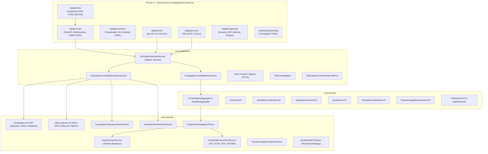

# 🏛️ Visão Geral da Arquitetura & O Hexágono Dourado

Este portal apresenta a especificação arquitetural abrangente do **Brazilian Regional Positioning System Simulator (RPS-BR)**, detalhando os fundamentos de engenharia de software de missão crítica, o hibridismo metodológico adotado e a transição do modelo hexagonal clássico para o paradigma do **Hexágono Dourado** do projeto Vanguard.

---

## 🎯 1. Princípios Arquiteturais Fundamentais

O projeto foi concebido sob quatro pilares metodológicos rigorosos:

1. **Arquitetura Hexagonal (*Ports & Adapters* - Alistair Cockburn):**
   * O **Core** de negócio é o hexágono central isolado do mundo exterior. Ele não conhece nem depende de frameworks de rede (FastAPI, WebSockets), middleware de robótica (ROS 2), motores de física (Gazebo Sim) ou bibliotecas de interface visual (Leaflet, CesiumJS).
   * As fronteiras de comunicação são delimitadas por **Portas (*Ports*)**:
     * *Driving Ports (Inbound):* Interfaces de Casos de Uso acionadas por agentes externos (REST, WebSockets, CLI, ROS 2).
     * *Driven Ports (Outbound):* Interfaces que o Core utiliza para notificar ou comandar o ambiente exterior (emissão de alertas DOP, persistência, controle de física do Gazebo).
2. **Clean Architecture (*Robert C. Martin*):**
   * A **Regra de Dependência Concêntrica** é estritamente inviolável: o fluxo de dependência aponta sempre para o centro ($\text{Domínio} \leftarrow \text{Aplicação} \leftarrow \text{Adaptadores/Infraestrutura}$).
   * Casos de Uso (*Application Services*) são dissociados das Entidades e Regras de Negócio Empresariais (*Domain*).
3. **Domain-Driven Design (DDD - Eric Evans):**
   * A linguagem ubíqua reflete fielmente o jargão da astrodinâmica e da radionavegação por satélite (*Keplerian Elements*, *Slant Range*, *Line of Sight*, *Dilution of Precision*, *Tropospheric Saastamoinen Delay*, *Klobuchar EIA*).
   * Separação clara entre **Entidades**, **Agregados**, **Value Objects Imutáveis**, **Políticas de Domínio**, **Especificações** e **Serviços de Domínio**.
4. **Design API-First & *Dogfooding*:**
   * A interface de usuário (SPA) é um cliente externo puro que consome as mesmas portas públicas de rede que qualquer outro cliente automatizado (receptores GNSS comerciais via NMEA 0183, nós ROS 2 ou agentes autônomos de IA).

---

## 🧭 2. Os Quatro Círculos Concêntricos da Arquitetura



---

## 🧬 3. Hibridismo Arquitetural: Clean + Hexagonal + Fractal

A arquitetura do RPS-BR não é refém de dogmas puristas de uma única metodologia; ela representa uma **síntese harmônica e deliberada de três grandes linhagens**:

```text
┌─────────────────────────────────────────────────────────────────────────────┐
│              SÍNTESE DA ARQUITETURA HEXAGONAL FRACTAL LIMPA                 │
├─────────────────────────────────────────────────────────────────────────────┤
│                                                                             │
│   1. ARQUITETURA HEXAGONAL (Cockburn):                                      │
│      • Delimita a fronteira simétrica do sistema.                           │
│      • Portas de Entrada (Driving) e Portas de Saída (Driven).              │
│      • Garante imunidade total contra acoplamento com frameworks.           │
│                                                                             │
│   2. CLEAN ARCHITECTURE (Robert C. Martin):                                 │
│      • Estabelece a Regra de Dependência Concêntrica Unidirecional.         │
│      • Separa com rigor Casos de Uso (Application) de Entidades (Domain).   │
│      • O centro nunca sabe quem está na periferia.                          │
│                                                                             │
│   3. ARQUITETURA FRACTAL (Vanguard / ADR 0005):                             │
│      • Substitui o hexágono monolítico estático por Auto-Similaridade.      │
│      • Permite que subsistemas complexos sejam sub-hexágonos completos.     │
│      • Adota a malha Network on Core (NoC) como sistema circulatório.       │
│                                                                             │
└─────────────────────────────────────────────────────────────────────────────┘
```

Denomina-se formalmente esse paradigma como **Arquitetura Hexagonal Fractal Limpa (*Clean Fractal Hexagonal Architecture*)**.

---

## 👑 4. O Confronto: Hexágono Comum vs. Hexágono Dourado (Vanguard)

O que precisamente separa a **Arquitetura Hexagonal clássica (Cockburn 2005)** do **Hexágono Dourado conceituado no projeto Vanguard**?

A teoria do Hexágono Dourado foi formulada para responder às deficiências do modelo clássico quando aplicado a **Sistemas Ciber-Físicos Aeroespaciais de Missão Crítica**:

| Dimensão | Hexágono Comum (Cockburn 2005) | Hexágono Dourado (Vanguard) |
| :--- | :--- | :--- |
| **Morfologia do Core** | Caixa-preta indiferenciada (sem estrutura interna). | **Fractal Assimétrico Multiescala** (particionado em subdomínios e autarquias autônomas). |
| **Topologia de Portas** | Acoplamento ponto-a-ponto ($O(N)$ portas diretas no Core). | **Network on Core (NoC)** com canais virtuais, QoS e envelopes universais (`GoldenPacket`). |
| **Governança & Regulação** | Inexistente (código de aplicação cuida de tudo). | **Sub-Core de Governança (Poder Judiciário)** para compliance de contratos, quarentena e relógio. |
| **Infraestrutura Física** | "Mero detalhe descartável" (visão empresarial web). | **Substrato Fundacional Vital** (invariantes físicos, tempo real, jitter e não-repúdio). |
| **Sincronismo Temporal** | Monótono / Best-effort (sem teoria de relógio). | **Barreira Temporal Rígida (IEEE 1516)** com rendezvous lock-step entre física e circuitos. |
| **Proporção Estrutural** | Arbitrária e plana. | **Proporção Áurea ($\phi \approx 1,618$)**: equilíbrio ótimo entre desacoplamento e coesão funcional. |

O Hexágono Dourado é, em essência, a **elevação da Arquitetura Hexagonal ao status de sistema operacional ciber-físico distribuído**, capaz de sustentar satélites de navegação, sistemas de atitude (AOCS) e agentes autônomos sem degeneração espaguete.

---

## 🗺️ 5. Navegação dos Módulos Arquiteturais

Para aprofundar-se em cada dimensão do sistema, navegue pelos módulos temáticos:

1. 🌲 **[Árvore do Projeto & Catálogo de Padrões de Projeto](tree_and_patterns.md):** Mapeamento do código-fonte e implementação de Strategy, Observer, Facade e Singleton Thread-Safe.
2. 🧩 **[Smart Adapters & Taxonomia Fractal](smart_adapters.md):** A anatomia em três camadas de adaptadores, antipadrão utilitário e a classificação de maturidade (Níveis 1 a 3).
3. ⚡ **[Co-Simulação Eletrônica com Ngspice](cosimulation_ngspice.md):** Modelagem de EPS, amplificadores de RF, front-end terrestre, 8 elementos de DDD e orquestração AutoGen + LangGraph.
4. 🌐 **[A Malha de Transporte de Alto Nível: Network on Core (NoC)](network_on_core.md):** Os cinco pilares do NoC, a dicotomia NoC Passivo vs. Ativo, o Sub-Core de Governança e o modelo de Soberania Constitucional.
5. 🏗️ **[A Camada de Infraestrutura & O Substrato Vanguard](infrastructure_substrate.md):** Dicotomia entre adaptadores e infraestrutura, os quatro substratos, persistência poliglota, Edge Network Interface e decisão lexical.
