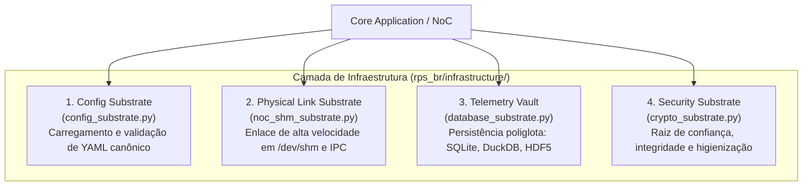

# 🏗️ Camada de Infraestrutura & Substrato Vanguard

A infraestrutura técnica, os quatro substratos fundacionais da Vanguard, persistência poliglota, regulação temporal IEEE 1516 e a interface de borda unificada no RPS-BR.

---

## 🎯 1. A Dicotomia de Borda: Adaptadores (`/adapters/`) vs. Infraestrutura (`/infrastructure/`)

Uma das decisões de design mais fundamentais na Arquitetura Hexagonal e na Clean Architecture reside na distinção rigorosa entre **Adaptadores de Borda** e a **Camada de Infraestrutura**:

```text
┌─────────────────────────────────────────────────────────────────────────────┐
│                    DICOTOMIA DE BORDA: ADAPTERS vs. INFRASTRUCTURE          │
├──────────────────────────────────────┬──────────────────────────────────────┤
│      ADAPTADORES (/adapters/)        │    INFRAESTRUTURA (/infrastructure/) │
├──────────────────────────────────────┼──────────────────────────────────────┤
│ • Sentidos e Atuadores da Missão     │ • Esqueleto Físico e Suporte Vital   │
│ • Voltam-se para AGENTES EXTERNOS    │ • Volta-se para o HARDWARE e o SO    │
│   (Usuários, Navegador 3D, Redes,    │   (Memória física /dev/shm, Arquivos,│
│    ROS 2, Processos Ngspice)         │    Cofre de Telemetria, Criptografia)│
│ • Traduzem protocolos específicos    │ • Fornece canais de I/O e garantias  │
│   (REST, WebSocket, NMEA, CZML)      │   não-funcionais duras (baixo jitter,│
│   para chamadas ou pacotes NoC       │   tempo real, integridade de disco)  │
│ • Driving & Driven Adapters de caso  │ • Suporte transversal a todo o       │
│   de uso (Web, CLI, Gráficos)        │   ecossistema (incluindo adaptadores)│
└──────────────────────────────────────┴──────────────────────────────────────┘
```

1. **Os Adaptadores (`/adapters/`):**
   * Representam os *sentidos e atuadores* do sistema.
   * Conectam a aplicação a agentes externos (usuários via interface gráfica web, operadores via CLI, nós robóticos no ecossistema ROS 2 ou simuladores físicos externos como Gazebo e Ngspice).
   * Traduzem as intenções externas para chamadas de portas do Core ou envelopes de pacotes NoC, e vice-versa.
2. **A Infraestrutura (`/infrastructure/`):**
   * Representa o *esqueleto e suporte vital* do sistema.
   * Não possui casos de uso de negócio ou modelos de radionavegação. Sua responsabilidade é fornecer primitivas técnicas concretas de computação, armazenamento persistente em disco/banco, alocação de memória de alta vazão e comunicação física com o sistema operacional hospedeiro.

---

## 🏛️ 2. Os Quatro Pilares da Camada de Infraestrutura no RPS-BR

A camada `rps_br/infrastructure/` sustenta o simulador através de quatro responsabilidades técnicas primordiais:



1. **Substrato de Configuração (`config/` ou `config_substrate.py`):**
   * Deserialização, parsing e validação rigorosa de esquemas dos arquivos de manifesto da simulação (`simulation_parameters.yaml`).
   * Fornece parâmetros imutáveis de satélites, estações terrenas e constantes astronômicas.
2. **Substrato Físico de Enlace do NoC (`noc/` ou `noc_shm_substrate.py`):**
   * Implementações de baixo nível da interface de enlace `ILinkDriver`.
   * Gerencia buffers circulares em memória compartilhada POSIX (`/dev/shm`), canais assíncronos (`asyncio`) e pipes de alta vazão para troca de telemetria sem cópia (*zero-copy*).
3. **Substrato de Persistência e Cofre de Telemetria (`persistence/` ou `database_substrate.py`):**
   * Implementação concreta de repositórios para armazenamento de séries temporais densas, trajetórias orbitais, matrizes DOP e métricas de desempenho.
4. **Substrato de Raiz de Confiança e Integridade (`security/` ou `crypto_substrate.py`):**
   * Validação de assinaturas criptográficas, integridade SHA-256 de manifestos e higienização de telemetrias externas.

---

## 🌌 3. O Substrato Vanguard (*Foundation & Structures Layer*)

Nas formulações conceituais do ecossistema **Vanguard** (*Hexágono Dourado*), a infraestrutura é denominada formalmente como a camada de **Substrato Fundamental (*Foundation & Structures Layer*)**.

Na cosmologia arquitetural da Vanguard:
* O **Core** representa a *Cognição e o Domínio* (as leis físicas, os modelos matemáticos e a lógica da missão);
* Os **Adaptadores** representam os *Sentidos e Atuadores* (a interface gráfica, a ponte com sensores externos, o enlace de rádio);
* A **Infraestrutura / Substrato** representa o *Esqueleto Físico e os Meios Vitais*:
  1. **Substrato Físico de Enlace (*Physical Link Substrate*):** A canalização concreta de bits (memória física mapeada, barramentos de IPC de latência determinística) sobre a qual a malha lógica do NoC navega;
  2. **Cofre de Telemetria (*Telemetry Vault / Mission Black-Box*):** Estrutura de persistência contínua com garantia de não-repúdio e registro cronológico estrito de cada amostra de voo;
  3. **Registro Canônico de Configuração (*Configuration Registry*):** Garante que todas as autarquias e fractais inicializem a partir de um manifesto de parâmetros imutável e auditado;
  4. **Raiz de Confiança e Integridade (*Root of Trust*):** Garante a higienização criptográfica e a autenticação das mensagens que entram no sistema.

---

## 🛡️ 4. Encapsulamento das Validações: Specifications de Domínio vs. Governança

### 1. As Specifications de Domínio Devem Ser Visíveis à Camada de Aplicação?
**Não. As Specifications de domínio são cidadãos de domínio puro e devem permanecer encapsuladas internamente em seus respectivos sub-cores.**

* **Fundamentação Técnica:**
  * O padrão **Specification** (ex.: `ZenithVisibilitySpec`, `BatteryUnderVoltageSpecification`, `KeplerianEccentricityBoundedSpec`) encapsula predicados de regras de negócio (`is_satisfied_by(candidate) -> bool`).
  * No design rigoroso de DDD, a Camada de Aplicação deve orquestrar casos de uso através de **intenções semânticas de alto nível** (ex.: `calculate_visible_satellites()`, `solve_pvt_for_ground_station()`, `propagate_step()`).
  * Se a Camada de Aplicação precisasse importar e instanciar manualmente cada Specification para verificar se o satélite está visível ou se a órbita fechou, estaríamos cometendo o antipadrão clássico do **Modelo de Domínio Anêmico (*Anemic Domain Model*)** com **Vazamento de Lógica de Negócio (*Domain Logic Leaking*)**: o caso de uso deixaria de ser um coordenador e se transformaria em um script procedural checando dezenas de `if` de negócio.
* **Quem Consome as Specifications?**
  * As Specifications são consumidas internamente por **Entidades**, **Agregados**, **Políticas de Domínio** ou **Serviços de Domínio**. A Aplicação recebe apenas o resultado consolidado da operação ou invoca o Serviço de Domínio que já executa a checagem internamente.

### 2. Como se Dividem as Camadas de Validação no Sistema?

| Camada | Tipo de Validação | O que valida? | Exemplo Concreto |
| :--- | :--- | :--- | :--- |
| **Borda / Adaptadores** | Validação Sintática de Entrada | Formato de JSON, query params, tipos básicos de dados. | Pydantic / DTO Schemas no FastAPI. |
| **Aplicação / Governança** | Validação de Contrato & Ciclo de Vida | Envelopes NoC, transições de estado, sincronismo temporal. | `ContractCensor.validate(packet)`, `ClockMaster`. |
| **Domínio Puro** | Validação Semântica & Invariantes | Leis físicas, regras astronômicas e limites matemáticos. | `ZenithVisibilitySpec`, `KeplerianElementsVO.__post_init__`. |

---

## ⏱️ 5. O Relógio da Simulação: Mestre de Barreira Temporal (IEEE 1516)

### 1. O Contraste entre o Modelo Atual e a Nova Arquitetura
A comparação entre a implementação atual (`SimulationSessionService`) e o modelo baseado em **Sub-Core de Governança + NoC** evidencia um salto qualitativo de robustez:

```text
┌─────────────────────────────────────────────────────────────────────────────┐
│                       EVOLUÇÃO DO CONTROLE DE RELÓGIO                       │
├──────────────────────────────────────┬──────────────────────────────────────┤
│    MODELO ATUAL (Imperativo / Lock)  │     NOVO MODELO (Governança / NoC)   │
├──────────────────────────────────────┼──────────────────────────────────────┤
│ • Variável escalar (_sim_time_sec)   │ • ClockMaster (Entidade Soberana)    │
│ • Acoplamento procedural in-memory   │ • Barramento reativo NoC (VC-Control)│
│ • Lista direta de portas registradas │ • Publicação de pacotes de tick      │
│ • Flags booleanas (_is_paused)       │ • Máquina de Estados Finita formal   │
│ • Sincronismo "Best-Effort"          │ • Barreira Temporal Rígida (IEEE 1516│
│   (adaptadores podem desincronizar)  │   lock-step rendezvous)              │
│ • Recuperação por timeout ad-hoc     │ • Políticas formais de quarentena    │
└──────────────────────────────────────┴──────────────────────────────────────┘
```

### 2. O Funcionamento da Barreira Temporal (*Lock-Step Synchronization*)
No modelo atual, se o Gazebo avança física, o Cesium no navegador roda seu próprio laço e o Ngspice efetua integração pesada, há risco permanente de drift temporal ou assincronia silenciosa.

Com a Governança e o NoC:
1. **Disparo do Passo:** O `ClockMaster` publica um `MissionPacket` no canal `VC-Control` com o comando `STEP_REQUEST(target_time=t_{k+1})` e prioridade máxima (Prioridade 7).
2. **Execução Concorrente e Hermética:** Cada subsistema registrado (Física no Gazebo, Circuito no Ngspice, Solver PVT no Core) executa seu avanço local para o tempo $t_{k+1}$.
3. **Barreira de Rendezvous (*Time-Barrier*):** Nenhum subsistema pode avançar para $t_{k+2}$ até que todos os nós críticos emitam `STEP_CONFIRMED(sim_time=t_{k+1})` de volta para a Governança.
4. **Resiliência e Tolerância:** Se um nó (ex.: Ngspice) sofrer timeout ou falhar na barreira, a Governança não trava o sistema: ela ativa a política de quarentena, preenche a telemetria com modelo linear aproximado e avança o relógio da constelação de forma segura.

### 3. Transição Suave e Compatibilidade Regressiva
Essa evolução arquitetural **não quebra** os contratos existentes:
* O `SimulationSessionService` atual continua existindo como a **Fachada de Caso de Uso** consumida pelos adaptadores REST e CLI;
* Em vez de gerenciar variáveis de estado imperativas diretamente em memória, o `SimulationSessionService` passa a delegar os comandos de relógio para o `ClockMaster` da Governança e consultar o estado consolidado da missão. As rotas `/api/simulation/pause`, `/step` e `/status` continuam respondendo exatamente aos mesmos contratos.

---

## 🔬 6. Comparativo Epistemológico: Modelo Tradicional vs. Modelo Vanguard

Ao confrontar o modelo tradicional de engenharia de software corporativa (`/infrastructure/` ou `/infra/`) com o modelo ciber-físico aeroespacial da **Vanguard (*Foundation Layer & Substrates*)**, emergem contrastes de maturidade, robustez e premissas operacionais:

```text
┌─────────────────────────────────────────────────────────────────────────────┐
│             CONFRONTO: INFRAESTRUTURA TRADICIONAL vs. VANGUARD              │
├──────────────────────────────────────┬──────────────────────────────────────┤
│    INFRAESTRUTURA TRADICIONAL        │      VANGUARD FOUNDATION LAYER       │
│     (/infrastructure/ ou /infra/)    │             (Substratos)             │
├──────────────────────────────────────┼──────────────────────────────────────┤
│ • Origem: DDD / Clean Architecture   │ • Origem: Engenharia de Missão Crí-  │
│   (software empresarial / web)       │   tica e Sistemas Ciber-Físicos      │
│ • "A persistência é um mero detalhe" │ • O substrato é o suporte vital      │
│   (descartável e substituível)       │   (invariantes físicos inegociáveis) │
│ • Foco: Desacoplamento funcional de  │ • Foco: Garantias não-funcionais     │
│   bibliotecas externas e bancos      │   (tempo real, jitter, não-repúdio)  │
│ • Maturidade: Altíssima no ecossis-  │ • Robustez: Superior para sistemas   │
│   tema de software global            │   críticos e aeroespaciais           │
│ • Nomenclatura universal padrão      │ • Nomenclatura ontológica profunda   │
└──────────────────────────────────────┴──────────────────────────────────────┘
```

1. **Qual Teorização é Mais Madura?**
   * **O Modelo Tradicional (`/infrastructure/`):** Possui mais de duas décadas de validação empírica em milhares de projetos industriais. É consagrado na literatura de Eric Evans, Alistair Cockburn e Robert C. Martin. Qualquer engenheiro de software no mundo reconhece instantaneamente sua função. Nesse sentido, **o modelo tradicional é mais maduro em termos de ecossistema e adoção comunitária**.
2. **Qual Teorização é Mais Robusta?**
   * **O Modelo Vanguard (*Foundation Substrates*):** Na engenharia de software tradicional, prega-se dogmaticamente que *"o banco de dados é um mero detalhe descartável"*. Na engenharia aeroespacial e de defesa, essa premissa é ingênua: o meio físico de transmissão, o tempo de acesso à memória não-volátil, a integridade contra radiação (*Single Event Upsets*) e o determinismo de barramento não são "detalhes descartáveis" — são restrições vitais da missão.
   * Portanto, **o modelo Vanguard é conceitualmente mais robusto para sistemas ciber-físicos**, pois trata a fundação como um **substrato que assegura garantias duras (*hard real-time guarantees*, não-repúdio e determinismo nanosegundo)**.
3. **Qual é a Melhor Escolha? (A Síntese Harmônica)**
   * **Na árvore de diretórios física:** Adota-se o padrão da indústria **`rps_br/infrastructure/`**. Isso evita burocracia de imports e mantém a base de código amigável a ferramentas de linting, empacotamento e novos desenvolvedores.
   * **Na arquitetura semântica interna:** Organiza-se o diretório rigorosamente conforme os **Quatro Substratos da Vanguard** (`config/`, `noc/`, `persistence/`, `security/`).

---

## 💾 7. Persistência de Dados e a Escala de Maturidade Hexagonal

A persistência de dados em simulações espaciais e de radionavegação difere radicalmente do modelo CRUD tradicional. À medida que o sistema passa a lidar com séries temporais densas (10 Hz a 100 Hz), telemetria contínua de 7 satélites, cálculos analíticos espaciais e múltiplos backends de armazenamento (SQLite, DuckDB, TimescaleDB, HDF5, Parquet, arquivos RINEX e SP3), a persistência evolui pelos **Níveis de Maturidade Hexagonal** (conforme estabelecido no [ADR 0005](../adr/0005_hexagonal_architecture_maturity_levels.md)):

```text
┌─────────────────────────────────────────────────────────────────────────────┐
│                 ESCALA DE MATURIDADE DA PERSISTÊNCIA DE DADOS               │
├─────────────────────────────────────────────────────────────────────────────┤
│                                                                             │
│  NÍVEL 0: Persistência Ad-Hoc / I/O Procedural                              │
│  └── open("telemetry.csv", "w") direto no meio da integração orbital.       │
│      (Antipadrão proibido em missão crítica: acoplamento e I/O bloqueante)   │
│                                                                             │
│  NÍVEL 1: Thin Persistence Adapter (Hexágono Canônico Cockburn)             │
│  └── Interface ITelemetryRepository no Core -> SqliteTelemetryRepository.   │
│      (Executa queries diretas; adequado para configurações e snapshots)     │
│                                                                             │
│  NÍVEL 2: Smart Persistence Adapter (Três Camadas Coesas)                   │
│  ├── 1. Adapter Application Layer: Buffer assíncrono em lote (batch flush), │
│  │   pool de conexões, retries e controle de transação thread-safe.         │
│  ├── 2. Adapter Domain Layer: Modelos de partição temporal (por dia juliano)│
│  │   e critérios de janelamento analítico (resampling, bounding boxes).     │
│  └── 3. Adapter Driver / Transport: Drivers nativos (psycopg2, duckdb, h5py)│
│                                                                             │
│  NÍVEL 3: Fractal de Persistência e Telemetria (O "Telemetry Vault" Vanguard│
│  └── Sub-Hexágono Completo Autônomo com NoC dedicado:                       │
│      - Tem seu próprio ciclo de vida em background (downsampling contínuo,  │
│        compactação lossless zstd, exportação para RINEX/SP3 da IGS);        │
│      - Possui seus próprios Agregados e Serviços de compressão analítica;   │
│      - Comunica-se exclusivamente via NoC assíncrono (VC-Telemetry),        │
│        blindando o Core contra qualquer jitter ou latência de disco/rede.   │
│└─────────────────────────────────────────────────────────────────────────────┘
```

1. **A Aplicação Prática no RPS-BR:**
   * **Fase Atual (Nível 1):** O RPS-BR opera no Nível 1, gravando trajetórias pontuais e gerando séries temporais diretamente em memória (`DopTelemetryBufferObserver`, `ground_track_plotter.py`).
   * **Fase de Escala (Nível 2):** Conforme missões de 24 horas acumularem milhões de amostras de pseudodistância e ruídos de propagação, o adaptador de persistência é promovido para o Nível 2 (Smart Adapter), introduzindo buffers de escrita assíncrona em lote e separando o modelo relacional/colunar do driver de banco.
   * **Fase de Missão Crítica / Vanguard (Nível 3 - Fractal):** Quando o sistema integrar o ecossistema completo de voo, a persistência atinge o status de **Fractal Autônomo (*Telemetry Vault*)**, rodando em thread ou processo isolado com NoC dedicado, garantindo gravação de alta vazão com zero impacto na taxa de quadros da física orbital.

---

## 🎭 8. A Síntese Harmônica: Fachada vs. Motor Operacional

A conciliação definitiva entre a convenção de software e a cosmologia da Vanguard reside na aplicação do padrão **Facade em Nível Arquitetural**:

```text
┌─────────────────────────────────────────────────────────────────────────────┐
│                    ARQUITETURA DE CAMADA: FACHADA vs. MOTOR                 │
├─────────────────────────────────────────────────────────────────────────────┤
│                                                                             │
│   FACHADA ERGONÔMICA EXTERNA:                                               │
│   rps_br/infrastructure/                                                    │
│   • Cumpre os padrões industriais de Clean Architecture e DDD.              │
│   • Reconhecida instantaneamente por linters, empacotadores e IDEs.         │
│   • Apresenta-se como a infraestrutura técnica comum de qualquer software.  │
│                                                                             │
│                         ▼ (Sob o capô / Motor Operacional)                  │
│                                                                             │
│   MOTOR OPERACIONAL INTERNO:                                                │
│   Os Quatro Substratos da Vanguard (Foundation & Structures)                │
│   • Governa invariantes físicos, tempo real, jitter e não-repúdio.          │
│   • Canaliza a comunicação e os batimentos do NoC com a física da missão.   │
│   • Assegura a integridade ciber-física exigida em sistemas aeroespaciais.  │
│                                                                             │
└─────────────────────────────────────────────────────────────────────────────┘
```

---

## 🗂️ 9. A Convenção dos Substratos Planos (*Flat Layout*)

Convenciona-se formalmente que:
1. **Os Adaptadores Técnicos de Suporte são denominados Substratos:**
   * Adaptadores que conversam com usuários e atuadores externos residem em `/adapters/` (Web, CLI, ROS 2, Gazebo, Cesium).
   * Adaptadores que oferecem suporte a dados, configurações e enlace residem em `/infrastructure/` e são modelados internamente como **Substratos da Vanguard**.
2. **Rejeição ao Hiper-Aninhamento (Layout Plano):**
   * Em conformidade com o princípio *"Flat is better than nested"*, evita-se criar árvores labirínticas como `infrastructure/persistence/database/relational/sqlite/...`.
   * Os substratos residem em primeiro nível plano dentro de `infrastructure/`:
     ```text
     rps_br/infrastructure/
     ├── config_substrate.py       # (ou config/) Substrato de parâmetros canônicos
     ├── database_substrate.py     # Substrato de persistência/banco (SQLite / DuckDB)
     ├── noc_shm_substrate.py      # Substrato de enlace físico em /dev/shm
     └── crypto_substrate.py       # Substrato de segurança e raiz de confiança
     ```

---

## 🔌 10. Interoperabilidade do NoC com Níveis 0, 1 e 2: O Padrão Edge NI

Seria um erro gravíssimo de sobreengenharia forçar que cada script de Nível 0 ou repositório de Nível 1 implementasse uma malha de NoC interna. A solução padrão da microeletrônica e dos sistemas de rede é o **Padrão Edge Network Interface (Terminal Gateway / Shim Adapter)**:

```text
┌─────────────────────────────────────────────────────────────────────────────┐
│             INTEROPERABILIDADE: MALHA NOC vs. COMPONENTES LEIGOS            │
├─────────────────────────────────────────────────────────────────────────────┤
│                                                                             │
│   ═══════════════════════════════════════════════════════════════════════   │
│     MALHA DE ALTO NÍVEL DO NoC (MissionPackets, VC-Control, VC-Telemetry)   │
│   ═══════════════════════════════════════════════════════════════════════   │
│                 │                                         │                 │
│                 ▼                                         ▼                 │
│      ┌─────────────────────┐                   ┌─────────────────────┐      │
│      │  NATIVO (Nível 3)   │                   │  EDGE NETWORK IFACE │      │
│      │  Smart Adapter      │                   │  (Terminal Gateway) │      │
│      │  com NoC Fractal    │                   └──────────┬──────────┘      │
│      │  (Ex: Ngspice)      │                              │ Chamada         │
│      └─────────────────────┘                              │ Método Direta   │
│                                                           ▼                 │
│                                                ┌─────────────────────┐      │
│                                                │  COMPONENTE LEIGO   │      │
│                                                │  (Nível 0, 1 ou 2)  │      │
│                                                │  - Repositório SQL  │      │
│                                                │  - CLI Runner       │      │
│                                                │  - Exportador CSV   │      │
│                                                └─────────────────────┘      │
└─────────────────────────────────────────────────────────────────────────────┘
```

1. **O Componente Leigo Permanece Puro e Simples:**
   * O adaptador de Nível 0, 1 ou 2 não sabe o que é um pacote, um canal virtual ou um roteador lógico. Ele apenas expõe ou consome uma assinatura limpa de função em Python: `save_telemetry(data: dict)` ou `read_parameter(key: str)`.
2. **A Edge Network Interface (Terminal Gateway) Faz a Ponte:**
   * A Porta Hexagonal do Core ou um *Shim* de borda conecta-se ao NoC.
   * Quando um pacote `MissionPacket` chega pelo canal `VC-Telemetry`, a Edge NI extrai o payload, desserializa-o e invoca o método tradicional do componente leigo (`repository.save(entity)`).
   * No sentido inverso, quando a CLI chama `session.pause()`, o método na porta traduz a chamada procedural para um pacote `MissionPacket` no canal `VC-Control` e o injeta na malha.

---

## 🔤 11. Decisão Lexical Canônica: `/infrastructure/` (Singular) vs. `/structures/`

Para eliminar quaisquer ambiguidades nominais na árvore do repositório, fixa-se a decisão terminológica:

1. **Por que NÃO `/infrastructures/` (Plural)?**
   * Em língua inglesa técnica, a palavra *infrastructure* é gramaticalmente um substantivo incontável (*mass noun*). O uso do plural *"infrastructures"* para diretórios de software soa não-idiomático e viola a convenção dos ecossistemas Python, Linux e ROS 2.
2. **Por que NÃO `/structures/`?**
   * Em ciência da computação e engenharia de software, o termo *structures* é universalmente reservado para **estruturas de dados** (*data structures*: árvores, grafos, filas, structs) ou para estruturas físicas/estruturais da fuselagem em engenharia mecânica aeroespacial. Nomear uma camada de serviços de baixo nível como `structures` criaria confusão cognitiva severa.
3. **A Resolução Canônica:**
   * O identificador canônico da pasta física é **`rps_br/infrastructure/`** (no singular).
   * O conceito arquitetural sob o qual seus módulos são projetados é denominado **Substrato Fundamental (*Vanguard Foundation Layer*)**.

---

## 🔄 12. Dualidade Simétrica da Edge NI: Porta Inbound vs. Outbound Shim

A questão sobre se a Edge Network Interface (Terminal Gateway) deve ser implementada como a própria **Porta Hexagonal do Core** ou como um **Shim de borda** resolve-se pela **direção do fluxo de controle de execução**:

```text
┌─────────────────────────────────────────────────────────────────────────────┐
│                   A DUALIDADE SIMÉTRICA DA EDGE NETWORK INTERFACE           │
├─────────────────────────────────────────────────────────────────────────────┤
│                                                                             │
│   FLUXO 1: INBOUND (De Fora para Dentro - Driving Ports)                    │
│   [ Cliente Externo / CLI / REST ]                                          │
│              │ Invocação de método Python simples: session.pause()          │
│              ▼                                                              │
│   ┌─────────────────────────────────────────┐                               │
│   │ PORTA HEXAGONAL DO CORE (Edge Gateway)  │                               │
│   │ • Recebe chamada procedural limpa;      │                               │
│   │ • Envelopa intenção em MissionPacket;   │                               │
│   │ • Injeta pacote no canal VC-Control.    │                               │
│   └────────────────────┬────────────────────┘                               │
│                        │ Injeção no NoC                                     │
│                        ▼                                                    │
│               ═══════════════════                                           │
│               NoC TRANSPORT MESH                                            │
│               ═══════════════════                                           │
│                        │ Despacho assíncrono                                │
│                        ▼                                                    │
│   ┌─────────────────────────────────────────┐                               │
│   │ OUTBOUND SHIM ADAPTER (Edge Transceiver)│                               │
│   │ • Subscrito ao canal VC-Telemetry;      │                               │
│   │ • Desempacota o payload do pacote;      │                               │
│   │ • Invoca o método do adaptador leigo.   │                               │
│   └────────────────────┬────────────────────┘                               │
│                        │ Invocação procedural: repository.save(entity)      │
│                        ▼                                                    │
│   [ Adaptador de Saída Leigo / CSV / SQLite ]                               │
│                                                                             │
│   FLUXO 2: OUTBOUND (De Dentro para Fora - Driven Ports)                    │
└─────────────────────────────────────────────────────────────────────────────┘
```

1. **No Fluxo Inbound (Portas de Entrada - Driving): A Porta Hexagonal do Core É a Edge NI.**
   * Quando uma CLI ou controlador REST executa uma ação de controle (ex.: `session.step(1)`), o adaptador de entrada não precisa de nenhum shim intermediário.
   * A Porta Hexagonal no Core recebe a chamada de função Python regular, cria o `MissionPacket` correspondente com prioridade estrita (Prioridade 7) e o injeta na malha do NoC (`VC-Control`).
2. **No Fluxo Outbound (Portas de Saída - Driven): O Outbound Shim É a Edge NI.**
   * Componentes de saída leigos (um gerador de CSV, um observador sonoro ou um banco SQLite de Nível 1) apenas implementam métodos procedurais simples (`write_sample(dict)`).
   * O **Outbound Shim** é o transceiver que se inscreve no canal do NoC (`VC-Telemetry`), intercepta os pacotes e invoca o método do componente leigo de forma transparente.
3. **Harmonia do Modelo:** **Ambos os mecanismos coexistem de forma simétrica**, garantindo que nenhum adaptador de Nível 1 precise conhecer a malha do NoC para enviar ou receber dados.

---

## 🗄️ 13. Arquitetura do Substrato de Persistência: Motores Poliglotas

Ao escalar o armazenamento para múltiplas tecnologias (SQLite para snapshots de missão, DuckDB para séries temporais analíticas de 100 Hz, HDF5 para integração orbital com NASA SPICE e arquivos de efemérides RINEX/SP3), **não se deve pulverizar a infraestrutura em dezenas de substratos isolados nem criar um único arquivo monolítico acoplado**.

Aplica-se o padrão **Substrato de Persistência Unificado com Motores Poliglotas (*Polyglot Persistence Substrate*)**:

```text
┌─────────────────────────────────────────────────────────────────────────────┐
│           SUBSTRATO DE PERSISTÊNCIA UNIFICADO COM MOTORES POLIGLOTAS        │
├─────────────────────────────────────────────────────────────────────────────┤
│                                                                             │
│   FACHADA DO SUBSTRATO (Visão Canônica do Sistema):                         │
│   rps_br/infrastructure/database_substrate.py (ou telemetry_vault.py)       │
│   • Interface de alto nível: store_telemetry(), store_state(), query_pvt()  │
│   • Roteador semântico de persistência e orquestração de transações         │
│                                                                             │
│                         ▼ Roteamento por Natureza do Dado                   │
│                                                                             │
│   MOTORES DE ARMAZENAMENTO ESPECIALIZADOS (Engines Intercambiáveis):        │
│   ┌──────────────────────┬──────────────────────┬─────────────────────────┐ │
│   │ DuckDbEngine /       │ SqliteEngine         │ Hdf5Engine /            │ │
│   │ ParquetEngine        │                      │ RinexSp3Exporter        │ │
│   ├──────────────────────┼──────────────────────┼─────────────────────────┤ │
│   │ Séries temporais de  │ Estado da máquina,   │ Campanhas orbitais de   │ │
│   │ alta vazão (100 Hz), │ sessões ativas, logs │ longa duração (24h+),   │ │
│   │ agregações OLAP e    │ de comandos e metada-│ matrizes binárias densas│ │
│   │ DOP em colunas.      │ dos transacionais.   │ e interoperabilidade.   │ │
│   └──────────────────────┴──────────────────────┴─────────────────────────┘ │
└─────────────────────────────────────────────────────────────────────────────┘
```

* **Interface Única:** O Core, a Governança e o NoC enxergam apenas o **Substrato de Persistência** (`database_substrate.py`), que oferece contratos orientados a casos de uso de missão.
* **Motores Especializados (*Storage Engines*):** Internamente, o substrato despacha o dado para a tecnologia física otimizada para o padrão de acesso daquela grandeza (colunar para telemetria, relacional para metadados, HDF5 para matrizes pesadas).

---

## 🧬 14. Fractais de Nível 3: Adaptadores Internos e Dependência de Substratos

A natureza de um **Smart Adapter de Nível 3 (Fractal)**, como o subsistema Ngspice, suscita duas regras fundamentais de isolamento e acoplamento:

### 1. Um Fractal Pode Ter Seus Próprios Adaptadores Internos?
**Sim, absolutamente.** Essa é a própria essência da propriedade matemática de **Auto-Similaridade (*Fractal Architecture*)**.
* Como um fractal é um sub-hexágono completo, ele reproduz internamente as três camadas de arquitetura:
  * Possui seu próprio **Domínio Interno** (`SatelliteCircuitAggregate`, entidades de nós, leis de Kirchhoff);
  * Possui suas próprias **Portas Internas** (`INgspiceProcessDriver`);
  * Possui seus **próprios Adaptadores Internos**:
    * `AsyncSubprocessNgspiceDriver`: Adaptador interno para processo real POSIX `/usr/bin/ngspice`;
    * `InMemoryMockNgspiceDriver`: Adaptador interno para simulação mock em testes unitários herméticos;
    * `ShmNgspiceDriver`: Adaptador interno que lê vetores de saída diretamente da memória compartilhada `/dev/shm`.
* **Escopo:** O fractal permanece dentro do repositório do RPS-BR, respeitando o princípio da Assimetria Adaptativa ([ADR 0005](../adr/0005_hexagonal_architecture_maturity_levels.md)) sem a necessidade burocrática de virar um repositório git separado.

### 2. Um Fractal Pode Consumir os Substratos como Dependência Transversal?
**Sim, e essa é a regra formal de sustentação do sistema.**
* Os Substratos em `rps_br/infrastructure/` são **recursos fundacionais transversais (*Cross-Cutting Foundation Substrates*)** por definição:
  * O adaptador fractal do Ngspice pode e deve consumir o **Substrato de Enlace Físico (`noc_shm_substrate`)** para ler buffers vetoriais em alta velocidade;
  * O adaptador fractal do Gazebo consome o **Substrato de Configuração (`config_substrate`)** para carregar os parâmetros canônicos de massa e inércia;
  * Qualquer fractal pode emitir pacotes de auditoria para o **Substrato do Cofre de Telemetria (`telemetry_vault`)** via NoC.
* **O Invariante Proibitivo:** O que um fractal **NUNCA** pode fazer é depender diretamente de detalhes privados de outros adaptadores (acoplamento lateral) ou importar o Domínio Matemático puro do Core (`astrodynamics`). Consumir a infraestrutura dos Substratos é perfeitamente legítimo e necessário.
