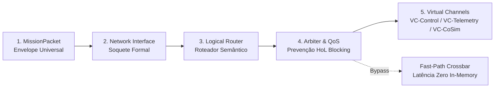

# 🌐 Network on Core (NoC) & Governança do Sistema

A malha de transporte de alto nível e o órgão regulador de ciclo de vida, integridade de contratos e barreira temporal no ecossistema RPS-BR.

---

## 🎯 1. Desmistificando o NoC em Software (Da Microeletrônica à Engenharia de Software)

No projeto **Vanguard** e na concepção de sistemas ciber-físicos aeroespaciais avançados, o conceito de **Network on Core (NoC)** importa o princípio de *Network on Chip* da microeletrônica moderna para resolver um gargalo arquitetural crítico:

* **Na Microeletrônica:** Em circuitos integrados de muitos núcleos (*MPSoCs*), o NoC substituiu os barramentos compartilhados e as trilhas dedicadas ponto-a-ponto porque a proliferação de conexões gerava contenção, acoplamento físico e capacitância parasita.
* **Na Engenharia de Software de Grande Porte:** O problema é estruturalmente idêntico:
  * À medida que o sistema cresce para comportar dezenas de *Smart Adapters* (CesiumJS, Gazebo Sim, Ngspice, NMEA 0183, REST Gateway, CLI, Agentes de IA), se cada adaptador exigir portas ponto-a-ponto acopladas com o Core ou entre si, o sistema degenera em uma malha espaguete incontrolável ($O(N^2)$ dependências cruzadas).
  * O **NoC (Network on Core)** é o **middleware e malha de transporte de alto nível do ecossistema de software**, responsável por rotear eventos, comandos e telemetria através de envelopes universais, roteadores semânticos, árbitros de QoS e canais virtuais segregados.

---

## 🧭 2. Distinção de Fronteira: NoC vs. Adapter Driver Layer

O NoC e a *Adapter Driver Layer* não concorrem nem se anulam; **eles atuam em escalas e fronteiras estritamente complementares**:

```text
┌─────────────────────────────────────────────────────────────────────────────┐
│                    CORE DO SISTEMA (DOMÍNIO & CASOS DE USO)                 │
└──────────────────────────────────────┬──────────────────────────────────────┘
                                       │ Soquete NI (Network Interface)
                                       ▼
═══════════════════════════════════════════════════════════════════════════════
  NoC (NETWORK ON CORE) - MALHA DE TRANSPORTE DE ALTO NÍVEL (INTRA-SISTEMA)
  - Envelope de Roteamento (MissionPacket / Header: Src, Dest, Priority, VC)
  - Logical Router (Roteamento Semântico baseado em intenção)
  - Arbiter & QoS (Prioridades estritas para evitar Head-of-Line Blocking)
  - Virtual Channels (VC-Control, VC-Telemetry, VC-CoSimulation)
  - Fast-Path Bypass (Latência Zero para chamadas in-process críticas)
═══════════════════════════════════════════════════════════════════════════════
        ▲                                                     ▲
        │ Soquete NI                                          │ Soquete NI
        ▼                                                     ▼
┌──────────────────────────────────┐        ┌──────────────────────────────────┐
│   SMART ADAPTER 1 (Ex: Cesium)   │        │   SMART ADAPTER 2 (Ex: Ngspice)  │
│                                  │        │                                  │
│  1. Adapter Application Layer    │        │  1. Adapter Application Layer    │
│  2. Adapter Domain Layer (CZML)  │        │  2. Adapter Domain Layer (Netlist│
│                                  │        │                                  │
│  3. Adapter Driver / Transport   │        │  3. Adapter Driver / Transport   │
│     (TRANSPORTE DE BAIXO NÍVEL   │        │     (TRANSPORTE DE BAIXO NÍVEL   │
│      COM O PERIFÉRICO EXTERNO)   │        │      COM O PERIFÉRICO EXTERNO)   │
│      - Sockets WebSocket / WebGL │        │      - Subprocess POSIX pipes /  │
│        Context Canvas Driver     │        │        I/O em /dev/shm Driver    │
└────────────────┬─────────────────┘        └────────────────┬─────────────────┘
                 │                                           │
                 ▼                                           ▼
      [ Navegador / Tela 3D ]                      [ Binário /usr/bin/ngspice ]
```

1. **O NoC é o Transporte Lógico de Alto Nível (Intra-Sistema / Lógica de Malha):**
   * Situa-se **dentro do ecossistema de software**, conectando os *Bounded Contexts* (Fractais) e *Smart Adapters* entre si e com o Core;
   * Padroniza a comunicação via envelopes estruturados (`MissionPacket` / `GoldenPacket`), blindando os componentes contra detalhes de implementação vizinhos;
   * Evita o acoplamento lateral (*cross-adapter coupling*): dois adaptadores podem colaborar sem que um importe o código do outro, interagindo exclusivamente através da malha do NoC;
   * Previne a contenção (*Head-of-Line Blocking*) através de **Canais Virtuais**: uma simulação transiente pesada do Ngspice rodando no canal de co-simulação não retém nem atrasa os batimentos críticos do relógio de controle no canal de controle.
2. **A Adapter Driver Layer é o Transporte Físico de Baixo Nível (Periférica / "PHY"):**
   * Situa-se **na extremidade exterior de cada Smart Adapter individual**;
   * É responsável por falar com o "mundo exterior" que não entende o protocolo do NoC (ex.: streams de bytes stdin/stdout de um executável C em `/usr/bin/ngspice`, chamadas WebGL com a GPU no navegador, portas seriais UART físicas ou o barramento DDS do ROS 2).

---

## 🏛️ 3. Os Cinco Pilares Estruturais do NoC em Software



1. **Envelope de Pacote (`MissionPacket`):**
   * Encapsula a mensagem com metadados universais de transporte: `source_id`, `destination_id`, `priority` (0 a 7), `virtual_channel`, `timestamp` e `payload`.
2. **Network Interface (NI):**
   * O "soquete" formal de acoplamento. O Core e os adaptadores apenas enxergam a NI, depositando e recebendo pacotes sem conhecer a topologia da malha.
3. **Logical Router:**
   * Motor de despacho semântico que entrega pacotes baseado em intenção (*Point-to-Point* para comandos específicos ou *Publish/Subscribe* para fluxos de telemetria contínua).
4. **Arbiter & QoS (Garantia de Qualidade de Serviço):**
   * Árbitro de tráfego com escalonamento por prioridade estrita. Mensagens de controle de emergência ou pausa imediata furam a fila de pacotes analíticos secundários.
5. **Canais Virtuais (Virtual Channels - VCs) e Fast-Path:**
   * **VC-Control:** Canal prioritário de alta garantia para pulsos de relógio, sinais de sincronismo IEEE 1516 e comandos de pausa/retomada;
   * **VC-Telemetry:** Canal de streaming contínuo para métricas orbitais, DOP e atrasos atmosféricos (1 Hz a 10 Hz);
   * **VC-CoSimulation:** Canal assíncrono para intercâmbio de dados pesados e simulações transientes (Ngspice, modelos térmicos);
   * **Fast-Path (Crossbar Virtual de Latência Zero):** Para trechos críticos de alta performance em que emissor e receptor residem no mesmo processo in-memory (ex.: propagação orbital consumida diretamente pelo solver PVT), a NI efetua o *bypass* da serialização e invoca a função destino em linha, atingindo latência zero com máxima velocidade de CPU.

---

## 🧱 4. Unificação da Interface de Rede no NoC: A Arquitetura em Duas Camadas

A fragmentação da comunicação ocorre quando cada adaptador estabelece contratos ad-hoc e protocolos heterogêneos para conversar com o Core (ex.: um adaptador expõe callbacks síncronos, outro usa RPC assíncrono, outro compartilha referências mutáveis em memória e outro consome sockets diretamente).

Para **desfragmentar a responsabilidade e padronizar o ecossistema**, o NoC atua como a **Interface Unificada de Comunicação**, organizada internamente em duas camadas concêntricas bem delimitadas:

```text
┌─────────────────────────────────────────────────────────────────────────────┐
│                       DOMÍNIO & CASOS DE USO DO CORE                        │
└──────────────────────────────────────┬──────────────────────────────────────┘
                                       │ INetworkInterface
                                       ▼
┌─────────────────────────────────────────────────────────────────────────────┐
│ 1. CAMADA DE ALTO NÍVEL (LÓGICA / SEMÂNTICA - NETWORK ON CORE MESH)         │
│    - Roteamento Semântico e Resolução de Destino por Intenção               │
│    - Envelope Universal MissionPacket / GoldenPacket                        │
│    - Gestão de Canais Virtuais (VC-Control, VC-Telemetry, VC-CoSimulation)  │
│    - Arbitragem de Prioridades (QoS 0 a 7, Prevenção de Head-of-Line Blocking│
│    - Filtros de Interceptação e Governança de Contrato                     │
└──────────────────────────────────────┬──────────────────────────────────────┘
                                       │ ILinkDriver (Inversão de Dependência)
                                       ▼
┌─────────────────────────────────────────────────────────────────────────────┐
│ 2. CAMADA DE BAIXO NÍVEL (ENLACE / TRANSPORTE CONCRETO - LINK DRIVERS)      │
│    ┌────────────────────────┬───────────────────────┬─────────────────────┐ │
│    │ MemoryLinkDriver       │ ShmIpcLinkDriver      │ NetworkLinkDriver   │ │
│    │ (In-Process Fast-Path, │ (POSIX Pipes,         │ (WebSocket, DDS/    │ │
│    │  Zero-Copy, asyncio)   │  /dev/shm, Shared Mem)│  ROS 2, TCP, gRPC)  │ │
│    └────────────────────────┴───────────────────────┴─────────────────────┘ │
└──────────────────────────────────────┬──────────────────────────────────────┘
                                       │ Sockets / Pipes / Buffers Físicos
                                       ▼
                    [ Mundo Exterior / Processos / SO ]
```

1. **A Camada Superior (Lógica / Semântica - Network Layer):**
   * Exposta a todos os nós do sistema através do contrato puro `INetworkInterface`.
   * Fornece primitivas semânticas de comunicação: `send_packet(packet)`, `request(query) -> response`, `subscribe(channel, listener)`.
   * Desconhece completamente se o destinatário está rodando na mesma thread, em um sub-processo C++ separado ou em uma máquina remota.
   * Assegura as garantias de qualidade de serviço (QoS), priorização estrita de pacotes de controle sobre pacotes de telemetria e o isolamento de canais virtuais.

2. **A Camada Inferior (Enlace / Transporte Físico - Link Driver Layer):**
   * Implementa a interface `ILinkDriver` para viabilizar o transporte físico concreto.
   * Desacopla o mecanismo de I/O da semântica de rede:
     * **In-Process Memory Driver (Fast-Path):** Utilizado quando emissor e receptor compartilham o mesmo espaço de endereçamento (ex.: Core e solver WLS PVT). O pacote é transferido por referência imutável ou fila thread-safe em memória, alcançando latência de nanossegundos e *zero-copy*.
     * **POSIX / Shared Memory Driver (`/dev/shm`):** Utilizado para isolar adaptadores de processos externos intensivos (ex.: binário Ngspice ou parsers C++), garantindo alta vazão sem sobrecarregar a rede do sistema operacional.
     * **Network / Protocol Driver:** Utilizado para atravessar a fronteira do processo ou da rede física (ex.: WebSockets para o CesiumJS no navegador, DDS para nós ROS 2, ou TCP/IP para estações de solo remotas).

---

## ⚖️ 5. A Dicotomia Vanguard: NoC Passivo (Local) vs. NoC Ativo (Centralizado)

Na concepção original do ecossistema **Vanguard** (*Hexágono Dourado*), o NoC foi idealizado em duas modalidades estruturais distintas:

| Dimensão Arquitetural | NoC Passivo (Descentralizado / Local) | NoC Ativo (Centralizado / Vanguard Kernel) |
| :--- | :--- | :--- |
| **Natureza de Execução** | Reativa (*Event-Driven* / Sob Demanda) | Proativa (*Active Supervisor Daemon*) |
| **Ciclo de Fundo (Daemon)** | Inexistente (Zero consumo de CPU em repouso) | Execução contínua com relógio de supervisão |
| **Determinismo Temporal** | Absoluto (reprodutibilidade estrita em testes) | Estocástico / Adaptativo ao tráfego de rede |
| **Escopo Primário** | Nó local, simulações monoprocesso ou IPC | Federação multi-nó, multi-máquina e distribuída |
| **Latência Típica** | Latência Zero / Nanosegundos (*In-Process*) | Milissegundos (sobrecarga de rede e telemetria) |
| **Governança e Compliance** | Interceptores síncronos em pipeline | Árbitro centralizado permanente e dinâmico |
| **Adequação ao RPS-BR Atual** | **Excelente (Modelo Recomendado)** | Complexidade desnecessária para simulação local |

### 1. NoC Passivo (Local / Descentralizado / Autônomo)
* **Princípio Operacional:** O NoC Passivo é uma malha reativa embutida (*in-library / event-driven*). Ele **não executa um daemon ou thread de fundo contínua** quando não há mensagens em trânsito.
* **Mecanismo de Despacho:** O fluxo de dados só ocorre quando um nó chama explicitamente `send_packet()` na `INetworkInterface` ou quando um ciclo de simulação avança. A entrega para os inscritos ocorre de maneira imediata e determinística através de filas prioritárias locais ou invocações diretas de callbacks protegidos.
* **Por que é o modelo ideal para a fase atual do RPS-BR?**
  1. **Determinismo Temporal Rígido:** Não há condições de corrida (*race conditions*) provocadas por escalonadores externos imprevisíveis. Uma simulação orbital passo a passo ($t_0, t_1, \dots, t_n$) produz exatamente o mesmo resultado bit-a-bit em qualquer máquina.
  2. **Testabilidade Hermética:** Facilita a execução de suítes de testes unitários (`pytest`) em milissegundos, sem necessidade de levantar servidores de mensageria, brokers RabbitMQ/Kafka ou daemons de background.
  3. **Eficiência e Sobrecarga Zero:** Sem ociosidade de CPU, ideal para ambientes embarcados ou execuções locais de alto desempenho.

### 2. NoC Ativo (Centralizado / Orquestrado pelo Vanguard Kernel)
* **Princípio Operacional:** O NoC Ativo possui uma entidade orquestradora centralizada em execução permanente (*Active Mesh Supervisor* ou *Vanguard Orchestrator*), que roda seu próprio relógio de supervisão.
* **Capacidades Avançadas:**
  1. **Supervisão Contínua e Heartbeats:** Monitora ativamente o pulso de vida de cada subsistema conectado. Se um nó travar ou entrar em loop infinito, o supervisor detecta a ausência de batimento e aplica medidas de quarentena.
  2. **Controle Dinâmico de Congestionamento:** Aplica *backpressure* proativo, modulando a taxa de emissão de adaptadores barulhentos antes que os buffers de canais virtuais transbordem.
  3. **Roteamento Dinâmico Adaptativo:** Capaz de reconfigurar caminhos de pacotes em tempo de execução caso um enlace físico ou nó intermediário falhe.
  4. **Gestão de Federação Distribuída:** Orquestra a sincronização entre múltiplos processos, contêineres e nós computacionais geograficamente distribuídos.

### 3. O Caminho de Transição: "Construir Passivo, Preparar para Ativo"
A engenharia de software de alta resiliência recomenda que o sistema **nasça como um NoC Passivo robusto**, dotado de contratos de interface estritos. Quando o ecossistema Vanguard for ativado:
* O nó local do RPS-BR continua executando seu NoC Passivo internamente com máxima performance.
* Um adaptador especializado (**NoC Gateway / Vanguard Uplink**) conecta a malha local ao NoC Ativo da Vanguard, integrando o simulador à federação global sem exigir a alteração de uma única linha de código do Domínio Kepleriano ou dos algoritmos de navegação.

---

## 🏛️ 6. Localização Arquitetural do NoC e o Sub-Core de Governança

```text
┌─────────────────────────────────────────────────────────────────────────────┐
│                              SISTEMA RPS-BR                                 │
│                                                                             │
│  ┌───────────────────────────────────────────────────────────────────────┐  │
│  │ SUB-CORE DE GOVERNANÇA (O "PODER JUDICIÁRIO")                         │  │
│  │ - Validação Constitucional de Contratos e Schemas                     │  │
│  │ - Mestre do Relógio e Ciclo de Vida da Missão                         │  │
│  │ - Gestão de Estados Globais (INIT, RUN, PAUSE, SAFE_MODE, TEARDOWN)   │  │
│  │ - Auditoria, Rastreabilidade e Políticas de Sanção                    │  │
│  └──────────────────────────────────┬────────────────────────────────────┘  │
│                                     │ Interceptação / Veto                  │
│  ┌──────────────────────────────────┴────────────────────────────────────┐  │
│  │ CAMADA DE APLICAÇÃO DO CORE                                           │  │
│  │ - Orquestração de Casos de Uso (RunStepUseCase, SolvePvtUseCase)      │  │
│  │ - Portas Hexagonais: INetworkInterface, INoCArbiter                   │  │
│  │ - NoC Fabric Service (Malha Lógica de Alto Nível)                     │  │
│  └──────────────────────────────────┬────────────────────────────────────┘  │
│                                     │ Dados de Domínio Puros                │
│  ┌──────────────────────────────────┴────────────────────────────────────┐  │
│  │ CAMADA DE DOMÍNIO DO CORE (O "PODER EXECUTIVO")                       │  │
│  │ - Matemática Kepleriana, Modelos Troposféricos/Ionoféricos, WLS PVT    │  │
│  │ - 100% Livre de conceitos de Rede, Soquetes, Pacotes ou Filas         │  │
│  └───────────────────────────────────────────────────────────────────────┘  │
└─────────────────────────────────────────────────────────────────────────────┘
```

### 1. Em Qual Camada Habita o NoC?
* **O NoC NÃO pertence ao Domínio Puro do Core:** As leis da gravidade de dois corpos, o modelo ionosférico de Klobuchar e o solver WLS PVT operam sobre vetores tridimensionais, matrizes e instantes de tempo físico ($t$). Eles não devem saber o que é um `MissionPacket`, uma porta TCP, uma prioridade de QoS ou um buffer circular.
* **O NoC habita a Camada de Aplicação do Core / Infraestrutura Compartilhada:**
  * As **Portas** (`INetworkInterface`, `INoCRouter`) residem em `core/application/ports/noc/`.
  * Os **Serviços de Aplicação** utilizam essas portas para publicar eventos de missão e orquestrar os fluxos de trabalho.
  * A **Implementação da Malha** (`NoCFabric`, `LogicalRouter`, `StrictPriorityArbiter`) reside na infraestrutura do Core, orquestrando o tráfego intra-processo e inter-adaptadores.

### 2. O Sub-Core de Governança: O "Poder Judiciário" do Sistema
Enquanto a Camada de Aplicação e o Domínio formam o "Poder Executivo" (executam a lógica de satélites e cálculo posicional), o **Sub-Core de Governança** funciona como o **Poder Judiciário e Regulatório**:

1. **Fiscalização de Conformidade e Schemas (Contract Compliance):**
   * Nenhum pacote transita pelo NoC sem antes passar pelos censores de governança.
   * Se um adaptador defeituoso enviar um pacote com coordenadas contendo valores `NaN`, tempos negativos ou comandos fora de ordem, o Sub-Core de Governança **veta o pacote**, emite um alerta de violação de invariante e impede a contaminação do Core.
2. **Mestre do Relógio e Ciclos de Vida (Clock & Lifecycle Master):**
   * O Sub-Core de Governança arbitra soberanamente as transições da máquina de estados global:
     $$\text{INITIALIZING} \longrightarrow \text{READY} \longleftrightarrow \text{RUNNING} \longleftrightarrow \text{PAUSED} \longrightarrow \text{SAFE\_MODE} \longrightarrow \text{TERMINATED}$$
   * Controla a sincronização temporal determinística (IEEE 1516 / Discrete Event Simulation), assegurando que o Cesium, o Gazebo e o Ngspice avancem em estrito uníssono (*lock-step* ou *time-barrier*).
3. **Políticas de Sanção e Isolamento de Falhas (Failure Containment):**
   * Caso um adaptador fractal (ex.: Ngspice) entre em pane numérica ou não responda dentro do limite de tempo (*timeout*), o Sub-Core de Governança sanciona o adaptador:
     * Comuta o nó para estado isolado (*Quarantine*);
     * Ativa uma política de contingência (ex.: utiliza o último estado elétrico válido ou um modelo linear simplificado);
     * Permite que a propagação orbital e a navegação continuem operando de forma resiliente e ininterrupta.

### 3. Os NoCs dos Adaptadores Fractais São Ativos ou Passivos?
* Dentro de um Smart Adapter Fractal (Nível 3, como o Ngspice ou o Gazebo), o seu **NoC interno deve ser estritamente PASSIVO**.
* **Fundamentação:**
  * Um adaptador fractal não deve instanciar daemons de orquestração concorrentes que disputem o controle de threads com a aplicação principal;
  * Sua governança interna limita-se a gerenciar os invariantes do próprio subsistema (ex.: ausência de nós flutuantes no circuito SPICE ou integridade do Z-buffer na cena gráfica);
  * O ciclo de vida do fractal é passivo e subordinado às ordens do Mestre do Relógio da Governança Central.

---

## 🌐 7. Escalabilidade e Federação Inter-Projetos: O Papel do NoC Ativo

À medida que o simulador RPS-BR expande suas fronteiras e passa a se integrar com outros sistemas e projetos de grande porte (ex.: Simulador de Dinâmica e Controle de Atitude - AOCS, Simuladores de Cargas Úteis de Comunicação, Redes Reais de Rastreamento de Satélites e Sistemas Multi-Agente de IA), a topologia de malha evolui naturalmente:

```text
┌─────────────────────────────────────────────────────────────────────────────┐
│                   FEDERAÇÃO INTER-PROJETOS (VANGUARD MESH)                  │
├─────────────────────────────────────────────────────────────────────────────┤
│                                                                             │
│                  ┌────────────────────────────────────────┐                 │
│                  │        VANGUARD KERNEL / NOC ATIVO     │                 │
│                  │  - Orquestrador Global de Federação    │                 │
│                  │  - Roteamento Inter-Projetos (BGP-like)│                 │
│                  │  - QoS Global e Alocação de Banda      │                 │
│                  └───────▲────────────────────────▲───────┘                 │
│                          │                        │                         │
│           NoC Uplink     │                        │ NoC Uplink              │
│                          ▼                        ▼                         │
│     ┌───────────────────────────┐   ┌───────────────────────────┐           │
│     │    PROJETO RPS-BR         │   │    PROJETO AOCS SIM       │           │
│     │  - NoC Passivo Local      │   │  - NoC Passivo Local      │           │
│     │  - Sub-Core de Governança │   │  - Sub-Core de Governança │           │
│     │  - Fractais Locais        │   │  - Fractais Locais        │           │
│     └───────────────────────────┘   └───────────────────────────┘           │
└─────────────────────────────────────────────────────────────────────────────┘
```

1. **Autonomia Local Preservada:** Cada projeto individual preserva seu **NoC Passivo Local**, operando com velocidade de barramento de memória interna, sem sofrer latências desnecessárias de rede distribuída.
2. **Federação Transparente via NoC Ativo:** O NoC Ativo da Vanguard atua no topo da hierarquia, assumindo o papel de **Roteador de Borda e Árbitro Federado**:
   * Descobre automaticamente os serviços expostos por cada projeto;
   * Traduz e roteia pacotes inter-projetos de alta prioridade (ex.: comando do AOCS solicitando manobra corretiva baseado no DOP calculado pelo RPS-BR);
   * Garante a sincronia de relógio global da federação via protocolos de tempo coordenado (*Distributed Virtual Time*).

---

## 🛠️ 8. Diretrizes de Engenharia para o RPS-BR

| Diretriz | Regra de Engenharia | Justificativa Arquitetural |
| :--- | :--- | :--- |
| **Interface Única** | Todo componente se comunica via `INetworkInterface`. | Elimina o acoplamento ponto-a-ponto e desfragmenta as camadas de comunicação. |
| **Separação de Camadas** | Separar rigidamente a lógica do NoC (`MissionPacket`, Canais) dos drivers físicos de enlace (`ILinkDriver`). | Permite alternar entre memória local, IPC `/dev/shm` e WebSockets sem alterar a lógica de negócios. |
| **NoC Base Passivo** | O NoC do RPS-BR deve ser implementado inicialmente no modo **Passivo (Reativo)**. | Garante determinismo total, reprodutibilidade em testes unitários e sobrecarga zero de CPU. |
| **NoC Fractal Passivo** | Adaptadores fractais (Ngspice, Gazebo) devem usar NoC interno passivo subordinado ao Core. | Evita concorrência e condições de corrida entre múltiplos daemons de orquestração. |
| **Governança Separada** | Manter o Sub-Core de Governança responsável por Schemas, Relógio e Ciclo de Vida. | Desonera o Domínio puro de preocupações regulatórias e garante contenção de falhas (*fail-safe*). |
| **Prontidão para Federação** | Projetar os envelopes de pacotes com identificadores universais (`source_id`, `destination_id`, `system_id`). | Viabiliza conexão plug-and-play futura com o NoC Ativo da Vanguard sem necessidade de refatoração. |

---

## 📁 9. Topologia de Diretórios e Fronteiras de Soberania

### 1. Endereçamento do NoC: Por que `core/application/noc/` e Não um Maior Aninhamento?

* **Prevenção do Antipadrão de Hiper-Aninhamento (*Over-Nesting / Deep Hierarchy Smell*):**
  * Hierarquias excessivamente profundas em Python geram importações quilométricas, aumentam o risco de ciclos de importação espúrios e impõem burocracia cognitiva desnecessária.
  * O PEP 20 (*The Zen of Python*) prescreve expressamente: *"Flat is better than nested"* e *"Namespaces are one honking great idea -- let's do more of those!"*.
* **O NoC como Cidadão de Primeira Classe da Aplicação:**
  * O NoC não é um "serviço comum" (como um caso de uso pontual), nem mero DTO. Ele é a própria infraestrutura lógica de comunicação da camada de aplicação.
  * O endereço `rps_br/core/application/noc/` concede a granularidade ideal:
    ```text
    rps_br/core/application/noc/
    ├── __init__.py          # Exporta a Fachada: INetworkInterface, MissionPacket, VirtualChannel
    ├── ports/               # Portas abstratas: INetworkInterface, ILinkDriver, INoCRouter
    ├── models/              # Envelopes e VOs: MissionPacket, VirtualChannel, PriorityVO
    ├── mesh/                # Implementação lógica: NoCFabric, LogicalRouter, StrictPriorityArbiter
    └── drivers/             # Driver in-memory puro (Fast-Path zero-copy com stdlib)
    ```
  * Drivers concretos pesados ou com dependências externas de SO/rede (ex.: POSIX `/dev/shm`, DDS/ROS 2, WebSockets) residem em `rps_br/infrastructure/noc/` ou nos adaptadores de borda, implementando a porta `ILinkDriver`.

### 2. Endereçamento do Sub-Core de Governança: Por que em `core/application/governance/`?

* **A Pureza Atemporal do Domínio:**
  * O Domínio Matemático Puro (`core/domain/astrodynamics`, `signal_propagation`, `navigation_pvt`) é atemporal e passivo: equações diferenciais orbitais, modelos ionosféricos de Klobuchar e solvers WLS não têm consciência de estados de simulação ("Pausa", "Reset", "Modo de Segurança", "Quarentena"). Eles operam como funções puras $f(t, \mathbf{x})$.
* **A Governança como Órgão Especial da Aplicação (O "Poder Judiciário"):**
  * O controle da máquina de estados global, a imposição de barreiras temporais de sincronização (*time-barriers*) e a censura/sanção de pacotes malformados são atribuições executivas e regulatórias da Camada de Aplicação.
  * A Governança habita formalmente em `rps_br/core/application/governance/`:
    ```text
    rps_br/core/application/governance/
    ├── __init__.py          # Exporta: MissionLifecycleState, ClockMaster, ContractCensor
    ├── lifecycle/           # Máquina de estados: MissionStateMachine, ClockBarrierMaster
    ├── compliance/          # Validação constitucional: ContractCensor, SchemaValidator
    └── supervision/         # Quarentena e sanção: FailureSupervisor, CircuitBreakerPolicy
    ```

### 3. Fronteiras de Soberania: Compartilhamento vs. Autossuficiência da Governança

A relação entre a Governança e os demais sub-cores resolve o dilema entre duplicação de código e acoplamento tóxico através do **Modelo de Soberania Constitucional**:

```text
┌─────────────────────────────────────────────────────────────────────────────┐
│                   MODELO DE SOBERANIA CONSTITUCIONAL                        │
├─────────────────────────────────────────────────────────────────────────────┤
│                                                                             │
│   [ RECURSOS COMPARTILHADOS ]               [ SOBERANIA E AUTOSSUFICIÊNCIA ]│
│   (Shared Kernel Mínimo / Imutável)         (Propriedade Exclusiva da Governança)
│                                                                             │
│   • core/domain/shared/                     • Estado Global do Ciclo de Vida│
│     - JulianDate, Vector3DVO,                 (INIT, RUN, PAUSE, SAFE_MODE) │
│       GeodeticCoordinatesVO, SatelliteId    • Relógio Mestre & Time Barriers│
│   • core/application/noc/                   • Critérios de Censura & Schemas│
│     - MissionPacket, VirtualChannel,        • Regras de Quarentena & Sanção │
│       PriorityVO                            • Mecanismos de Fail-Safe       │
│                                                                             │
│   "A Governança compartilha a língua         "A Governança é autossuficiente│
│    e a Constituição do sistema..."            em sua autoridade deliberativa"│
└─────────────────────────────────────────────────────────────────────────────┘
```

* **O que a Governança COMPARTILHA:**
  * **O Shared Kernel Mínimo Imutável (`core/domain/shared/`):** Objetos de valor atômicos livres de efeitos colaterais (`JulianDate`, `Vector3DVO`, `GeodeticCoordinatesVO`). Compartilhar esses VOs evita a aberração de duplicar conceitos fundamentais e preserva a Linguagem Ubíqua.
  * **Os Envelopes do NoC (`core/application/noc/`):** Tipos universais de transporte (`MissionPacket`, `VirtualChannel`).
* **No que a Governança é TOTALMENTE AUTOSSUFICIENTE:**
  * **Soberania de Estado (*State Sovereignty*):** O estado da máquina de ciclo de vida (`MissionLifecycleState`) é imutável para agentes externos. Nenhum sub-core ou adaptador pode forçar ou alterar o estado do sistema; apenas a Governança delibera e transiciona.
  * **Soberania de Regras (*Rule Sovereignty*):** As especificações de integridade, limites de tolerância de erro e políticas de quarentena residem encapsuladas dentro de `governance/`. Os sub-cores executivos não podem desativar ou contornar essas regras.
  * **Soberania de Resiliência (*Fault Independence*):** Se o subdomínio de astrodinâmica lançar uma exceção catastrófica ou o Ngspice travar em divergência numérica, a Governança **não morre junto**. Ela intercepta a falha, isola o componente em quarentena e comuta autonomamente a constelação para `SAFE_MODE`, garantindo que o sistema como um todo sobreviva.
