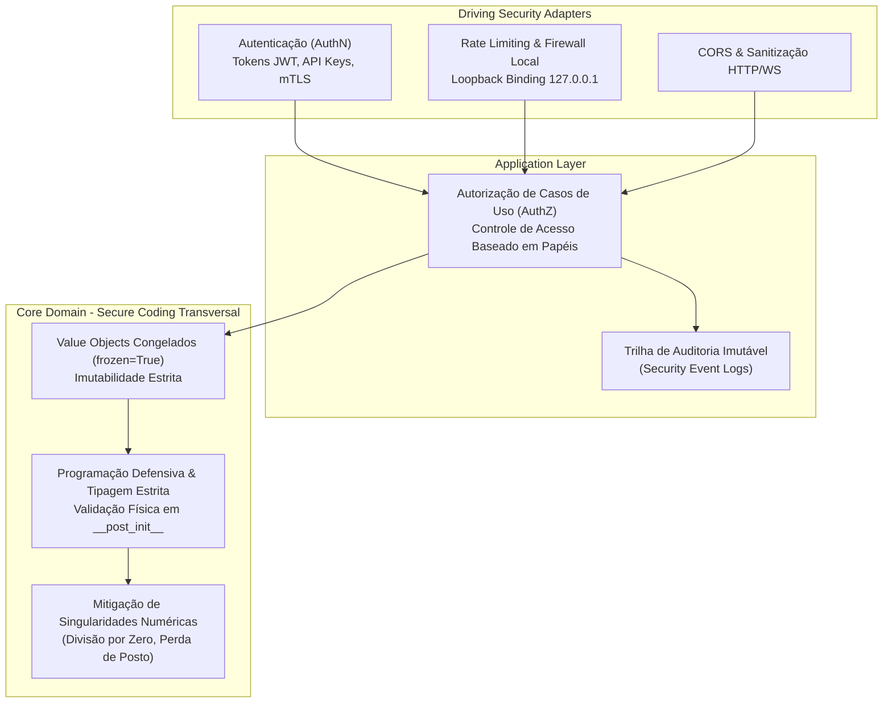

# 🛡️ Arquitetura de Cibersegurança, Confiabilidade e Proteção de Interfaces

Este documento formaliza as diretrizes de cibersegurança, modelagem de ameaças, salvaguardas operacionais e integridade de software do **Brazilian Regional Positioning System Simulator (RPS-BR)**.

Em sistemas espaciais, aeronáuticos e de radionavegação por satélite (PNT), a cibersegurança é uma propriedade intrínseca da segurança operacional (*safety*). Uma violação de integridade nos sinais ou na simulação de trajetória pode comprometer decisões de missão, cálculos de proteção à vida humana (níveis HPL/VPL) e a soberania da infraestrutura nacional.

---

## 🎯 1. Princípios Fundamentais & Normas de Referência

A engenharia de segurança do RPS-BR fundamenta-se nos seguintes referenciais técnicos:

* **RTCA DO-326A / EUROCAE ED-202A:** *Airworthiness Security Process Specification* (processos de segurança cibernética para sistemas aviônicos e comunicação solo-ar).
* **NIST SP 800-160:** *Systems Security Engineering* (engenharia de sistemas confiáveis e resistentes a ataques cibernéticos).
* **ECSS-Q-ST-80C:** *Space Product Assurance — Software* (requisitos da Agência Espacial Europeia para garantia de integridade e não-vulnerabilidade de software espacial).
* **OWASP Top 10 API Security Risks:** Diretrizes para proteção de gateways REST, WebSockets e streaming de dados.

---

## 🏛️ 2. Onde Reside a Cibersegurança na Arquitetura Hexagonal?

Uma das dúvidas mais comuns no design de sistemas distribuídos e de missão crítica é: *a cibersegurança deve ser implementada como código seguro em todo o projeto, como um adaptador dedicado ou como um "subcore"?*

A resposta arquitetural rigorosa baseia-se no princípio da **Defesa em Profundidade (*Defense-in-Depth*)** e na separação de responsabilidades do Domain-Driven Design (DDD):

### A. Autenticação NÃO é um "Subcore": É um Adaptador de Borda
* **Autenticação (AuthN — *Quem é você?*):** Lida com protocolos de transporte, certificados X.509, assinaturas HMAC-SHA256, tokens JWT, cabeçalhos HTTP e sessões. Esses mecanismos são voláteis e mudam conforme a infraestrutura de rede.
* Colocar mecanismos criptográficos de rede no Core violaria o princípio de independência tecnológica da Arquitetura Hexagonal. A autenticação pertence aos **Adaptadores de Interface (*Driving Adapters*)** como um *middleware* interceptador.

### B. Autorização de Alto Nível Reside na Camada de Aplicação
* **Autorização (AuthZ — *O que você pode fazer?*):** O *middleware* de rede valida o token e constrói um contexto de identidade confiável (`SecurityContext` com papéis do usuário).
* A Camada de Aplicação (`core.application`) valida se o papel associado à requisição possui permissão para disparar o Caso de Uso solicitado (ex: pausar a simulação ou injetar anomalias).

### C. Auditoria e Contabilização (Auditing / Accounting — *O que foi feito e quando?*)
* O terceiro pilar do **modelo clássico AAA** garante a rastreabilidade forense e o **não-repúdio (*non-repudiation*)**, essenciais para investigações pós-incidente em aviação e missões espaciais.
* Na Arquitetura Hexagonal, a auditoria é estruturada como uma **Porta de Saída (*Driven Outbound Port*)**:
  * **Porta Abstrata:** `IAuditLogOutboundPort` definida na camada de aplicação, invocada sempre que uma ação de controle ou anomalia é despachada.
  * **Value Object Imutável:** `SecurityAuditEventVO` com carimbo de tempo UTC, tempo da simulação, ator, ação executada (`PAUSE`, `SPEED_CHANGE`, `INJECT_FAULT`), status (`SUCCESS` ou `DENIED`), IP do cliente e hash criptográfico SHA-256 do payload.
  * **Adaptadores Concretos:** `FileAuditLogAdapter` (registro em arquivo *append-only* com permissão Unix restrita `600`), `SqliteAuditAdapter` e `SyslogAdapter` para centros de operações.

### D. Código Seguro é Transversal a Todo o Código (*Secure Coding Everywhere*)
O Core puro não precisa de bibliotecas de rede nem de senhas, mas implementa **segurança de software por construção**:
* **Imutabilidade Inegociável:** Value Objects são blindados (`@dataclass(frozen=True)`), impedindo alteração indevida de estados orbitais após a criação.
* **Validação de Invariantes em `__post_init__`:** Impossibilidade de instanciar satélites com anomalias físicas (ex: excentricidades negativas $e < 0$ ou altitudes abaixo do raio da Terra).
* **Zero Código Dinâmico Arbitrário:** Ausência absoluta de `eval()`, `exec()` ou serialização insegura (`pickle`), prevenindo vetores de Execução Remota de Código (RCE).
* **Determinismo e Tolerância a Falhas:** Ausência de laços infinitos garantida por contadores de iteração fixos ($k_{\max} = 10$ no solver de Kepler) e travas reentrantes (`threading.RLock`) que evitam condições de corrida (*race conditions*).

---

## 🔍 3. Modelagem de Ameaças (Framework STRIDE)

| Categoria STRIDE | Ameaça Específica no RPS-BR | Impacto Potencial | Salvaguarda Arquitetural Implementada / Projetada |
| :--- | :--- | :--- | :--- |
| **S — Spoofing** *(Falsificação de Identidade)* | Cliente malicioso forja requisições fingindo ser o nó do Gazebo no endpoint `/api/internal/clock`. | Dessincronização do relógio mestre ou salto temporal abrupto da simulação. | Token de serviço exclusivo (`ROLE_MASTER_ENGINE`) e restrição de rota para a interface de rede local (`127.0.0.1` / IPC). |
| **T — Tampering** *(Adulteração de Dados)* | Manipulação de parâmetros de efemérides ou injeção de ruídos orbitais astronômicos durante o trânsito de rede. | Degradação forçada de precisão de navegação e disparo de falsos alarmes RAIM. | Assinatura HMAC de pacotes de comando, validação estrita de esquemas Pydantic e Value Objects imutáveis. |
| **R — Repudiation** *(Repúdio de Ações)* | Um operador altera a taxa de aceleração temporal para $10.000\times$ e nega ter realizado o comando. | Impossibilidade de rastrear a causa raiz de anomalias em ensaios operacionais. | Trilha de auditoria append-only com registro de IP, papel, carimbo de data/hora UTC e hash da operação. |
| **I — Information Disclosure** *(Vazamento de Dados)* | Sniffing de tráfego de telemetria orbital em redes públicas não encriptadas. | Acesso não autorizado à topologia de veículos e alvos de rastreamento. | Encriptação obrigatória de transporte via TLS/HTTPS e WSS (*WebSocket Secure*). |
| **D — Denial of Service** *(Negação de Serviço)* | Abertura maciça de conexões simultâneas de streaming NMEA ou chamadas REST em loop infinito. | Exaustão de memória/CPU e bloqueio da propagação física em tempo real. | Rate limiting na camada de borda, limite de conexões simultâneas e decoupling assíncrono via `queue.Queue`. |
| **E — Elevation of Privilege** *(Elevação de Privilégios)* | Usuário com permissão de visualização (`ROLE_MONITOR`) envia requisição POST para `/api/pause`. | Interrupção indevida da simulação contínua por clientes não autorizados. | Checagem estrita de escopo/papel no gateway da API antes do encaminhamento ao Caso de Uso. |

---

## 👥 4. Matriz de Controle de Acesso Baseado em Papéis (RBAC)

As permissões operacionais do sistema são categorizadas em três papéis principais:

| Papel (*Role*) | Finalidade Operacional | Endpoints & Portas Permitidas | Requisito de Autenticação |
| :--- | :--- | :--- | :--- |
| **`ROLE_MONITOR`** | Monitoramento passivo, estações de visualização, receptores GNSS virtuais e painéis. | `GET /api/telemetry` `GET /api/dop` `GET /api/delays` `GET /api/nmea/stream` `WS /ws/telemetry` `GET /api/cesium/*` | Token JWT de visualização ou modo anônimo (se `--insecure` ativado). |
| **`ROLE_OPERATOR`** | Analista de missão e controladores de ensaio orbital. | Todos do `ROLE_MONITOR` + `POST /api/pause` `POST /api/resume` `POST /api/step` `POST /api/speed` Injeção de anomalias/cenários | Token JWT assinado com chave de operador ou API Key dedicada. |
| **`ROLE_MASTER_ENGINE`** | Processo do motor de física (Gazebo Sim / ROS 2 Bridge). | `POST /api/internal/clock` | Token de alta entropia injetado por variável de ambiente em canal seguro local (`localhost`). |

---

## 🛡️ 5. Boas Práticas e Diretrizes de Implementação Segura

1. **Gestão Segura de Credenciais e Segredos:**
   * Jamais embutir chaves de assinatura (*hardcoded secrets*) no código-fonte.
   * Utilizar variáveis de ambiente (ex: `RPS_JWT_SECRET`, `RPS_INTERNAL_TOKEN`) com fallback para segredos criptográficos efêmeros gerados via `secrets.token_urlsafe(32)` na inicialização.
   * Arquivo de configuração de credenciais locais protegido por permissões Unix `chmod 600`.

2. **Isolamento de Redes e Binding de Sockets:**
   * Endpoints de controle de simulação interna jamais devem ser expostos na interface `0.0.0.0` sem autenticação.
   * Em produção ou ensaios integrados, a porta de interface web deve operar atrás de um proxy reverso (Nginx, Traefik ou Envoy) responsável pela terminação TLS e mitigação de DDoS.

3. **Política de Resposta a Incidentes & Modo Didático:**
   * O sistema proverá a flag explícita `--disable-auth` / `--dev-mode` para ambientes puramente acadêmicos ou testes unitários rápidos. Quando ativada, o sistema emite um alerta explícito no console advertindo sobre a ausência de controles de acesso.
