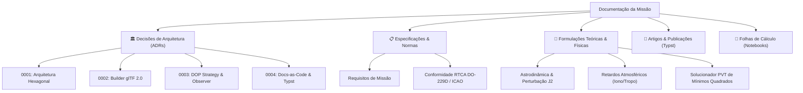

# 🛰️ Brazilian RPS Sim — Documentação da Missão

Bem-vindo ao portal de engenharia e documentação científica do **Brazilian Regional Positioning & Augmentation System Simulator (RPS-BR)**.

Este projeto modela, propaga e avalia um sistema de posicionamento e aumento regional soberano para o território brasileiro, sua Zona Econômica Exclusiva (Amazônia Azul) e espaço aéreo adjacente.

---

## 🏛️ Filosofia *Docs-as-Code* & Padrões Aeroespaciais

A documentação deste repositório é tratada com o mesmo rigor, versionamento e automação do código-fonte:
* **Arquitetura Hexagonal (Ports & Adapters)**: Desacoplamento absoluto entre formulações matemáticas de domínio puro e frameworks externos (ROS 2 / Gazebo Sim).
* **Rastreabilidade Bidirecional**: Cada modelo implementado responde a uma especificação teórica formal e a um requisito operacional rastreável no [GitHub Projects](https://github.com/users/Rj-mwe/projects/2).
* **Test-Driven Development (TDD)**: Toda equação é validada por casos de teste com tolerâncias analíticas estritas antes da integração.
* **Artigos em Typst**: Produção científica rápida, reprodutível e versionável em código-fonte puro.

---

## 🗺️ Mapa de Navegação da Documentação

---

## 🚀 Constelação de Referência (7 Satélites)

| Satélite | Tipo | Órbita / Parâmetros | Função Operacional |
| :--- | :---: | :--- | :--- |
| **RPS-GEO-1** | GEO | $a = 42.164\text{ km}, i = 0^\circ, \lambda = 60^\circ\text{W}$ | Cobertura Amazônia Central e Norte |
| **RPS-GEO-2** | GEO | $a = 42.164\text{ km}, i = 0^\circ, \lambda = 48^\circ\text{W}$ | Cobertura Centro-Oeste / Brasília |
| **RPS-GEO-3** | GEO | $a = 42.164\text{ km}, i = 0^\circ, \lambda = 36^\circ\text{W}$ | Cobertura Costa Leste e Nordeste |
| **RPS-IGSO-1** | IGSO | $a = 42.164\text{ km}, e = 0.040, i = 25^\circ, \omega = 90^\circ$ | Figura-8 sobre o Brasil (Apogeu no Sul) |
| **RPS-IGSO-2** | IGSO | $a = 42.164\text{ km}, e = 0.040, i = 25^\circ, \omega = 90^\circ$ | Figura-8 sobre o Brasil (Fase $90^\circ$) |
| **RPS-IGSO-3** | IGSO | $a = 42.164\text{ km}, e = 0.040, i = 25^\circ, \omega = 90^\circ$ | Figura-8 sobre o Brasil (Fase $180^\circ$) |
| **RPS-IGSO-4** | IGSO | $a = 42.164\text{ km}, e = 0.040, i = 25^\circ, \omega = 90^\circ$ | Figura-8 sobre o Brasil (Fase $270^\circ$) |
