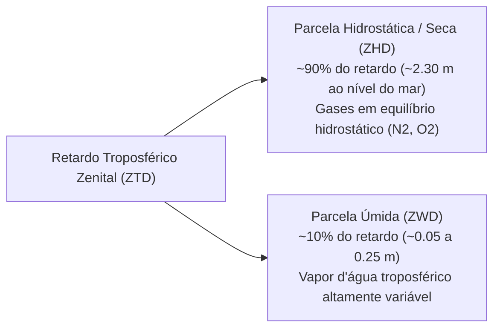

# 🌤️ Modelagem de Retardos Atmosféricos (Ionosfera e Troposfera)

> **Módulo de Física e Propagação de Sinais Espaciais**  
> **Subdomínio:** `core/domain/signal_propagation/`  
> **Normas de Referência:** IS-GPS-200, RTCA DO-229D, IERS Conventions (2010), Saastamoinen (1972)

---

## 1. Retardo Ionosférico (Modelo de Klobuchar)

A ionosfera é a camada superior da atmosfera (aproximadamente de $50\text{ km}$ a $1000\text{ km}$ de altitude), caracterizada pela presença de elétrons livres e íons gerados pela radiação solar ultravioleta e raios-X.

### 1.1. Natureza Dispersiva e Relação com o TEC
Diferentemente da troposfera, a ionosfera é um meio **dispersivo** para radiofrequências GNSS: a velocidade de fase é acelerada ($v_p > c$), enquanto a velocidade de grupo do código de modulação é atrasada ($v_g < c$). O atraso de grupo em metros é diretamente proporcional ao Conteúdo Total de Elétrons ($\text{TEC}$):

$$\Delta_{\text{iono}} = \frac{40.3 \cdot \text{TEC}}{f^2} \quad [\text{m}]$$

onde $f$ é a frequência da portadora (ex: $f_{L1} = 1575.42\text{ MHz}$) e $1\text{ TECU} = 10^{16}\text{ elétrons/m}^2$.

### 1.2. O Algoritmo de Klobuchar (IS-GPS-200 / RTCA DO-229D)
Para receptores mono-frequência (L1), o retardo zenital é modelado através de uma base constante noturna ($5\text{ ns}$) somada a uma função semi-cossenoidal com pico às 14:00 horas do Tempo Solar Local:

$$I_z(t) = \begin{cases} 
5 \times 10^{-9} + A_I \cdot \cos\left( \frac{2\pi (t - 50400)}{P_I} \right), & |t - 50400| < \frac{P_I}{4} \\
5 \times 10^{-9}, & |t - 50400| \ge \frac{P_I}{4}
\end{cases} \quad [\text{s}]$$

onde:
* $t$: Tempo Local no Ponto de Penetração Ionosférica (IPP).
* $A_I = \sum_{n=0}^3 \alpha_n \phi_m^n$: Amplitude diurna calculada pelos 4 coeficientes $\alpha$ do almanaque GPS e latitude geomagnética $\phi_m$.
* $P_I = \sum_{n=0}^3 \beta_n \phi_m^n$: Período do cosseno (mínimo de $72000\text{ s}$).

O retardo oblíquo na linha de visada é obtido pelo Fator de Obliqüidade ($F$):
$$F(\text{el}) = 1.0 + 16.0 \cdot (0.53 - \text{el}_{\text{sc}})^3$$
$$\Delta_{\text{iono, slant}} = c \cdot F(\text{el}) \cdot I_z$$

---

## 2. Retardo Troposférico (Modelo Clássico de Saastamoinen)

A troposfera é a camada inferior da atmosfera neutra (estendendo-se da superfície terrestre até aproximadamente $11\text{ km}$ a $16\text{ km}$ de altitude). Ao contrário da ionosfera, a troposfera é um **meio não-dispersivo** para sinais eletromagnéticos com frequências inferiores a $15\text{ GHz}$. Portanto, todas as portadoras GNSS (L1, L2, L5) e sinais do SBAS sofrem rigorosamente o **mesmo retardo geométrico**.

O atraso total na linha de visada $\Delta_{\text{tropo}}$ é composto pela soma de duas parcelas físicas distintas:
$$\Delta_{\text{tropo}}(\text{el}) = ZHD \cdot m_h(\text{el}) + ZWD \cdot m_w(\text{el})$$

---

### 2.1. Retardo Hidrostático Zenital ($ZHD$)
A parcela seca decorre da refratividade molecular de gases neutros em equilíbrio hidrostático. Segundo a formulação clássica de Saastamoinen (1972) adotada nas convenções do IERS (2010):

$$ZHD = \frac{0.0022768 \cdot P_0}{1.0 - 0.00266 \cdot \cos(2\phi) - 0.00028 \cdot H_{\text{km}}} \quad [\text{m}]$$

onde:
* $P_0$: Pressão atmosférica total na altitude da antena do receptor ($\text{hPa}$ ou $\text{mbar}$).
* $\phi$: Latitude geodésica do receptor ($\text{rad}$).
* $H_{\text{km}}$: Altitude ortométrica/elipsoidal acima do nível médio do mar em quilômetros ($H_{\text{m}} / 1000$).
* O denominador $f(\phi, H) = 1.0 - 0.00266 \cos(2\phi) - 0.00028 H_{\text{km}}$ modela a variação gravitacional local com a latitude e a altitude.

> **Propriedade Física:** Ao nível do mar sob pressão padrão ($P_0 = 1013.25\text{ hPa}$) na latitude média de $45^\circ$, $ZHD \approx 2.307\text{ m}$. O retardo hidrostático decai de forma suave e previsível com a elevação do terreno.

---

### 2.2. Retardo Úmido Zenital ($ZWD$)
A parcela úmida decorre do momento dipolar permanente das moléculas de vapor d'água na atmosfera inferior:

$$ZWD = 0.002277 \cdot \left( \frac{1255}{T_0} + 0.05 \right) \cdot e_0 \quad [\text{m}]$$

onde:
* $T_0$: Temperatura absoluta na superfície da antena ($\text{K}$).
* $e_0$: Pressão parcial de vapor d'água ($\text{hPa}$).

#### Cálculo da Pressão Parcial de Vapor d'Água ($e_0$)
A partir da Umidade Relativa do ar ($RH \in [0, 100]\%$) e da temperatura em Celsius ($T_c = T_0 - 273.15$), a pressão de saturação $e_{\text{sat}}$ é obtida pela equação de Magnus-Tetens:

$$e_{\text{sat}}(T_c) = 6.1121 \cdot \exp\left( \frac{17.502 \cdot T_c}{T_c + 240.97} \right) \quad [\text{hPa}]$$
$$e_0 = \frac{RH}{100.0} \cdot e_{\text{sat}}(T_c) \quad [\text{hPa}]$$

---

### 2.3. Função de Mapeamento Oblíquo ($m(\text{el})$)
Para elevar o retardo zenital à linha de visada em função do ângulo de elevação do satélite ($\text{el}$), adota-se a função contínua de Chao / Black & Eisner:

$$m(\text{el}) = \frac{1.0}{\sin(\text{el}_{\text{rad}}) + \frac{0.00143}{\tan(\text{el}_{\text{rad}}) + 0.0445}}$$

Essa função apresenta excelente comportamento numérico:
* No zênite ($\text{el} = 90^\circ$): $m(90^\circ) = 1.000$.
* Em elevações médias ($\text{el} = 30^\circ$): $m(30^\circ) \approx 1.995 \approx \csc(30^\circ)$.
* Em baixas elevações ($\text{el} = 10^\circ$): $m(10^\circ) \approx 5.60$.
* Na linha do horizonte ($\text{el} \to 0^\circ$): Permanece finita ($m(0^\circ) \approx 31.1$), eliminando a singularidade de divisão por zero típica do modelo simplificado de cossecante $\csc(\text{el})$.

Os atrasos oblíquos finais resultam em:
$$\Delta_{\text{hydro, slant}} = ZHD \cdot m(\text{el}) \quad [\text{m}]$$
$$\Delta_{\text{wet, slant}} = ZWD \cdot m(\text{el}) \quad [\text{m}]$$
$$\Delta_{\text{total, slant}} = (ZHD + ZWD) \cdot m(\text{el}) \quad [\text{m}]$$
$$\Delta t_{\text{tropo}} = \frac{\Delta_{\text{total, slant}}}{c} \quad [\text{s}]$$

onde $c = 299792458.0\text{ m/s}$ é a velocidade da luz no vácuo.

---

### 2.4. Modelo de Atmosfera Padrão (Fallback Meteorológico)
Quando estações terrestres ou receptores móveis não possuem sensores barométricos e higrométricos in-situ, os parâmetros de superfície são derivados pelo Perfil de Atmosfera Padrão (US Standard 1976 / ICAO):

| Parâmetro Físico | Valor ao Nível do Mar ($H = 0$) | Variação com a Altitude $H$ ($H < 11\text{ km}$) |
| :--- | :--- | :--- |
| **Temperatura ($T$)** | $T_{\text{sl}} = 288.15\text{ K}$ ($15.0^\circ\text{C}$) | $T(H) = T_{\text{sl}} - 6.5 \cdot H_{\text{km}}$ |
| **Pressão ($P$)** | $P_{\text{sl}} = 1013.25\text{ hPa}$ | $P(H) = P_{\text{sl}} \cdot \left( 1.0 - \frac{0.0065 \cdot H}{T_{\text{sl}}} \right)^{5.255877}$ |
| **Umidade Relativa ($RH$)** | $RH_{\text{sl}} = 50.0\%$ | $RH(H) = RH_{\text{sl}} \cdot \exp(-0.0006396 \cdot H)$ |

---

## 3. Implementação no Código e Cobertura de Testes

O modelo é implementado na arquitetura através de classes puras no subdomínio `core/domain/signal_propagation/`:
1. [TroposphericWeatherVO](file:///home/rjgamito/Projetos/Engenharia/Aeroespacial/brazilian-rps-sim/rps_br/core/domain/signal_propagation/value_objects/TroposphericWeatherVO.py): Value Object imutável que valida fisicamente as condições atmosféricas e calcula $e_0$.
2. [TroposphericDelayVO](file:///home/rjgamito/Projetos/Engenharia/Aeroespacial/brazilian-rps-sim/rps_br/core/domain/signal_propagation/value_objects/TroposphericDelayVO.py): Value Object imutável discriminando métricas métricas e temporais.
3. [TroposphereSaastamoinenService](file:///home/rjgamito/Projetos/Engenharia/Aeroespacial/brazilian-rps-sim/rps_br/core/domain/signal_propagation/services/TroposphereSaastamoinenService.py): Serviço de domínio determinístico com suporte a atmosfera padrão automática.
4. [test_troposphere_saastamoinen.py](file:///home/rjgamito/Projetos/Engenharia/Aeroespacial/brazilian-rps-sim/tests/unit/signal_propagation/test_troposphere_saastamoinen.py): Suíte de testes unitários com 9 cenários de validação rigorosa (100% de sucesso).
