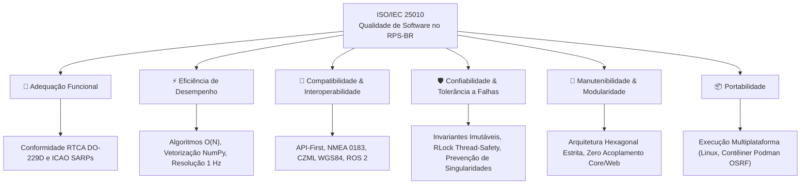
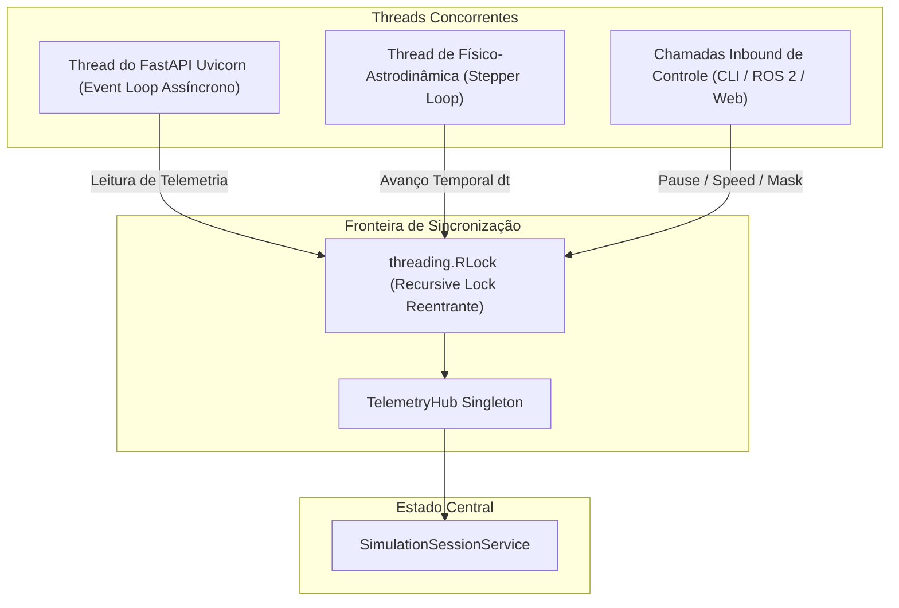

# 🛡️ Qualidade, Confiabilidade e Segurança de Software

Aplicações de engenharia aeroespacial e radionavegação por satélite exigem os mais altos padrões de confiabilidade, determinismo e segurança funcional. O projeto **RPS-BR** incorpora princípios das principais normas internacionais de software de missão crítica:

* **DO-178C / ED-12C:** *Software Considerations in Airborne Systems and Equipment Certification in Communication, Navigation and Surveillance*.
* **ECSS-E-ST-40C & ECSS-Q-ST-80C:** *European Cooperation for Space Standardization — Space Engineering & Product Assurance*.
* **NASA-STD-8719.13C:** *NASA Software Safety Standard*.
* **ISO/IEC 25010:** *Systems and software engineering — Systems and software Quality Requirements and Evaluation (SQuaRE)*.

---

## 🏛️ 1. Aplicação do Modelo de Qualidade ISO/IEC 25010



---

## 🔒 2. Programação Defensiva e Invariantes de Domínio

### A. Imutabilidade Estrutural com *Frozen Value Objects*
No Core do RPS-BR, conceitos fundamentais (como vetores tridimensionais, coordenadas geodésicas, elementos keplerianos e grandezas meteorológicas) são modelados como **Value Objects imutáveis** (`@dataclass(frozen=True)`):
* Uma vez instanciado, um Value Object jamais tem seu estado corrompido ou modificado por efeitos colaterais (*side effects*).
* A comparação é feita por **valor estrutural**, não por identidade de memória.

### B. Validação Antecipada de Invariantes (`__post_init__`)
Toda tentativa de criar um objeto com parâmetros fisicamente incoerentes dispara uma exceção imediata antes que o estado inválido contamine a simulação:

```python
@dataclass(frozen=True)
class KeplerianElementsVO:
    semi_major_axis_km: float
    eccentricity: float
    inclination_rad: float
    raan_rad: float
    arg_perigee_rad: float
    mean_anomaly_rad: float

    def __post_init__(self):
        # 1. Semieixo maior deve ser estritamente positivo
        if self.semi_major_axis_km <= 0.0:
            raise ValueError(f"Semieixo maior deve ser positivo: {self.semi_major_axis_km}")
        # 2. Excentricidade deve pertencer ao regime fechado/elíptico [0, 1)
        if not (0.0 <= self.eccentricity < 1.0):
            raise ValueError(f"Excentricidade para órbita elíptica deve estar em [0, 1): {self.eccentricity}")
```

```python
@dataclass(frozen=True)
class GeodeticCoordinatesVO:
    latitude_deg: float
    longitude_deg: float
    altitude_km: float

    def __post_init__(self):
        if not (-90.0 <= self.latitude_deg <= 90.0):
            raise ValueError(f"Latitude fora do intervalo [-90°, +90°]: {self.latitude_deg}")
        if not (-180.0 <= self.longitude_deg <= 180.0):
            raise ValueError(f"Longitude fora do intervalo [-180°, +180°]: {self.longitude_deg}")
        if self.altitude_km < -1.0:  # Abaixo da fossa mais profunda
            raise ValueError(f"Altitude não-física: {self.altitude_km} km")
```

---

## 🧮 3. Estabilidade Numérica e Proteção contra Singularidades

Modelos matemáticos de propagação e astrodinâmica são suscetíveis a indeterminações ou divisão por zero em geometrias extremas. O RPS-BR implementa proteções ativas:

### A. Proteção contra o Horizonte Troposférico ($el \to 0^\circ$)
A função de mapeamento troposférico tradicional de Saastamoinen aproxima-se de $1 / \sin(el)$. Para ângulos de elevação rasantes próximos a zero, o retardo tenderia a infinito ($\infty$).
* **Mitigação Defensiva:** O `TroposphereSaastamoinenService` impõe um corte de segurança para ângulos inferiores a $1.0^\circ$ e estabiliza o mapeamento através de coeficientes da atmosfera padrão, evitando estouro de ponto flutuante (*overflow*).

### B. Degradação Graciosa em Matrizes DOP ($N < 4$ Satélites)
O cálculo da matriz de diluição de precisão ($H = (G^T G)^{-1}$) requer posto completo ($\text{rank}(G) = 4$). Se o número de satélites visíveis for inferior a 4, a matriz é algebricamente singular e não invertível:
* **Mitigação Defensiva:** A estratégia `ElevationMaskDopStrategy` verifica a contagem de linhas e o número de condição da matriz $G^T G$. Caso não haja geometria suficiente para um fixo 3D, a estratégia retorna um objeto `DopVO` com a flag `is_valid = False` e valores nominais seguros, impedindo exceções `LinAlgError` não tratadas de interromper o fluxo da missão.

### C. Convergência da Equação de Kepler
O método de Newton-Raphson para o cálculo da anomalia excêntrica ($E - e \sin E = M$) opera com critério de parada duplo:
1. Resíduo absoluto: $|E_{k+1} - E_k| < 10^{-10}\text{ rad}$.
2. Guarda de iterações máximas: Se em 10 iterações a convergência não for atingida (cenário teoricamente impossível para $e = 0.040$), o laço é interrompido defensivamente com a melhor aproximação disponível.

---

## 🧵 4. Concorrência Segura e Determinismo Temporal

O sistema integra múltiplas fontes concorrentes de temporização e dados (FastAPI assíncrono, streaming WebSocket a 1 Hz, laços de física do Gazebo e comandos de usuários via REST ou CLI).



* **Exclusão Mútua Reentrante (`threading.RLock`):** O `TelemetryHub` utiliza um lock reentrante em todas as operações de leitura e escrita de estado. Isso garante que nenhum cliente receba um estado da constelação parcialmente propagado (onde alguns satélites estão em $t$ e outros em $t + \Delta t$).
* **Isolamento de Tarefas Assíncronas:** A propagação numérica do domínio ocorre em sincronia segura com o relógio mestre sem bloquear o laço de eventos (*Event Loop*) do FastAPI, preservando baixa latência nas requisições HTTP e WebSockets.

---

## 📊 5. Diretrizes de Qualidade de Código (*Code Quality Guidelines*)

* **Tipagem Estática (PEP 484):** $100\%$ das funções e métodos do Core e Adaptadores possuem *type hints* explícitos para parâmetros e retornos.
* **Isolamento de Dependências (Clean Architecture):** Nenhuma biblioteca externa com impacto em runtime (como `fastapi`, `starlette`, `rclpy`, `gz`) pode ser importada dentro do pacote `rps_br.core.*`. O núcleo utiliza estritamente `math`, `typing`, `dataclasses` e `numpy`.
* **Zero Código Morto (*Zero Dead Code*):** Toda funcionalidade nova é acompanhada por testes automatizados no `pytest`, mantendo cobertura rastreável.
* **Compatibilidade Retroativa Gradual (*Strangler Fig Pattern*):** Mudanças de interface pública mantêm pontes de depreciação via PEP 562 (`__getattr__` dinâmico com advertências claras) antes da remoção definitiva de submódulos legados.
