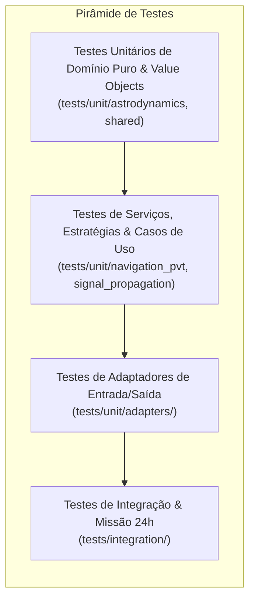
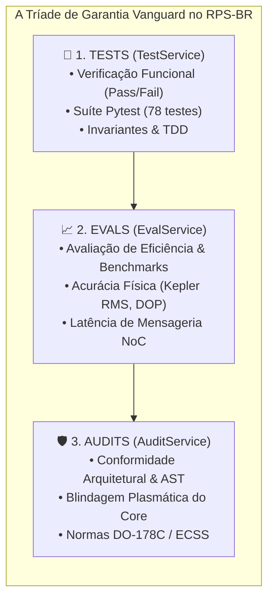

# 🧪 Engenharia e Estratégia de Testes de Software

A confiabilidade dos modelos de dinâmica orbital, propagação eletromagnética e estimativa de posição no projeto **RPS-BR** é sustentada por uma infraestrutura formal de testes orientada pelo paradigma **Test-Driven Development (TDD)** e alinhada com as diretrizes de certificação aeroespacial (DO-178C e ECSS).

O simulador adota uma política de **tolerância analítica estrita**, garantindo que cada algoritmo responda fielmente às equações fundamentais da mecânica celeste e dos padrões de radionavegação da ICAO / RTCA DO-229D.

---

## 🏛️ A Pirâmide de Testes no RPS-BR

A Arquitetura Hexagonal simplifica drasticamente a testabilidade do sistema: como o **Core** de domínio é 100% puro e desprovido de dependências externas (sem frameworks web, motores gráficos ou middleware de robótica), mais de 80% da suíte de testes executa em nanossegundos sem a necessidade de *mocks* ou emuladores.



### 1. Testes Unitários de Domínio Puro (`tests/unit/astrodynamics/`, `tests/unit/shared/`)
* **Objetivo:** Validar a inviolabilidade das leis físicas e das estruturas de dados fundamentais.
* **Características:** Zero dependências de I/O, execução puramente vetorial via NumPy/math, determinismo total.
* **Componentes Cobertos:**
  * `Vector3DVO`: Operações algébricas (produto escalar, vetorial, norma euclidiana, normalização).
  * `GeodeticCoordinatesVO`: Validação de intervalos invariantes (Latitude $\in [-90^\circ, +90^\circ]$, Longitude $\in [-180^\circ, +180^\circ]$, Altitude $\ge -1.0\text{ km}$).
  * `KeplerianElementsVO`: Excentricidade elíptica $e \in [0, 1)$, semieixo $a > 0$, período orbital e movimento médio.
  * `KeplerSolverService`: Convergência da Equação de Kepler transcendental $M = E - e \sin E$ pelo método de Newton-Raphson com precisão $\epsilon < 10^{-10}\text{ rad}$.
  * `CoordinateTransformService`: Matriz de rotação ortogonal ECI J2000 $\leftrightarrow$ ECEF (determinante $\det(R) = 1.0 \pm 10^{-14}$) e conversão reversa WGS84 fechada.

### 2. Testes de Modelagem Física e Sinais (`tests/unit/signal_propagation/`, `tests/unit/navigation_pvt/`)
* **Objetivo:** Assegurar que os modelos atmosféricos e de geometria PVT reproduzem as recomendações internacionais da ICAO e da RTCA DO-229D.
* **Componentes Cobertos:**
  * `TroposphereSaastamoinenService`: Cálculo analítico dos retardos zenitais hidrostático ($ZHD \approx 2.27\text{ m}$) e úmido ($ZWD \approx 0.15\text{ m}$), escala de redução com a altitude da estação, e estabilidade numérica para ângulos rasantes no horizonte ($el < 1^\circ$).
  * `IonosphereKlobucharService`: Modelo diurno com perfil cosseno truncado, piso noturno constante de $5\text{ ns}$, pico solar pontual às 14:00 hora local, fator de obliquidade esférica e escalonamento de frequência ($L_1 = 1575.42\text{ MHz}$ vs $L_2 = 1227.60\text{ MHz}$).
  * `DopStrategies`: Estratégia padrão, máscara de elevação e ponderação estocástica; tratamento de singularidade matemática quando $N < 4$ satélites visíveis.
  * `DopObserver`: Padrão Observer com disparador de alerta para $PDOP > 6.0$ e amortecimento em buffer circular.

### 3. Testes de Adaptadores (`tests/unit/adapters/`)
* **Objetivo:** Verificar a conformidade dos contratos de interface externa (REST, WebSocket, NMEA, Cesium CZML, CLI e nós ROS 2).
* **Componentes Cobertos:**
  * `test_api_adapter.py`: Rotas RESTful, sincronização com o singleton `TelemetryHub`, controle de pausa/velocidade/máscara, formatação NMEA e algoritmo de checksum XOR.
  * `test_cesium_czml.py`: Geração de pacotes CZML da constelação (3 GEOs, 4 IGSOs, 7 estações terrestres) e integridade de coordenadas WGS84 cartesianas.
  * `test_cli_adapter.py`: Execução dos comandos `status`, `satellites`, `dop`, `pause`, `resume`, `speed` em modo conectado e em modo *core-fallback*.
  * `test_ros2_node.py`: Ciclo de atualização de tempo do nó ROS 2 e publicação de tópicos de telemetria sem acoplamento a bibliotecas web.
  * `test_web_adapter.py`: Camada de compatibilidade retroativa (PEP 562 lazy import).

### 4. Testes de Integração e Missão 24h (`tests/integration/`)
* **Objetivo:** Submeter a constelação completa a uma simulação temporal de um dia sideral ininterrupto ($86.164\text{ s}$), avaliando cobertura contínua sobre o Brasil.
* **Componentes Cobertos:**
  * `test_propagate_constellation_use_case.py`: Propagação síncrona dos 7 veículos orbitais e fechamento de rastro.
  * `test_ground_station_dop_use_case.py`: Monitoramento de métricas DOP nas 7 capitais de referência em passos de 10 minutos por 24 horas, confirmando disponibilidade de sinal $100\%$ do tempo ($PDOP < 6.0$).

---

## 🎯 Tolerâncias Analíticas e Critérios de Aceitação

| Grandeza Física / Algoritmo | Requisito / Critério de Aceitação | Norma / Referência |
| :--- | :--- | :--- |
| **Fechamento de Órbita GEO (24h)** | Erro residual de posição $\Delta r < 1.0\text{ metro}$ após 1 período orbital completo ($86.164\text{ s}$) | Astrodinâmica Kepleriana |
| **Convergência de Kepler** | Resíduo de anomalia excêntrica $\|E_{k+1} - E_k\| < 10^{-10}\text{ rad}$ em $\le 10$ iterações | Vallado (2013) / Battin |
| **Ortogonalidade ECI $\to$ ECEF** | $\|R \cdot R^T - I\| < 10^{-14}$ e determinante $\det(R) = 1.0 \pm 10^{-14}$ | Álgebra Linear Numérica |
| **Retardo Troposférico Zenital ($ZHD$)** | $2.20\text{ m} \le ZHD \le 2.35\text{ m}$ ao nível do mar ($P = 1013.25\text{ hPa}$) | Saastamoinen (1972) / IERS |
| **Piso Noturno Ionosférico** | Retardo vertical constante exatamente igual a $5.0\text{ ns}$ | GPS ICD-200 / Klobuchar |
| **Máscara de Elevação** | Satélites com elevação $< \theta_{\text{mask}}$ descartados da matriz $G$ | RTCA DO-229D |
| **Checksum NMEA 0183** | Formato hexadecimal de 2 dígitos estritamente igual ao XOR dos bytes da sentença | NMEA 0183 v4.10 / IEC 61162 |

---

## 🚀 Como Executar a Suíte de Testes

### 1. Execução Completa (Todos os Testes)
```bash
python3 -m pytest -v
```

### 2. Execução Filtrada por Camada da Arquitetura
```bash
# Executar apenas testes do Domínio e Astrodinâmica:
python3 -m pytest tests/unit/astrodynamics/ -v

# Executar testes de Modelos Atmosféricos e Sinais:
python3 -m pytest tests/unit/signal_propagation/ -v

# Executar testes de Qualidade Geométrica (DOP / PVT):
python3 -m pytest tests/unit/navigation_pvt/ -v

# Executar apenas testes dos Adaptadores (API, CLI, Cesium, ROS 2):
python3 -m pytest tests/unit/adapters/ -v

# Executar testes de Integração de Longa Duração (Missão 24h):
python3 -m pytest tests/integration/ -v
```

### 3. Execução com Cobertura de Código (*Coverage Report*)
```bash
python3 -m pytest --cov=rps_br --cov-report=term-missing tests/
```

### 4. Execução Rápida em Modo Silencioso (CI/CD)
```bash
python3 -m pytest -q
```

---

## 🛡️ A Tríade da Garantia de Qualidade da Vanguard (Tests, Evals e Audits)

Para além da pirâmide de testes tradicional, o simulador RPS-BR orienta-se pela **Tríade de Garantia do Ecossistema Vanguard**, segmentando a validação em três instâncias epistemológicas e operacionais complementares:



### 1. Nível 1: Tests (Exatidão Comportamental Booleana)
Verificação lógica e funcional executada na pasta `tests/` via `pytest`. Garante que cada fórmula matemática, serviço kepleriano e adaptador de borda responda com fidelidade binária (`Pass` / `Fail`) à especificação formal.

### 2. Nível 2: Evals (Acurácia Física & Benchmarks de Desempenho)
Métricas contínuas de eficiência e precisão numérica, gerando scorecards analíticos:
* **Convergência Numérica:** Tempo médio e número de iterações do método de Newton-Raphson na Equação de Kepler ($\epsilon < 10^{-10}\text{ rad}$).
* **Acurácia PVT:** Erro quadrático médio ($\text{RMS}$) da solução de navegação WLS frente a oráculos de verdade terrestre (*Ground Truth*).
* **Latência de Transporte NoC:** Medição de dispersão temporal ($P_{50}$, $P_{99}$) na transmissão in-process do envelope `MissionPacket` sob o padrão *Zero-Overhead*.

### 3. Nível 3: Audits (Conformidade Arquitetural & Segurança Estática)
Inspeção formal automatizada da integridade estrutural e segurança do código-fonte:
* **Auditoria de Blindagem Plasmática:** Varredura estática de AST para comprovar que nenhuma classe em `core/` referencia ou importa módulos em `adapters/` ou `infrastructure/`.
* **Auditoria de Imutabilidade:** Validação sistemática garantindo que todas as estruturas de dados fundamentais utilizem `@dataclass(frozen=True)`.
* **Auditoria de Segurança & Segredos:** Rastreamento contínuo de credenciais, chaves criptográficas ou dados sensíveis embutidos em arquivos versionados.
* **Auditoria Normativa:** Verificação de rastreabilidade de requisitos para conformidade com DO-178C e ECSS.

